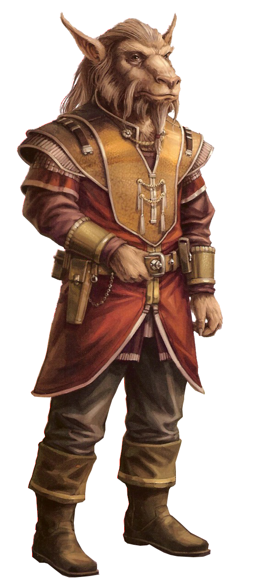

## Bothan

#### Visual Characteristics

|:--|:--|
|***Skin Color***|Brown|
|***Hair Color***|Black, brown, or gray (with age)|
|***Eye Color***|Brown or green|
|***Distinctions***|Diminutive stature, mood-sensitive fur|

#### Physical Characteristics

|:--|:--|:--:|
|***Height***|4'3"|+2d4"|
|***Weight***|60 lb.|x(2d4) lb.|

#### Sociocultural Characteristics

|:--|:--|
|***Homeworld***|Bothawui|
|***Language***|Bothese|

### Biology and Appearance
Bothans are a short species of furry humanoids. Bothans are covered in fur which shifted in response to their emotional state by way of gentle ripplings. It is this trait, named Wrendui, that betrays them when members of their kind intend to be duplicitous in their dealings with others. They possess tapered pointed ears, and both males and females were known to sport beards. 

Bothans are able to interbreed with the other species, though it is rare that they do so. Such hybrids somewhat resembled baseline humans with haunches, hooves, fur, pointed ears and a long tail.

### Society and Culture
Bothan culture is guided by the philosophy and principles from the ancient text known as The Way, written by Golm Fervse'dra. In this "Bothan Way", the pursuit of power and influence is paramount. Thus, individual bothans put their own political and economic success above all other concerns, and as a species, bothans put their own advancement ahead of other intergalactic interests. The volume of backstabbing, subtle character assassination and political maneuvering in bothan society is dizzying, and results in many species stereotyping bothans as untrustworthy. In fact, most bothans are habitually paranoid, believing that anyone who's not working with them, is working against them. In times of crisis, the focus of bothan society shifts to a survivalist state known as "ar'krai". When engaged in ar'krai, all fit bothans volunteer to defend their species from impending extinction. 

### Names
Male bothan names are often trickey while female's are soft. Surnames are familial.

**Male Names.** Garc, Hibriak, Nith, Tramom, Ventagt 

**Female Names.** Ceerriah, Dhaim, Gnam, Meenn, Vit 

**Surnames.** Bwif'livi, Gra'kit, Hia'faitu, Main'dil

### Bothan Traits
As a bothan, you have the following special traits.

***Ability Score Increase.***   Your Intelligence score increases by 2, and your Dexterity score increases by 1.

***Age.***   Bothans reach adulthood in their late teens and live less than a century.

***Alignment.***   Bothans' duplicitous nature causes them to tend toward the dark side, though there are exceptions.

***Size.***   Bothans stand 4-5 feet tall and weigh under 100 pounds. Regardless of your position in that range, your size is Medium.

***Speed.***   Your base walking speed is 30 feet.

***Naturally Stealthy.***   You can attempt to hide even when you are obscured only by a creature that is your size or larger than you.

***Nimble Escape.***  You can take the Disengage or Hide action as a bonus action on each of your turns.

> While bothans are suitable for many classes, they most iconically fit as operatives. The ***Nimble Escape*** special trait heavily overlaps with the operative's ***Cunning Action*** feature, however, making this species/class combination counterintuitive. If, during the character creation part of your game, a player decides to make a bothan operative, consider letting them use the following feature instead:
>
> ***Versatile Expertise.*** You gain proficiency in one skill of your choice. You gain expertise in one skill of your choice in which you are proficient.

***Shrewd.***   You are proficient in the Insight and Deception skills.

***Languages.*** You can speak, read, and write Galactic Basic and Bothese. Bothese had a great influence on the forming of Galactic Basic; the two languages share many cognates.
