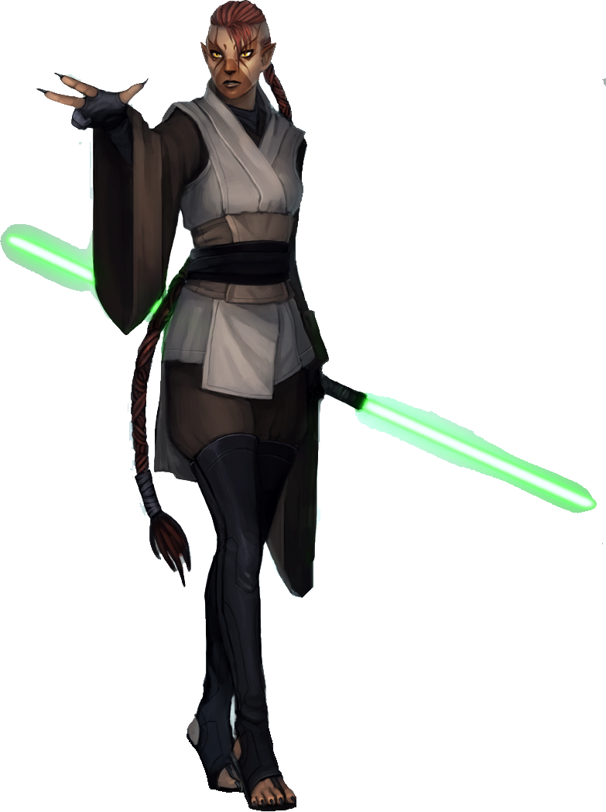

## Cathar

#### Visual Characteristics

|:--|:--|
|***Skin Color***|Gold to yellow-brown with dark stripes|
|***Hair Color***|Brown, black, or grey|
|***Eye Color***|Yellow or brown|
|***Distinctions***|Lion-like features|

#### Physical Characteristics

|:--|:--|:--:|
|***Height***|4'9"|+2d12"|
|***Weight***|130 lb.|x(2d4) lb.|

#### Sociocultural Characteristics

|:--|:--|
|***Homeworld***|Cathar|
|***Language***|Catharese|

### Biology and Appearance
The Cathar have fur-covered bodies with thick manes as well as prominent, retractable claws that can deliver powerful killing attacks on foes and prey. Their bodies also possess rapid healing abilities. These traits make them the perfect hand-to-hand specialists.

The Cathar species also has two subspecies, known as the Juhani and the Myr Rho. Both of these are notably less catlike than mainline Cathar. Cathar are born into a litter. The Cathar species is biologically similar to the Bothan species.

### Society and Culture
On their homeworld, Cathar live in cities built into giant trees, and are organized into clans governed by elders. Stories of their great heroes were often carved into the trunks of these tree-homes for following generations to see. The Cathar mate for life, to the extent that when one mate dies, the survivor never has a relationship with another. Cathar clan society includes great pageants and celebrations, especially for their heroes. Their religion includes a ritual known as the "Blood Hunt," in which Cathar warriors individually engaged in combat against entire nests of Kiltik in order to gain honor and purge themselves of inner darkness. The native language of the Cathar is Catharese, which included the emphasis of some spoken words with a growl.

### Names
Cathar names can sound both melodic and fairly gutteral, but they almost always sound strong and fierce. Female names are typically longer than male names. Surnames are usually one syllable.

**Male Names.** Crurbirr, Isyrr, Nynorr, Suro, Tukarr 

**Female Names.** Cuwin, Jyvohr, Mulahr, Solyri

**Surnames.** Jin, Ki, Mak, Rhir, Ta

### Cathar Traits
As a cathar, you have the following special traits.

***Ability Score Increase.***   Your Dexterity score increases by 2, and your Charisma score increases by 1.

***Age.***   Cathar reach adulthood in their late teens and live less than a century.

***Alignment.***   Cathar tend toward no particular alignment. The best and worst are found among them.

***Size.***   Cathar range from 5 to 7 feet tall, and can weigh up to 300 lbs. Regardless of your position in that range, your size is Medium.

***Speed.***   Your base walking speed is 30 feet.

***Cat's Claws.***   Your unarmed strikes deal 1d6 kinetic damage and have the finesse property.

***Darkvision.***   Your vision can easily cut through darkness. You can see in dim light within 60 feet of you as if it were bright light, and in darkness as if it were dim light. You can’t discern color in darkness, only shades of gray.

***Leonine Agility.***   Your reflexes and agility allow you to move with a burst of speed. When you move on your turn in combat, you can double your speed until the end of the turn. Once you use this trait, you can’t use it again until you move 0 feet on one of your turns.

***Silent Step.***   You have proficiency in the Stealth skill.

***Treeclimber.***   You have a climbing speed of 30 feet. You have advantage on Strength saving throws and Strength (Athletics) checks that involve climbing.

***Languages.***   You can speak, read, and write Galactic Basic and Catharese.
