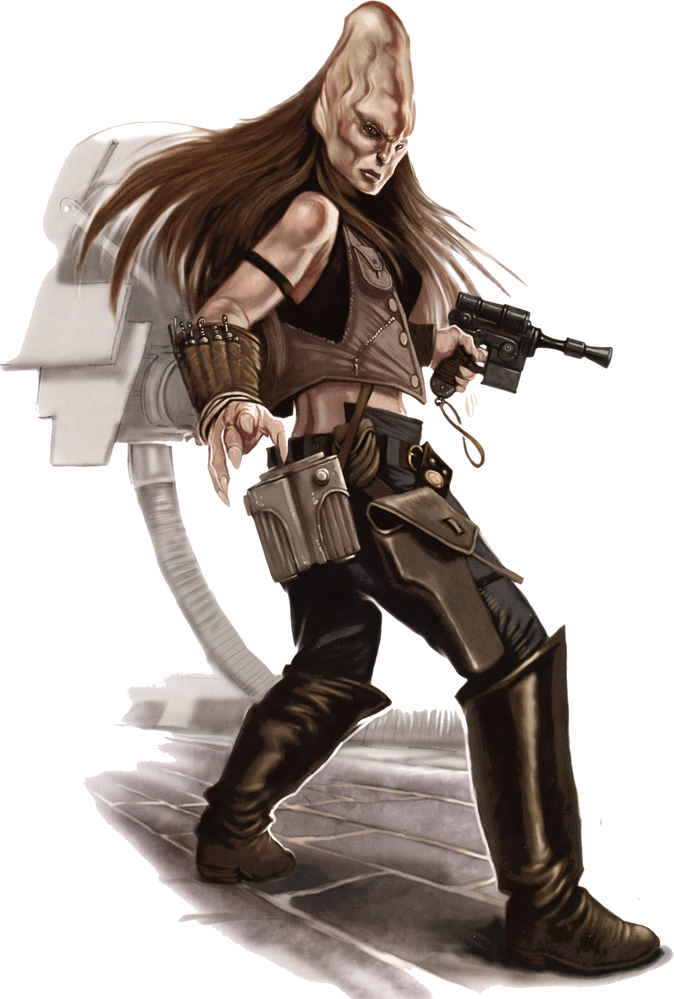

## Cerean

#### Visual Characteristics

|:--|:--|
|***Skin Color***|Light tones|
|***Hair Color***|Blond, brown, or white (usually with age)|
|***Eye Color***|Yellow|
|***Distinctions***|Cone-like skull, binary brain|

#### Physical Characteristics

|:--|:--|:--:|
|***Height***|5'8"|+2d8"|
|***Weight***|120 lb.|x(2d4) lb.|

#### Sociocultural Characteristics

|:--|:--|
|***Homeworld***|Cerea|
|***Language***|Cerean|

### Biology and Appearance
The Cereans' enlarged skulls, extending above their foreheads, house complex binary brains, provided with sufficient blood by an extra heart in their heads. The binary structure of Cerean thinking helps them to ponder two sides of an issue at once. It also enables them to process information and solve problems rapidly and provides a highly advanced capacity for concentration and meditation. Because of their thoughtful nature, they tend to be calm, rational and analytical, preferring peaceful philosophies and a lifestyle which works in harmony with nature. Though the quick-thinking Cereans have equally quick reflexes, they are commonly not as well coordinated as humans. 

### Society and Culture
Cereans developed a low-tech society on their homeworld and prefer to live in isolation from the wider galaxy. Preserving the natural beauty of Cerea, the planet is home to many Outsider Citadels where it is permissible to use offworld technology, though it could not be removed from the Citadel. Meditation is a core part of a Cerean's daily rituals, with many employing specially-forged kasha crystals as a focusing tool. By focusing one's thoughts while in contact with such crystals, distractions are eliminated, creating an exceptional meditation environment. Cerean Jedi sometimes incorporate these crystals into their lightsabers, providing great focus, even during intense physical combat.

### Names
Cerean male first names are often hyphenated, while females are not. Surnames are familial.

**Male Names.** Ji-Cheelia, Ki-Adi, Pick-toh, Sauli-Fanz

**Female Names.** Dreash, Kilniavy, Melm, Rharoth

**Surnames.** Codux, Emkom, Kyureft, Lonnik, Mundi

### Cerean Traits
As a cerean, you have the following special traits.

***Ability Score Increase.***   Your Intelligence score increases by 2, and your Wisdom score increases by 1.

***Age.***   Cereans reach adulthood in their late teens and live less than a century.

***Alignment.***   Cereans' altruistic nature causes them to tend toward the light side, though there are exceptions.

***Size.***   Cereans typically stand between 6 and 7 feet tall and weigh about 150 lbs. Regardless of your position in that range, your size is Medium.

***Speed.***   Your base walking speed is 30 feet.

***Intuitive Initiative.***   You can choose to reroll Initiative checks, but you must use the new roll.

***Natural Instinct.***   You have proficiency with Nature or Perception (your choice).

***Prediction.***   You can embrace the Force and use your advanced insight to predict likely outcomes, allowing you to turn failures into successes. When you roll a 1 on an attack roll, ability check, or saving throw, you can reroll the die and must use the new roll.

***Second Heart.***   When you are reduced to 0 hit points but not killed outright, you can drop to 1 hit point instead. You can’t use this feature again until you finish a long rest.

***Trance.***   You only need 3 hours of sleep during a long rest to gain its benefits, instead of 6. Additionally, if your long rest would be interrupted, you only need to complete the long rest instead of restarting it to gain its benefits.

***Languages.***   You can speak, read, and write Galactic Basic and Cerean. Cerean is characterized by its gravelly sounds.
