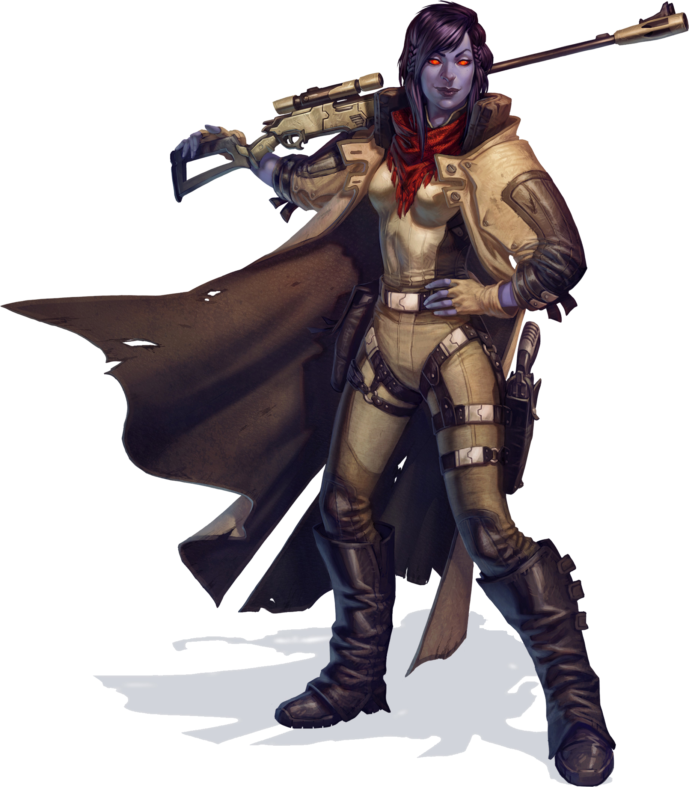

# Chiss

#### Visual Characteristics

|:--|:--|
|***Skin Color***|Blue or silver|
|***Hair Color***|Black, blue, or silver|
|***Eye Color***|Red|
|***Distinctions***|Glowing red eyes, above-average night vision|

#### Physical Characteristics

|:--|:--|:--:|
|***Height***|4'11"|+2d10"|
|***Weight***|110 lb.|x(2d4) lb.|

#### Sociocultural Characteristics

|:--|:--|
|***Homeworld***|Csilla|
|***Language***|Cheunh|

## Biology and Appearance
The chiss are a near-human species distinguished by their blue skin and glowing red eyes. Genetic analysis indicate that they are an offshoot of humanity, and it is believed that moving underground led to a divergence between them and baseline Humans. Their blue skin, jet black hair and red eyes generally command attention; these features make them physically striking and instantly recognizable.

## Society and Culture
Chiss society is highly structured and ordered with the rule of law being enforced by a group of four affiliations known as the Ruling Families: the Csapla, Nuruodo, Inrokini and Sabosen. These are not biological family groupings but instead different branches of their government. Every chiss claims affiliation to one of the four families, as determined by both tradition and place of birth. The family names are more of a cultural holdover; the bloodlines had grown so co-meddled that any chiss could claim affiliation to any of the ruling families. In spite of the outward impression of calm and order that the chiss like to project to outsiders, there were evidently tensions within the Families; political assassinations are a real part of chiss political life for the Ruling Families.

## Names
A chiss true-name has 3 parts, each separated by an apostrophe. The first part is their family name, the second part is their root name, and the third part is their occupation. Chiss rarely share their true-name with non-chiss, and usually go by their root name. Male and female names do not significantly deviate.

**Names.** Crorcu'ecuk'unist, Dash'esoru'ishur, Jerd'ecer'lonii, Kisk'egauw'eqhi, Marag'aliphil'eduo, Pommo'icuote'nlerme, Vornu'wuzi'lerdim

## Chiss Traits
As a chiss, you have the following special traits.

***Ability Score Increase***   Your Intelligence score increases by 2, and your Charisma score increases by 1.

***Age***   Chiss reach adulthood in their late teens and live less than a century.

***Alignment***   Chiss' tactical and selfish nature cause them to tend toward lawful dark side, though there are exceptions.

***Size***   Chiss typically stand between 5 and 6 feet tall and weigh about 160 lbs. Regardless of your position in that range, your size is Medium.

***Speed***   Your base walking speed is 30 feet.

***Martial Proficiency***   You have proficiency with light and medium armor as well as the heavy pistol and sniper rifle.

***Politically Minded***   You have proficiency in the Insight skill.

***Tech Resistance***   Growing up around technology leaves an impact on chiss. You have advantage on Dexterity and Intelligence saving throws against tech powers.

***Superior Darkvision***   Your vision can easily cut through darkness. You can see in dim light within 120 feet of you as if it were bright light, and in darkness as if it were dim light. You can’t discern color in darkness, only shades of gray.

***Languages***   You can speak, read, and write Galactic Basic, Cheunh, and your choice of Minnisiat or Sy Bisti. Cheunh is a complex language that is difficult for non-chiss to learn. Chiss take pride in this difficulty. Communications with outsiders are conducted through local trade-languages like Minnisiat or Sy Bisti.
