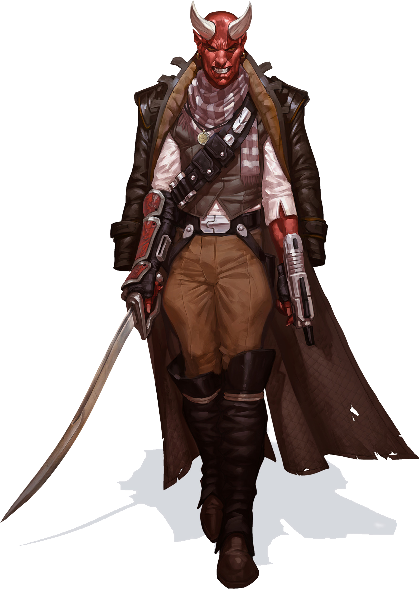

# Devaronian

#### Visual Characteristics

|:--|:--|
|***Skin Color***|Red, pink, brown, or white|
|***Hair Color***|Brown, black, or white|
|***Eye Color***|Black|
|***Distinctions***|Horns or horn spots, long pointed ears|

#### Physical Characteristics

|:--|:--|:--:|
|***Height***|4'10"|+2d8"|
|***Weight***|120 lb.|x(2d4) lb.|

#### Sociocultural Characteristics

|:--|:--|
|***Homeworld***|Devaron|
|***Language***|Devaronese|

## Biology and Appearance
A bipedal mammalian species, Devaronians evolved in the dense jungles of Devaron as a hunter-gather species. Their bodies are denser than most humanoids' and as a result they were heavier than their appearance would tend to indicate. Devaronians have silver-based blood, which appears thick and black when exposed. They possess a unique blood filtration and cleansing system which processes through two livers. Because their bodies are constantly cleansed of toxins and carcinogens, the species is highly resistant to poison. To this end, sulfur is used as a stimulant on Devaron to enhance speed and strength, because inhaling it causes the substance to enter the bloodstream rapidly. Their livers struggle to eliminate sulfur from their system, meaning that long-term use can be dangerous.

## Society and Culture
Devaronian males are driven by an urge to wander, usually taking the first opportunity to move on from one place to another; they are often found traveling the galaxy as tramp freighter captains and scouts. Female Devaronians, on the other hand, are content to remain in a single location, raising the young and running the government of Devaron. The males send money back to their homeworld to support their families, but otherwise hardly ever return. The females are content with this arrangement, as they tend to view the restless males as disruptive to home life. 

## Names
Devaronian names are dark, complex and often guttural, with some harsher tones mixed in here and there.

**Male Names.** Cir, Gremegris, Keirtihk, Kucx, Niruhk

**Female Names.** Crilnuy, Ghal, Milma, Nola, Taoluel 

**Surnames.** Breiz, Droddost, G'vaulnel, Raokt

## Devaronian Traits
As a devaronian, you have the following special traits.

***Ability Score Increase***   Your Constitution score increases by 2, and your Charisma score increases by 1.

***Age***   Devaronians reach adulthood in their late teens and live less than a century.

***Alignment***   Devaronians' greediness causes them to tend toward chaotic balanced, though there are exceptions.

***Size***   Devaronians typically stand between 5 and 6 feet tall and weigh about 160 lbs. Regardless of your position in that range, your size is Medium.

***Speed***   Your base walking speed is 30 feet.

***Curiosity***   You have proficiency with Survival or Investigation (your choice).

***Heat Adaptation***   You have advantage on Constitution saving throws made to avoid exhaustion due to extreme heat.

***Jungle Dweller***   Growing up in the jungles of Devaron has left an impact. You don’t treat jungle terrain as difficult terrain.

***Silver Tongue***   You have proficiency with Deception or Persuasion (your choice).

***Tech Resistance***   Growing up around technology leaves an impact on devaronians. You have advantage on Dexterity and Intelligence saving throws against tech powers.

***Two Livered***   Devaronians have two livers, which makes them adept at filtering toxins. You have advantage on saving throws against poison, and you have resistance against poison damage (explained in chapter 9).

***Languages***   You can speak, read, and write Galactic Basic and Devaronese. Devaronese is characterized by grunts and grumbles. It is rare to hear a Devaronian speak it anywhere other than their homeworld of Devaron.
