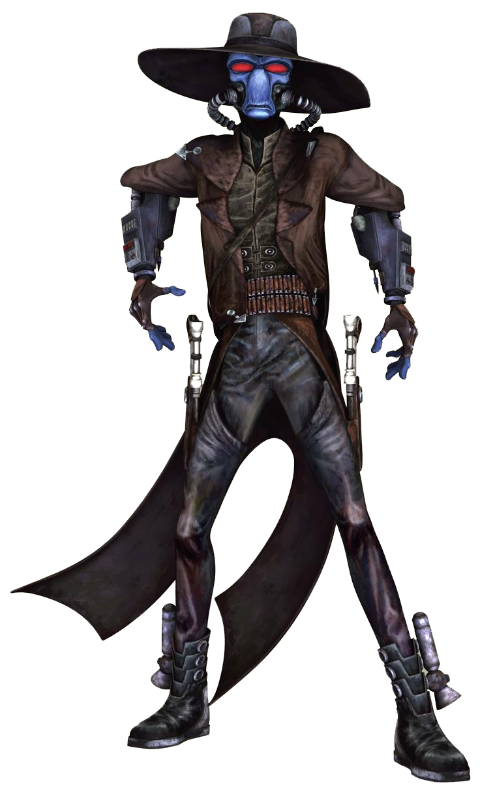

# Duros

#### Visual Characteristics

|:--|:--|
|***Skin Color***|Blue, green|
|***Hair Color***|None|
|***Eye Color***|Red|
|***Distinctions***|Noseless, large red eyes, affinity for space travel|

#### Physical Characteristics

|:--|:--|:--:|
|***Height***|5'5"|+2d10"|
|***Weight***|115 lb.|x(2d4) lb.|

#### Sociocultural Characteristics

|:--|:--|
|***Homeworld***|Duro|
|***Language***|Durese|

## Biology and Appearence
The duros are humanoids with smooth blue-green skin, red eyes, lipless mouths, long thin noseless faces and green blood. Olfactory organs beneath their eyes are responsible for their sense of smell. Both females and males are bald, though both genders are easily distinguished. Their large red goggle-like eyes have slit pupils. Duros females lay eggs as they are descended from ancient reptiles, and they are born in a larval grub stage. Unlike similar species, the duros take care of their offspring from birth.

## Society and Culture
Their home planet Duro is primarily uninhabited due to massive pollution on the world over time. Instead, it is covered with automated farms for food production. The duros live in twenty orbital space cities above the planet.

The duros also established a vast, grand starship construction industry in the Duro system. The duros set up their government around a consortium of starship construction corporations, with all important political decisions made by the stockholders of the corporations. This meant that any duros that held stock in a company could participate in the administration of the system.

With their strong memories, some duros also choose to become extraordinary storytellers, renowned galaxy-wide for their ability to learn a wide range of narratives by heart, and perform them all with stunning accuracy. 

## Names
Duros names are generally melodic, with female names having softer intonations. Surnames are familial.

**Male Names.** Cir, Fod, Mom, Rur, Zim

**Female Names.** Chochi, Fumsu, Kaleshef, Raada

**Surnames.** Dektuks, Jimoks, Silt, Tuzig, Zhoks

## Duros Traits
As a duros, you have the following special traits.

***Ability Score Increase***   Your Dexterity score increases by 2, and your Intelligence score increases by 1.

***Age***   Duros reach adulthood in their 20s and live an average of 150 years.

***Alignment***   Duros tend toward no particular alignment. The best and worst are found among them.

***Size***   Duros stand around 6 feet tall and weigh around 160 lbs. Regardless of your position in that range, your size is Medium.

***Speed***   Your base walking speed is 30 feet.

***Darkvision***   You have a keen eyesight, especially in the dark. You can see in dim light within 60 feet of you as if it were bright light, and in darkness as if it were dim light. You can’t discern color in darkness, only shades of gray.

***Galactic Traveler***   You have proficiency in the Piloting and Lore skills.

***Navigators***   You have proficiency in surveyor's implements.

***Superior Memory***   You can double your proficiency bonus for it when you make an Intelligence (Lore) check to recall information you have learned, or to recall the details of your experiences.

***Tech Resistance***   Growing up around technology leaves an impact on duros. You have advantage on Dexterity and Intelligence saving throws against tech powers.

***Languages***   You can speak, read, and write Galactic Basic and Durese. Durese is a common interstellar tongue used by prominent spacers and traders.
