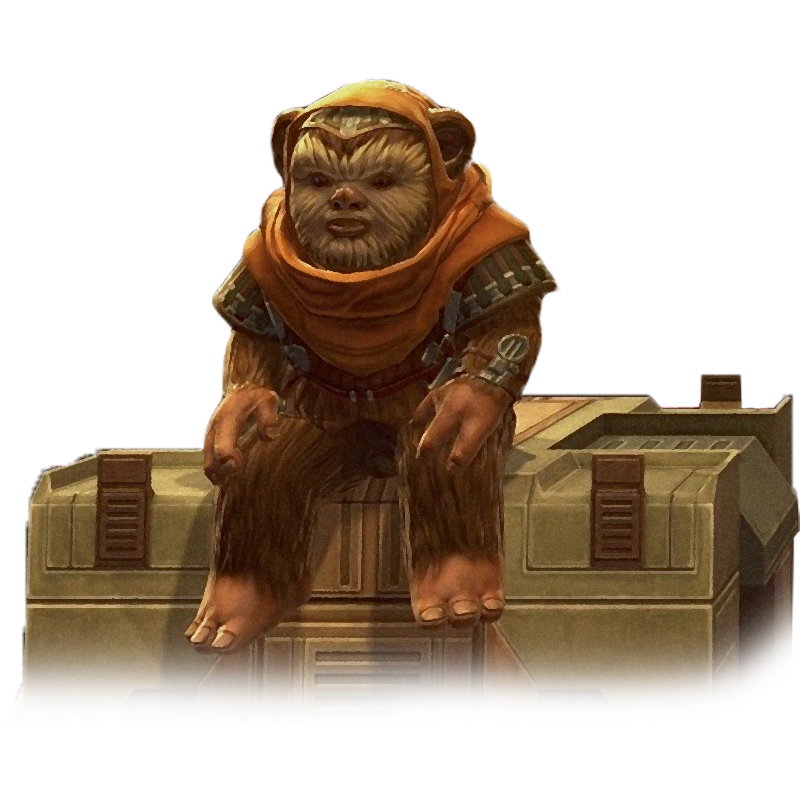

# Ewok

#### Visual Characteristics

|:--|:--|
|***Skin Color***|Brown|
|***Hair Color***|Shades of white, brown, red, and black|
|***Eye Color***|Black|
|***Distinctions***|Furry, short stature, acute sense of smell|

#### Physical Characteristics

|:--|:--|:--:|
|***Height***|2'9"|+2d6"|
|***Weight***|40 lb.|x1 lb.|

#### Sociocultural Characteristics

|:--|:--|
|***Homeworld***|Forest Moon of Endor|
|***Language***|Ewokese|

## Biology and Appearance
Ewoks are sentient humanoid mammals, averaging about one meter in height, which can provide an advantage when trying to hide. They are covered in fur from head to toe, with brown and black the most common colors. Other Ewoks have near-white or reddish fur, but red fur is supposedly the rarest shade an Ewok can get. Most Ewoks have solid-colored fur, though a few sport stripes. Ewoks have large, bright eyes, small humanoid noses, and hands that possess two fingers and an opposable thumb. Despite their small size, Ewoks are physically strong enough to overpower combat-trained Humans. Their appearance has been likened to "little bears," though they are sometimes referred to as "mini Wookiees."

## Society and Culture
Most Ewoks live high among the trees of the forest moon, in villages built between the closely spaced trees. The basic design of a tree village has a "Central Village" of thatched-roof huts on the primary limbs. These huts are high enough above the ground to be out of reach of predators. Suspended bridges connect the gaps between trees, adjoining distant huts. Knotted rope ladders allow access up or down.

Ewoks enjoy singing and playing music during celebrations and rituals. They are resourceful and tend to make use of everything they get their hands on; they use a variety of crude drums, horns, flutes, and other instruments in their music.

## Names
Ewok names are comprised of growled consonants. Female names always end in a vowel. Surnames are clan-based.

**Male Names.** Coostick, Erphek, Grarphil, Moodoo

**Female Names.** Booshi, Chela, Fesasha, Lipe, Ypezzi

**Surnames.** Fedrimra, Jellyng, Moomrack, Trantelaa

## Ewok Traits
As an Ewok, you have the following special traits.

***Ability Score Increase***   Your Dexterity score increases by 2, and your Constitution score increases by 1.

***Age***   Ewoks reach adulthood in their early teens and live about 50 years.

***Alignment***   Ewoks are inherently accepting, albeit naive, and tend toward the light side, though there are exceptions.

***Size***   Ewoks stand between 3 and 4 feet tall and weigh about 50 lbs. Regardless of your position in that range, your size is Small.

***Speed***   Your base walking speed is 25 feet.

***Crude Weapon Specialists***   Ewoks are used to making do with less. You can spend 1 hour, which you can do over the course of a short rest, crafting a weapon out of loose materials. You can craft any simple kinetic weapon, but the weapon's damage suffers a -1 penalty.

***Keen Smell***   You have advantage on Wisdom (Perception) checks that rely on smell.

***Mask of the Wild***   You can attempt to hide even when you are only lightly obscured by foliage, heavy rain, falling snow, mist, and other natural phenomena.

***Musical Culture***   Ewoks incorporate music in their celebrations and rituals. You have proficiency in an instrument of your choice.

***Natural Survivalist***   You have proficiency in Nature and Survival.

***Treeclimber***   You have a climbing speed of 25 feet. You have advantage on Strength saving throws and Strength (Athletics) checks that involve climbing.

***Undersized***   Your small stature makes it hard for you to wield bigger weapons. You can't use heavy shields. Additionally, you can't use martial weapons with the two-handed property unless it also has the light property, and if a martial weapon has the versatile property, you can only wield it in two hands.

***Languages***   You can speak, read, and write Ewokese. You can understand spoken and written Galactic Basic, but your vocal cords do not allow you to speak it.
