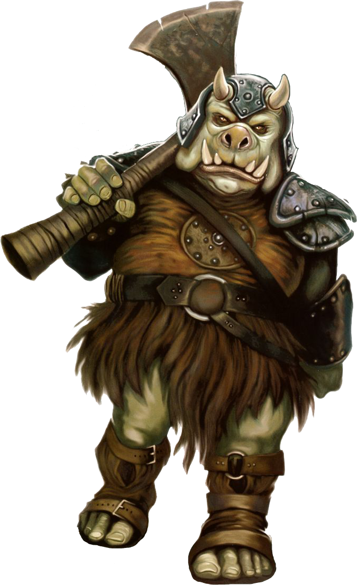

---
title:
parent: Species
grand_parent: Player's Handbook
---

# Gamorrean 

#### Visual Characteristics

|:--|:--|
|***Skin Color***|Black, brown, green, pink, or yellow|
|***Hair Color***|None|
|***Eye Color***|Blue, black, brown, or gold|
|***Distinctions***|Porcine humanoids with tusks and horns|

#### Physical Characteristics

|:--|:--|:--:|
|***Height***|4'10"|+2d8"|
|***Weight***|150 lb.|x(2d6) lb.|

#### Sociocultural Characteristics

|:--|:--|
|***Homeworld***|Gamorr|
|***Language***|Gamorrese|

## Biology and Appearance
Although a typical gamorrean is squat, green, and heavily built, not all shared these characteristics. Most gamorreans have a dark greenish coloration over a large portion of their bodies; however skin coloration does vary, particularly among females, with light skinned and two-toned pigmentation not uncommon. Black, brown, pinkish yellow, and even a rare white pigmentation are possible. Males tended to have less skin variation and had a greater tendency towards dark green skin perhaps because of their higher exposure to the radiation of the Gamorr Star. Eye coloration varied evenly between gold-yellow, blue, black and brown. The gamorreans generally put no importance on skin or eye coloration although there were some superstitions linked to certain markings.

## Society and Culture
Gamorreans are organized into clans ruled by a male warlord and his wife, who was the most powerful of the clan matrons. While the warlord and his boars are solely concerned with preparing and participating in battle with rival clans, the matrons of the clan performed all the productive work including farming, hunting, manufacturing, and running businesses. Since the amount of available arable land on Gamorr is scarce, clans often lay claim to the same piece of land, and they spend their time fighting over possession. 

## Names
Gamorrean names are very gutteral and rough. Male names are typically one syllable while females are two. Surnames are based on clan affiliation rather than family. 

**Male Names.** Ark, Blarrp, Blubrak, Cuab, Shos

**Female Names.** Dabrisz, Mernoos, Ogreb, Tagorq

**Surnames.** Doofnarq, Griks, Lurc, Poogmokk

## Gamorrean Traits
As a gamorrean, you have the following special traits.

***Ability Score Increase***    Your Strength score increases by 2, and your Constitution score increases by 1.

***Age***   Gamorreans reach adulthood in their early teens and live no more than 70 years.

***Alignment***   Gamorrean culture causes them to tend toward chaos, though there are exceptions.

***Size***   Gamorreans typically stand between 5 and 6 feet tall and weigh up to 200 lbs. Regardless of your position in that range, your size is Medium.

***Speed***   Your base walking speed is 30 feet.

***Gamorrean Toughness***   Your hit point maximum increases by 1, and it increases by 1 every time you gain a level. Additionally, you have advantage on Constitution saving throws.

***Gamorrean Weaponry***   You have proficiency with the vibroaxe, vibromace, and vibrosword.

***Savage Attacks***   When you score a critical hit with a melee weapon attack, you can roll one of the weapon's damage dice one additional time and add it to the extra damage of the critical hit.

***Languages***   You can speak, read, and write Gamorrese. You can understand spoken and written Galactic Basic, but your vocal cords do not allow you to speak it. Gamorrese is characterized by its grunts and squeals, and its writing is a crude, pictographic style.
