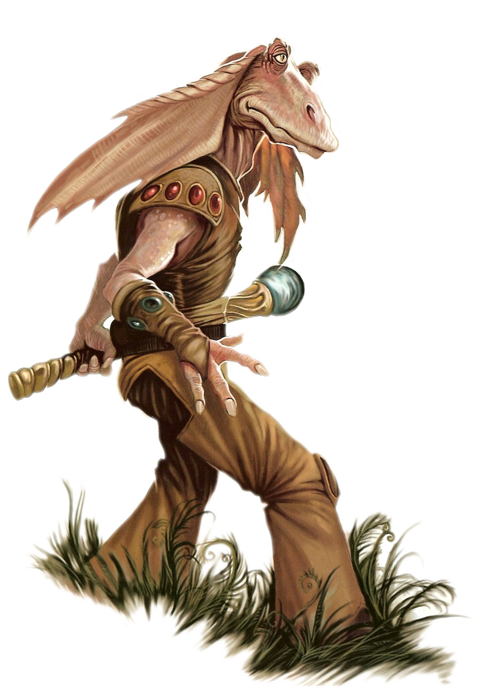

# Gungan

#### Visual Characteristics

|:--|:--|
|***Skin Color***|Blue, brown, or green|
|***Hair Color***|None|
|***Eye Color***|Light colors|
|***Distinctions***|Extendable tongues, long ears, eye stalks, three toes, aquatic species|

#### Physical Characteristics

|:--|:--|:--:|
|***Height***|5'5"|+2d10"|
|***Weight***|115 lb.|x(2d4) lb.|

#### Sociocultural Characteristics

|:--|:--|
|***Homeworld***|Naboo|
|***Language***|Gungan|

## Biology and Appearance
Starting life as tadpoles, Gungans develop into tall beings with extremely flexible cartilaginous skeletons. Strong leg muscles allow for powerful and quick frog-kick style swimming through water as well as a remarkable jumping ability while on land. Fin-like ears (called haillu) also aid them in swimming, as well as expressing emotions like aggression, friendship, and fear. They have partially retractable eyestalks with nictitating membranes when underwater. Green eyes are unusual amongst Gungans.

## Society and Culture
Gungans are generally a generous and peaceful species. They truly love to have visitors and warmly welcome them; however, they would remain suspicious until the visitors have earned their respect. Gungans are not tolerant of anyone who threatens their peaceful culture. They have very strict laws, and will go to the extremes to punish anyone who has committed a minor crime. Vandals, for example, can be given a sentence of exile, caning, or even stoning.

If a Gungan is cast out of society, it is very difficult for them to return. If they do manage to return legally, they are often subjected to heavy discrimination. This can make life very difficult for them and can go on for months or years, until their past offenses disappear from memory. Returning back to the settlement they were exiled from illegally will sometimes result in the death penalty, especially if they brought along outsiders. 

## Names
Gungan names are often repeated syllables hyphenated.

**Male Names.** Crinn-Crinn, Gic, Noc-Noc, Wal

**Female Names.** Hew, Khi, La-La, Phro-Phro, Yuss

**Surnames.** Baud, Gos, Jalles, Mag, Wub

## Gungan Traits
As a Gungan, you have the following special traits.

***Ability Score Increase***   Your Dexterity score increases by 2, and your Strength score increases by 1.

***Age***   Gungans reach adulthood in their early teens and live about 70 years.

***Alignment***   Gungans tend toward the light side, though there are exceptions.

***Size***   Gungans typically stand 6 to 7 feet tall and weigh about 170 lbs. Regardless of your position in that range, your size is Medium.

***Speed***   Your base walking speed is 30 feet.

***Amphibious***   You can breathe air and water.

***Darkvision***   Accustomed to life underwater, you have superior vision in low light conditions. You can see in dim light within 60 feet of you as if it were bright light, and in darkness as if it were dim light. You can’t discern color in darkness, only shades of gray.

***Flexible***   You have advantage on Dexterity (Acrobatics) checks that involve flexibility.

***Heat Sensitivity***   You have disadvantage on Constitution saving throws made to avoid exhaustion due to extreme heat.

***Martial Proficiency***   You have proficiency with light and medium armor as well as the techstaff and vibropike.

***Strong-Legged***   When you make a long jump, you can cover a number of feet up to twice your Strength score. When you make a high jump, you can leap a number of feet up into the air equal to 3 + twice your Strength modifier.

***Swim***   You have a swimming speed of 30 feet.

***Languages***   You can speak, read, and write Galactic Basic and Gungan. When speaking Galactic Basic, you often have trouble with word tenses and infinitives; this usually has a comical effect.
