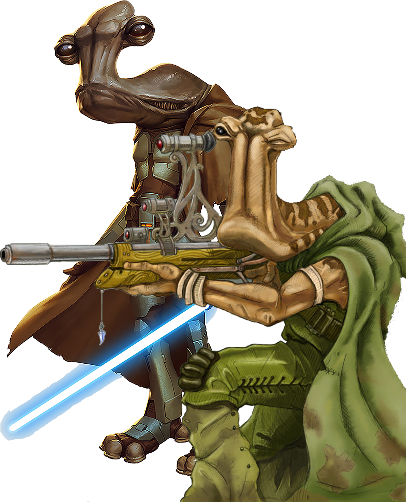

# Ithorian

#### Visual Characteristics

|:--|:--|
|***Skin Color***|Brown, dark red or green|
|***Hair Color***|Brown, gray, or white|
|***Eye Color***|Black or blue|
|***Distinctions***|Curved neck, two mouths, aural flaps, locomotion tubes, throat sack|

#### Physical Characteristics

|:--|:--|:--:|
|***Height***|5'9"|+2d12"|
|***Weight***|135 lb.|x(2d4) lb.|

#### Sociocultural Characteristics

|:--|:--|
|***Homeworld***|Ithor|
|***Language***|Ithorese|

## Biology and Appearance
Ithorians have two mouths and four throats, allowing them to speak in stereo. Female Ithorians have two humps on the back of their head, while males have only one. They have glossy, usually brown flesh. Their reflexes and coordination are somewhat slower than that of average humanoids.

In addition to allowing them to speak their unique stereophonic language, the Ithorians' four throats also have the ability to violently expel air, resulting in a deafening and potentially concussive scream. Despite this fact, most Ithorians go their entire lives without ever resorting to violence, and so the ability remained relatively ambiguous.

## Society and Culture
Ithorians worship the "Mother Jungle," a spiritual entity embodying the lush, tropical ecology of their world, Ithor. They are generally devoted environmentalists, staunch herbivores, and complete pacifists, devoting much time to contemplating their ecology, studying plants and their uses and the overall respecting of all living things. Most Ithorians never set foot on their own planet, instead living in floating cities above their world called herdships. Only three of their continents have been explored and harvested, the other two never having been touched by Ithorian hands. They demonstrate extreme belief in the protection and sustaining of their environment as dictated by their "Law of Life."

## Names
Ithorian names are quite varied in length but most names are soft and melodic. They are often difficult to prounounce by other species, so many Ithorians adopt nicknames.

**Male Names.** Del, Gizorthej, Pexxocl, Steorthibs

**Female Names.** Binshe, Dhu'sha, Mul, Slosh, Vlo

**Surnames.** Afleehl, Crukid, Tondand, Wamunn

## Ithorian Traits
As an Ithorian, you have the following special traits.

***Ability Score Increase***   Your Charisma score increases by 2, and your Wisdom score increases by 1.

***Age***   Ithorians reach adulthood in their late teens and live an average of 85 years.

***Alignment***   Ithorians tend toward the light side, though there are exceptions.

***Size***   Shorter Ithorians stand around 6 feet while taller reach over 7 and a half. Regardless of your position in that range, your size is Medium.

***Speed***   Your base walking speed is 30 feet.

***Call for Peace***   As an action on your turn, you can emphatically demand that your foes embrace peace, thereby distracting them. Until the end of your next turn, enemies within 10 feet of you that can see you gain disadvantage on attack rolls against your allies. Once you use this trait, you can't use it again until you finish a short or long rest.

***Hold Breath***   Ithorians have a great lung capacity and can hold their breath for up to 15 minutes at a time.

***Law of Life***   Ithorians have a sacred respect for the natural world, taking great care to preserve and study it. You have proficiency in the Nature skill and the bioanalysis kit.

***Sonic Scream***   As an action, you can violently expel air in a 15-foot cone. When you do so, each creature in the area of the exhalation must make a Wisdom saving throw (DC = 8 + your proficiency bonus + your Constitution modifier). A creature takes 2d6 sonic damage on a failed save, and half as much damage on a successful one. The damage increases to 4d6 at 5th level, 6d6 at 11th level, and 8d6 at 17th level. This ability has no effect on constructs. You can use this feature a number of times equal to your proficiency bonus. You regain all expended uses when you complete a long rest.

***Languages***   You can speak, read, and write Ithorese. You can understand spoken and written Galactic Basic, but your vocal cords do not allow you to speak it.
