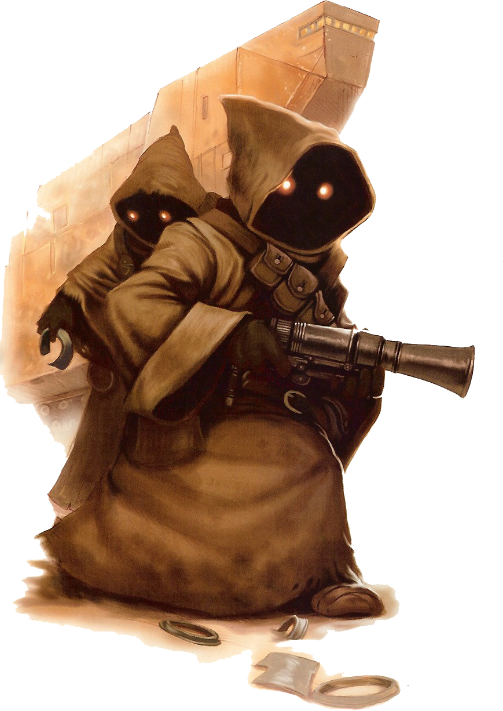

# Jawa

#### Visual Characteristics

|:--|:--|
|***Skin Color***|Black|
|***Hair Color***|Black|
|***Eye Color***|Yellow|
|***Distinctions***|Diminutive stature, mechanical aptitude, thieving nature|

#### Physical Characteristics

|:--|:--|:--:|
|***Height***|2'9"|+2d4"|
|***Weight***|35 lb.|x1 lb.|

#### Sociocultural Characteristics

|:--|:--|
|***Homeworld***|Tatooine|
|***Language***|Jawaese|

## Biology and Appearance
Jawas are easily identifiable by their traditional brown hooded robes, though it is not unheard of for them to wear other colors. Other notable features included their glowing yellow eyes, small stature and high pitched, quickly spoken language called Jawaese. Underneath their robes, jawas appear to be gaunt, rodent-like creatures, with shrunken faces and yellow eyes. 

## Society and Culture
Jawas are a communal, compulsive scavenger species who spend most of their life devoted to scavenging the deserts of Tatooine in search of any scrap metal, droid or mechanical part left behind from millennia of star travel and technological advancement. Most non-jawas regard the jawas as scavengers and thieves, a description that most jawas actually find pleasing.

The jawa's unofficial motto is *not to look for uses in a salvaged item, but rather to imagine someone else who might find a use for it.* This is evidenced in their endless search for wares with which to trade with almost any being jawas encounter. They have a kind of instinctive feel for machinery and electronics, notorious for knowing how to get a piece of equipment functioning just well enough to sell.

## Names
Jawa names are quickly spoken, complex, and often misunderstood. Jawas who spend the majority of their time around other species respond well to nicknames. Male and female names do not significantly deviate. Surnames are clan based.

**Male names.** Bilvu, Mnak, Penk, Plin, Vih

**Female names.** Bahimos, Kola, Levu, Rhovi, Uvet

**Surnames.** Kkejenem, M'avoe, Tjoteelt, Wiamoel

## Jawa Traits
As a jawa, you have the following special traits.

***Ability Score Increase***   Your Dexterity score increases by 2, and your Intelligence score increases by 1.

***Age***   Jawas are considered adults when they make their first sale and live less than a century.

***Alignment***   Jawas tendency to steal and swindle causes them to tend towards the dark side, though there are exceptions.

***Size***   Jawas stand around 3 to 4 feet tall and weigh about 40 lbs. Regardless of your position in that range, your size is Small.

***Speed***   Your base walking speed is 25 feet.

***Darkvision***   You have a keen eyesight, especially in the dark. You can see in dim light within 60 feet of you as if it were bright light, and in darkness as if it were dim light. You can’t discern color in darkness, only shades of gray.

***Grovel, Cower, and Beg***   As an action on your turn, you can cower pathetically to distract nearby foes. Until the end of your next turn, your allies gain advantage on attack rolls against enemies within 10 feet of you that can see you. Once you use this trait, you can’t use it again until you finish a short or long rest.

***Heat Adaptation***   You have advantage on Constitution saving throws made to avoid exhaustion due to extreme heat.

***Tech Dabbler***   You know the *ion blast* at-will tech power. When you reach 3rd level, you learn and can cast the *repair droid* tech power once per long rest. When you reach 5th level, you learn and can cast the *hold droid* tech power once per long rest. Your techcasting ability is Intelligence. You do not require use of a wristpad for these powers.

***Thieving***   You have proficiency in the Sleight of Hand skill.

***Tinker***   You have proficiency with tinker’s implements. You can use these and spend 1 hour and 100 cr worth of materials to construct a Tiny Device (AC 5, 1 hp). You can take the Use an Object action to have your device cause one of the following effects: create a small explosion, create a repeating loud noise for 1 minute, create smoke for 1 minute, cause a small electrical fire. You can maintain a number of these devices up to your proficiency bonus at once, and a device stops functioning after 24 hours away from you. You can dismantle the device to reclaim the materials used to create it.

***Undersized***   Your small stature makes it hard for you to wield bigger weapons. You can’t use heavy shields. Additionally, you can’t use martial weapons with the two-handed property unless it also has the light property, and if a martial weapon has the versatile property, you can only wield it in two hands.

***Languages***   You can speak, read, and write Jawaese (and the Jawa Trade Language). You can understand spoken and written Galactic Basic, but your vocal cords do not allow you to speak it. Jawaese blends quickly spoken, semi-meaningless syllables with scents to be understood. To more easily bargain and trade with other species, they rely on a simplified variant called the Jawa Trade language which removes the use of scent.
