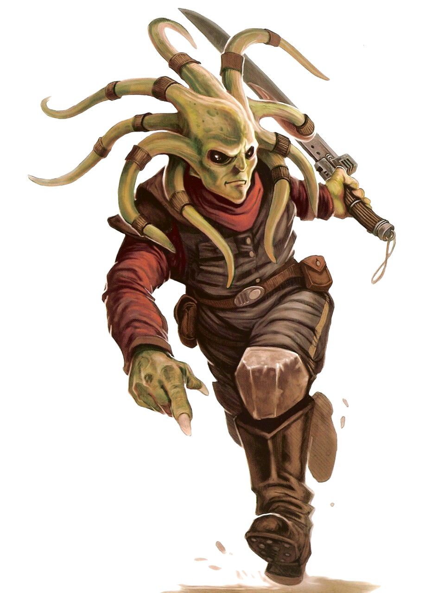

# Nautolan

#### Visual Characteristics

|:--|:--|
|***Skin Color***|Blue, brown, green, purple, or grey|
|***Hair Color***|None|
|***Eye Color***|Black, brown, or red|
|***Distinctions***|Extrasensory head tentacles capable of detecting chemicals|

#### Physical Characteristics

|:--|:--|:--:|
|***Height***|5'1"|+2d8"|
|***Weight***|120 lb.|x(2d4) lb.|

#### Sociocultural Characteristics

|:--|:--|
|***Homeworld***|Glee Anselm|
|***Language***|Nautila|

## Biology and Appearance
Nautolans possess physiology common to amphibious species, including low light vision and excellent swimming skills. Their bony endoskeleton and dense cartilage make them tough and resistant to glancing blows. An egg-laying species, Nautolans emerge from their egg as a tadpole that develops arms, legs, and head-tails during their second year of life. Roughly the same size as a Human infant during this time, their limbs are weak and unable to support their weight, forcing youthful Nautolans to remain in aquatic environments for much of their childhood. 

## Society and Culture
The society developed by the Nautolans on Glee Anselm is centralized around local families and governments. The centralized government of Glee Anselm is comprised of representatives from the Council of Elders that govern each settlement. Elders are elected on merit, and can be made up of youthful politicians as well as the most aged members of the society. A culture that promotes life-long mates, Nautolan families are characterized by their loyalty between spouses and the equality of the sexes in the household. Arranged marriages are not uncommon. 

No cultural affinity for the Force ever developed on Glee Anselm, though members of the Nautolan species recognize its importance and respected those among them that were Forceful.

## Names
Nautolan names are generally short and melodic. Female names usually end in a vowel. Surnames are familial.

**Male Names.** Brod, Knirkoc, Peng, Tikuwik, Zesufreat

**Female Names.** Doli, Hahi, Thamlymyo, Usha, Zezu

**Surnames.** Iarre, Rirrall, Sompanong, Uzumdall

## Nautolan Traits
As a Nautolan, you have the following special traits.

***Ability Score Increase***   Your Dexterity score increases by 2, and your Wisdom score increases by 1.

***Age***   Nautolans reach adulthood in their early teens and live about 70 years on average.

***Alignment***   Nautolans' benevolence cause them to tend toward the light side, though there are exceptions.

***Size***   Nautolans typically stand 5 to 6 feet tall and rarely weigh more than 160 lbs. Regardless of your position in that range, your size is Medium.

***Speed***   Your base walking speed is 30 feet.

***Acute Smell***   Whenever you make a Wisdom (Perception) check involving smell, you are considered to have expertise in the Perception skill.

***Amphibious***   You can breathe air and water.

***Darkvision***   Accustomed to life underwater, you have superior vision in low light conditions. You can see in dim light within 60 feet of you as if it were bright light, and in darkness as if it were dim light. You can’t discern color in darkness, only shades of gray.

***Hide***   You have a thick hide. While you are unarmored or wearing light armor, your AC is 12 + your Dexterity modifier. 

***Natural Empathy***   Nautolan head tentacles are adept at determining moods. You have advantage on Wisdom (Insight) checks to determine emotions against humanoids and beasts within 10 feet of you.

***Swim***   You have a swimming speed of 30 feet.

***Languages***   You can speak, read, and write Galactic Basic and Nautila. Nautila is unique in that it can only be properly pronounced underwater due to its use of pheromones in addition to spoken sounds. In any other environment, the language loses a great amount of detail; that nautolans find this annoying.
