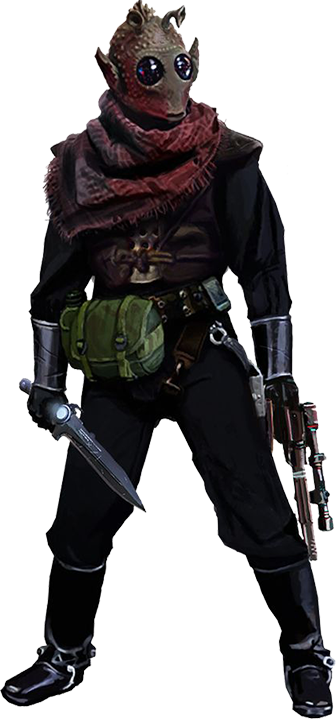

# Rodian

#### Visual Characteristics

|:--|:--|
|***Skin Color***|Blue, green, purple, turquoise, or yellow|
|***Hair Color***|None|
|***Eye Color***|Blue, black, green, purple, or red|
|***Distinctions***|Large and round pupil-less eyes, snouts, pointed ears, antennae, scaled and usually green skin|

#### Physical Characteristics

|:--|:--|:--:|:--:|
|***Height***|4'9"|+2d10"|
|***Weight***|115 lb.|x(2d4) lb.|

#### Sociocultural Characteristics

|:--|:--|
|***Homeworld***|Rodia|
|***Language***|Rodese|

## Biology and Appearence
The rodians are green-skinned humanoids from the planet Rodia. They possess distinctive faces: large, round, multifaceted eyes; tapir-like snouts; and a pair of saucer-shaped antennae on their heads, which served to detect vibrations. The flexible snouts augmented the rodians' finely tuned olfactory senses, collecting and filtering the air. Their characteristically large eyes indicated a primarily nocturnal ancestry and were capable of seeing into the infrared part of the spectrum. Due to their love of fighting and active lifestyles, most rodians kept in good condition, normally lean and wiry; however, some wealthy rodians became complacent and obese.

## Society and Culture
Rodian culture is obsessed with violence and death, due to behaviors and practices that are ingrained since their earliest ancestry. Their densely packed jungle homeworld is ill-suited for agriculture, requiring rodians to compete with vicious predators for most of their food, some of which can wipe out entire rodian villages. As the rodians developed cunning hunting tactics to survive, the hunt became central to their culture. Eventually, having driven most of the other predators on the planet to near extinction, they began to hunt each other in various wars and gladiatorial contests.

## Names
Female names tend to be longer than male names. Surnames are familial.

**Male Names.** Dagon, Dwedd, Gweym, Steech, Xeep

**Female Names.** Heebmu, Iissi, Teezle, Whunam

**Surnames.** Bluchosso, Encekserr, Gieeseaagg

## Rodian Traits
As a rodian, you have the following special traits.

***Ability Score Increase***   Your Dexterity score increases by 2, and your Constitution score increases by 1.

***Age***   Rodians reach adulthood in their late teens and live less than a century.

***Alignment***   Rodian culture's violent focus causes them to tend toward the dark side, though there are exceptions.

***Size***   Rodians typically stand 5 to 6 feet tall and weigh 160 lbs. Regardless of your position in that range, your size is Medium.

***Speed***   Your base walking speed is 30 feet.

***Adept Climbers***   You have a climbing speed of 30 feet.

***Darkvision***   Your vision can easily cut through darkness. You can see in dim light within 60 feet of you as if it were bright light, and in darkness as if it were dim light. You can’t discern color in darkness, only shades of gray.

***Keen Hearing and Smell***   You have advantage on Wisdom (Perception) checks that involve hearing or smell.

***Stalking Hunter***   You have proficiency in the Survival and Stealth skills.

***Languages***   You can speak, read, and write Galactic Basic and Rodese. Rodians can communicate with each other using pheromones. Force-sensitives can detect this communication, though they can’t understand it.
