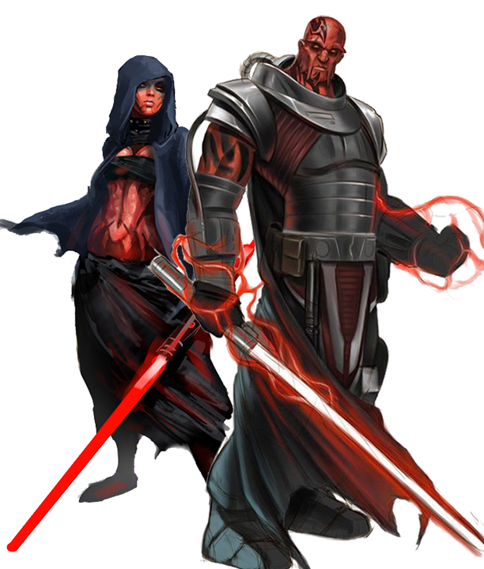

# Sith Pureblood
---
title:
parent: Species
grand_parent: Player's Handbook
---

#### Visual Characteristics

|:--|:--|
|***Skin Color***|Black or red|
|***Hair Color***|Black, brown, gray, red, or white|
|***Eye Color***|Orange, red, or yellow|
|***Distinctions***|Tentacle facial appendages, often wear jewelry or have tattoos, bone spurs|

#### Physical Characteristics

|:--|:--|:--:|
|***Height***|4'8"|+2d10"|
|***Weight***|110 lb.|x(2d4) lb.|

#### Sociocultural Characteristics

|:--|:--|
|***Homeworld***|Korriban|
|***Language***|Sith|

## Biology and Appearance
Sith are a proud and violent species of humanoids that evolved on Korriban, a planet within the Horuset system in an isolated Outer Rim region called the Stygian Caldera. Sith have a larger than average number of individuals with potential to use the Force in their species, so high in fact that the entire species was considered strongly Force-sensitive. 

Sith purebloods are characterized by their expressive facial appendages, bone spurs, cranial horns, and predatory gaze.

## Society and Culture
Sith culture is a rigid and stratified caste-based society. For the sith, war and violence are just as much a part of the natural order of life as peace or serenity. Though they are in an almost constant state of war, their civilization is quite sophisticated; they see these acts not as cruel or barbaric, but simply basic aspects of existence. Their constant warring led to a dwindling of the population on their original homeworld of Korriban as well as cultivated an intensely xenophobic society. 

## Names
Sith pureblood names are not conventional. They are often named for virtues in the Sith tongue. Sith rarely share surnames, since they do not value family ties. When a sith pureblood achieves a success or victory, they often change their name to match their perceived newfound status. Since Force-sensitivity is common in sith purebloods, and their culture is built around strength, most sith are called simply "My Lord," or some other epithet, by their underlings.

**Male Names.** Aqorzum, Khashai, Sihmot, Wirjol

**Female Names.** Aqurwia, Cliriu, Nupax, Ubhesosiuth

## Sith Pureblood Traits
As a sith pureblood, you have the following special traits.

***Ability Score Increase***   Your Charisma score increases by 2, and your Strength or Dexterity score increases by 1.

***Age***   Sith reach adulthood in their late teens and live less than a century.

***Alignment***   The cruelty of the Sith causes them to tend toward chaotic dark side, though there are exceptions.

***Size***   Sith generally stand between 5 and 6 feet tall and weigh less than 200 lbs. Regardless of your position in that range, your size is Medium.

***Speed***   Your base walking speed is 30 feet.

***Darkvision***   Your vision can easily cut through darkness. You can see in dim light within 60 feet of you as if it were bright light, and in darkness as if it were dim light. You can’t discern color in darkness, only shades of gray.

***Force-Sensitive***   You know the *denounce* at-will force power. When you reach 3rd level, you learn and can cast the *curse* force power once per long rest. When you reach 5th level, you learn and can cast the *bestow curse* force power once per long rest. Your forcecasting ability is Charisma for these powers.

***Keen Senses***   You have proficiency in the Perception skill.

***Menacing***   You have proficiency in the Intimidation skill.

***Languages***   You can speak, read, and write Galactic Basic and Sith. Sith is an agglutinative language, in which words or even phrases were made up of linears sequences of distinct meaningful units.
