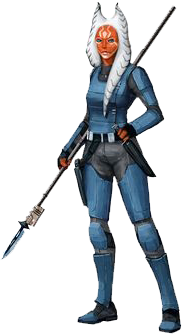

# Togruta

#### Visual Characteristics

|:--|:--|
|***Skin Color***|Blue, green, orange, purple, red, white, or yellow|
|***Hair Color***|None|
|***Eye Color***|Black, blue, green, orange, purple, yellow, or red|
|***Distinctions***|Sharp canine teeth, two montrals, three or four head-tails|

#### Physical Characteristics

|:--|:--|:--:|
|***Height***|4'9"|+2d8"|
|***Weight***|115 lb.|x(2d4) lb.|

#### Sociocultural Characteristics

|:--|:--|
|***Homeworld***|Shili|
|***Language***|Togruti|

## Biology and Appearence
Togruta have rusty skin tones ranging in hue from blue to red to green, with white pigmentation on their faces, greyish lips, and white stripes adorn various parts of their bodies. The pattern of stripes varies from individual to individual. This red and white pattern was a phenotype left over from their ancestor's camouflage that helped them to blend in with Shili's natural surroundings.

Their heads bear two montrals, with three to four head-tails, whose stripes were darker than those of the montrals. Togruta have the ability to sense the proximity and movement of physical objects around them by means of their hollow montrals, which detect space ultrasonically. Young togrutas' montrals and posterior head-tail do not fully grow until adolescence, when their montrals curve and their final head-tail grows to the length of their other head-tails.

## Society and Culture
Togruta have a strong sense of unity and togetherness. On their native homeworld of Shili, they rely on each other and  band together to take a stand against the massive monsters that hunt them. The creatures of Shili most often attack in groups, which was even more reason for the native togruta to work together. While most of Shili is covered in the scrublands where the togruta hunt their herbivorous prey, the togruta live in small communities in the forest valleys.

## Names
Togruta names are typically long. Surnames are familial.

**Male Names.** Acanaar, Mukraas, Obolak, Tokrym

**Female Names.** Akoma, Maasha, Okohlo, Shola

**Surnames.** Hyl, Na, Nim, Ris, Resh, Vaal, Zin

## Togruta Traits
As a togruta, you have the following special traits.

***Ability Score Increase***   Your Wisdom score increases by 2, and your Strength or Dexterity score increases by 1.

***Age***   Togruta reach adulthood in their late teens and live less than a century.

***Alignment***   Togruta culture focuses on unity which causes them to tend toward the light side, though there are exceptions.

***Size***   Togruta typically stand between 5 and 6 feet tall and weigh 150 lbs. Regardless of your position in that range, your size is Medium.

***Speed***   Your base walking speed is 30 feet.

***Mask of the Wild***   You can attempt to hide even when you are only lightly obscured by foliage, heavy rain, falling snow, mist, and other natural phenomena.

***Montral Reception***   You have tremorsense out to 30 feet. You can detect and pinpoint the origin of vibrations within a specific radius, provided that you and the source of the vibrations are in contact with the same ground or substance. Tremorsense can’t be used to detect flying or incorporeal creatures.

***Wild Hunters***   You have proficiency in the Survival skill.

***Languages***   You can speak, read, and write Galactic Basic and Togruti. Togruti is an ornate language characterized by trills and long vowel sounds which are modified by subtle tremors in the togruta’s head-tails. This language is heavily influenced by Basic, but also incorporates some native idioms, which cause Basic-speaking togruta to use seemingly strange expressions.
