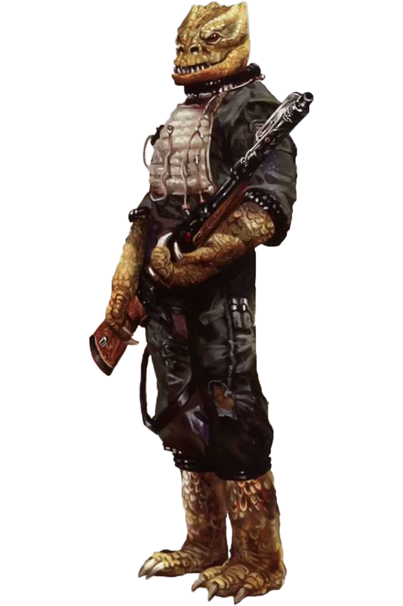

---
title:
parent: Species
grand_parent: Player's Handbook
---

# Trandoshan

#### Visual Characteristics

|:--|:--|
|***Skin Color***|Green, yellow, brown, orange, red|
|***Hair Color***|None|
|***Eye Color***|Yellow, orange|
|***Distinctions***|Reptilian, scaly skin, regenerative properties|

#### Physical Characteristics

|:--|:--|:--:|
|***Height***|5'5"|+2d12"|
|***Weight***|130 lb.|x(2d6) lb.|

#### Sociocultural Characteristics

|:--|:--|
|***Homeworld***|Trandosha|
|***Language***|Dosh|

## Biology and Appearance
Trandoshans are a large, bipedal sentient species, with scaly skin which was shed roughly once every standard year and was thought to be very durable. Cold-blooded reptiles, trandoshans had two super-sensitive varied color eyes with horizontal black pupils, which could see far into the infrared range. Each of their four limbs ends in three razor sharp claws. These are perfect for combat, but did not grant them manual dexterity, making a trandoshan's finger movements somewhat clumsy and awkward. 

## Society and Culture
Trandoshans worship their goddess, the Scorekeeper, whom they would appease through acts which increased their Jagannath points. This is done by living a lifestyle which was, by non-trandoshan standards, overtly aggressive, leading many trandoshans to become bounty hunters, mercenaries, or slavers. Trandoshans especially prize wookiee pelts, which consequently play a large part in earning Jagannath points-capturing the pelts of particularly infamous wookiees would give the hunter a large increase in Jagganath points. To be shamed or captured during a hunt would zero one's Jagganath points-effectively making their life forfeit in the eyes of the Scorekeeper. They could, however, win all those points back by killing the one who zeroed their score.

## Names
Trandoshan names are quite harsh and contain a lot of elongated sounds, as well as a lot of s's. Differences between male and female names are often very subtle, but there is a higher chance for female names to contain softer sounds.

**Male Names.** Bossk, Tshyrrng, Varrsk, Wuikkekss

**Female Names.** Aksa, Idwiks, Kluks, Mezuus, Shokss

**Surnames.** Dallosss, Druc, Groqisch, Hsac, Nausdot

## Trandoshan Traits
As a trandoshan, you have the following special traits.

***Ability Score Increase***   Your Strength score increases by 2, and your Wisdom score increases by 1.

***Age***   Trandoshans reach adulthood in their early teens and rarely live to be older than 70.

***Alignment***   Trandoshans tend toward the dark side, though there are exceptions.

***Size***   Trandoshans stand as tall as 7 and a half feet and can weigh over 300 lbs. Regardless of your position in that range, your size is Medium.

***Speed***   Your base walking speed is 30 feet.

***Claws***   Your claws are natural weapons, which you can use to make unarmed strikes. Additionally, your unarmed strikes deal 1d4 kinetic damage.

***Darkvision***   Your vision can easily cut through darkness. You can see in dim light within 60 feet of you as if it were bright light, and in darkness as if it were dim light. You can’t discern color in darkness, only shades of gray.

***Hide***   You have a thick hide. While you are unarmored or wearing light armor, your AC is 12 + your Dexterity modifier. 

***Regenerative***   When you take damage, you can use your reaction and expend a Hit Die to regain hit points as long as the damage would not reduce your hit points to 0.

***Saving Face***   Trandoshans are careful not to show weakness in front of their allies, for fear of losing status. If you miss with an attack roll or fail an ability check or a saving throw, you can gain a bonus to the roll equal to the number of allies you can see within 30 feet of you (maximum bonus of +5). Once you use this trait, you can’t use it again until you finish a short or long rest.

***Languages***   You can speak, read, and write Galactic Basic and Dosh. Dosh is characterized by its harsh grunts, hisses and growls, and its written form that used alphabetic glyphs.
