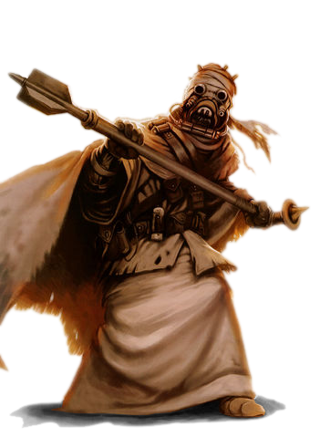

# Tusken

#### Visual Characteristics

|:--|:--|
|***Skin Color***|Brown, gray, or tan|
|***Hair Color***|Black|
|***Eye Color***|Pale gray or black|
|***Distinctions***|Full-body wrappings, goggles, mouth filter|

#### Physical Characteristics

|:--|:--|:--:|
|***Height***|4'9"|+2d8"|
|***Weight***|110 lb.|x(2d4) lb.|

#### Sociocultural Characteristics

|:--|:--|
|***Homeworld***|Tatooine|
|***Language***|Tusken|

## Biology and Appearance
While Tuskens, also known as Tusken Raiders or Sand People, are easily recognizable by their full-body clothing, goggles, and mouth filters, little of their true physical appearance can be discerned. From birth, Tuskens are covered in wraps, and, barring very rare occasions, will not bare any part of their skin in sight of another person. This, combined with their hostility to outsiders and Tatooine's remote and arid nature, makes even study of Tusken corpses difficult.

## Society and Culture
Tuskens are a primative, tribal race, mostly living in small clans scattered throughout Tatooine's deserts. Due to the harsh and unforgiving desert environment, Tusken clans are often xenophobic and territorial, but it is not unknown for them to adopt members of other species into the clan. They believe that all water is sacred and promised to them alone, and are infamous among the other residents of Tatooine for raiding and pillaging settlements and farms.

Tusken clans are usually very stratified, with males as hunters and warriors, while females and children maintain the camp. Tusken warriors hold their bond with their gaderffii weapons and Bantha mounts as sacred, and will choose death before relinquishing either.

## Names
Tusken naming traditions vary between clans, but most are made up of harsh, guttural sounds. Tuskens do not use surnames.

**Male Names.** Ur Ur, A'Koba, Qeruru'rr, Gr'Karr

**Female Names.** K'Yark, Reirin, K'Orou, Ursarr'u

## Tusken Traits
As a Tusken, you have the following special traits.

***Ability Score Increase***   Your Constitution score increases by 2, and your Strength or Charisma score increases by 1.

***Age***   Tuskens are considered adults when they turn 15. Because of the harsh and unforgiving climate of their home world, they rarely live longer than half a century.

***Alignment***   Tusken culture's violent focus and disregard of those outside the tribe causes them to tend towards chaotic dark side, though there are exceptions.

***Size***   Tusken stand between 5 and 6 feet tall and weigh around 155 lbs. Regardless of your position in that range, your size is Medium.

***Speed***   Your base walking speed is 30 feet.

***Aggressive***   As a bonus action, you can move up to your speed toward an enemy of your choice that you can see or hear. You must end this move closer to the enemy than you started.

***Animal Handler***   You have proficiency in the Animal Handling skill.

***Desert Protection***   You have advantage on saving throws against being blinded.

***Fearsome Roar***   Once per day, you can cast the *fear* force power. Charisma is your forcecasting ability for this power.

***Survivors of the Sands***   You have proficiency in the Survival skill. Additionally, you don’t treat desert terrain as difficult terrain. Lastly, you have advantage on Constitution saving throws made to avoid exhaustion due to extreme heat.

***Tech-Impaired***   While tuskens can figure out basic technology, they experience difficulty using more complex equipment like wristpads. You can not use tech powers or take levels in techcasting classes.

***Tusken Weaponry***   You have proficiency with the cycler rifle and vibroaxe.

***Languages***   You can speak Tusken, and speak, read, and write Galactic Basic. Tusken is a guttural language characterized by its barks, growls, and roars. While Tuskens typically understand Galactic Basic, it is rare to hear them speak anything but Tusken. Tusken has no written form. Tuskens also know a complex sign language used to communicate with other tuskens silently.
