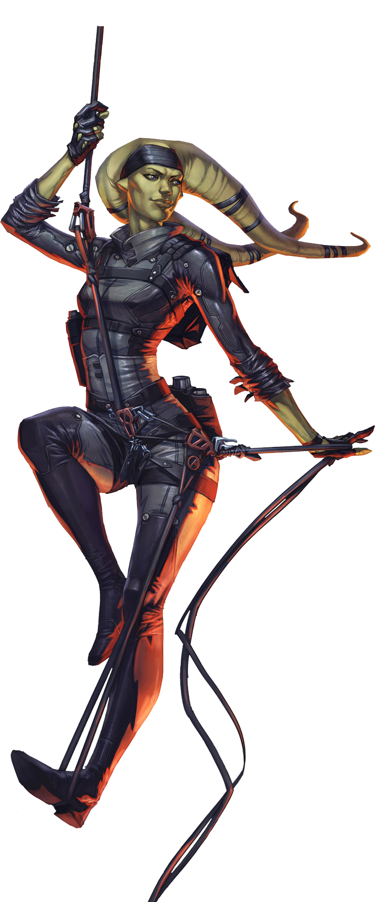

---
title:Twi'lek
parent: Species
grand_parent: Player's Handbook
---

# Twi'lek

#### Visual Characteristics

|:--|:--|
|***Skin Color***|Blue, brown, dark grey, green, orange, pink, purple, red, tan, teal, white, yellow, or striped|
|***Hair Color***|None|
|***Eye Color***|Black, blue, brown, green, hazel, orange, pink, purple, or yellow|
|***Distinctions***|Lekku, sharp claw-like nails, males often file their teeth to points|

#### Physical Characteristics

|:--|:--|:--:|
|***Height***|5'3"|+2d12"|
|***Weight***|125 lb.|x(2d4) lb.|

#### Sociocultural Characteristics

|:--|:--|
|***Homeworld***|Ryloth|
|***Language***|Twi'leki|

## Biology and Appearence
Twi'leks are usually thin, although corpulent individuals were known to exist. Twi'leks are omnivores; this diet is essential given that food is scarce on their homeworld, Ryloth. Twi'leks possess multiple stomachs, an unusual trait that enables them to eat almost any food. When traveling off their homeworld, twi'leks rarely refuse food, which frequently leads to obesity among starfarers. Twi'lek society also considers obesity as a sign of influence and success.

## Society and Culture
The natural grace and exotic beauty of the female twi'leks make them a popular target among slave traders. Slavery is the main currency of Ryloth. Some see it as a chance to make money by kidnapping or selling orphaned children, while others see slavery as a way of saving children from growing up in Ryloth's harsh environment. A number of twi'leks believe that slavery is an efficient way to proliferate their species and preserve their culture, as the twi'leks lack their own means of inter-planetary travel. Regardless of how it came about, many twi'leks live as slaves or entertainers and are considered status symbols, especially the females of rarer skin hues. Twi'leks that manage to escape from captivity usually turned to a life of thievery or prostitution, with both genders making use of their powers of seduction.

## Names
Twi'lek names combine their first name and a clan name into a single name, rather than having a separate surname.

**Male Names.** Ecrizsati, Gaj'mogos, Ukelweko

**Female Names.** Arag'mure, Oanicfuba, Unaecripi

## Twi'lek Traits
As a twi'lek, you have the following special traits.

***Ability Score Increase***   Your Charisma score increases by 2, and your Dexterity score increases by 1.

***Age***   Twi'leks reach adulthood in their late teens and live less than a century.

***Alignment***   Twi'leks harsh upbringing cause them to tend toward the dark side, though there are exceptions.

***Size***   Twi'leks stand between 5 and 7 feet tall and weigh up to 200 lbs. Regardless of your position in that range, your size is Medium.

***Speed***   Your base walking speed is 30 feet.

***Charismatic***   You have proficiency with Deception or Persuasion (your choice).

***Darkvision***   Your vision can easily cut through darkness. You can see in dim light within 60 feet of you as if it were bright light, and in darkness as if it were dim light. You can’t discern color in darkness, only shades of gray.

***Elegant Dancers***   You have proficiency in the Performance skill.

***Natural Antitoxins***   You have advantage on saving throws against poison and disease, and you have resistance against poison damage (explained in Chapter 9).

***Unarmed Combatant***   Your unarmed strikes deal 1d4 kinetic damage and have the finesse property.

***Languages***   You can speak, read, and write Galactic Basic and Twi’leki. You can communicate non-verbally with other twi’leks through a complex language of subtle head-tail motions.
