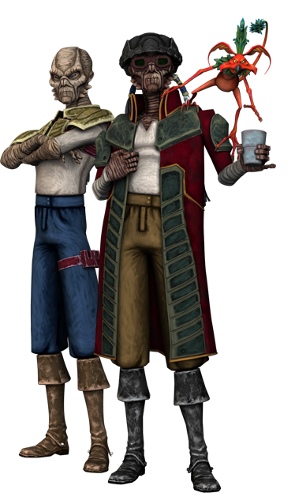

# Weequay

#### Visual Characteristics

|:--|:--|
|***Skin Color***|Brown, gray, red, or yellow|
|***Hair Color***|Black or blond|
|***Eye Color***|Black, gold, or gray|
|***Distinctions***|Tough, leathery skin that provided resistance to blasterfire|

#### Physical Characteristics

|:--|:--|:--:|
|***Height***|5'5"|+2d8"|
|***Weight***|120 lb.|x(2d4) lb.|

#### Sociocultural Characteristics

|:--|:--|
|***Homeworld***|Sriluur|
|***Language***|Sriluurian|

## Biology and Appearance
Weequays are humanoids with thick, leathery skin that ranges in color from tan to dark brown. Their faces are lipless, with a frill along each of their jowls.

## Society and Culture
Weequays have the ability to communicate with members of their own clan through smell by exuding complex pheromones. This pheromonal language can not be understood by any other species, or even by Weequays of another clan. Only Jedi senses can even tell that two Weequay are communicating. Since each Weequay's pheromones are unique, Weequay have no need for a name within their clan. As a result, speech is only a secondary form of communication for Weequay, and they seldom speak a whole sentence, resulting in Humans mistakenly believing the species to be unintelligent.

Male Weequay often tie their hair into a long braid each year spent away from their homeworld as a tribute to their home. When they returned, they shaved their braids. Weequays serving the Hutts were often very close to their homeworld, and would only have one or two braids. Female Weequay were usually bald, and did not follow this tradition.

## Names
Only Weequay who have to live among other clans, or among non-Weequay, take a personal name. Even then, some are simply referred to as "Weequay". In Weequay culture, individual identity is much less important than the clan. As long as the clan survives, a single Weequay is expendable. This results in a sometimes brutal culture.

**Male Names.** Chublu, Fah, Kreakk, Og-Rollo, Yurrenn

**Female Names.** Gila, Qommi, Palsa, Sex, Xelror

**Surnames.** Britreg, Dlur, Klanz, Maub, Semu

## Weequay Traits
As a weequay, you have the following special traits.

***Ability Score Increase***   Your Constitution score increases by 2, and your Wisdom or Charisma score increases by 1.

***Age***   Weequay reach adulthood in their late teens and live less than a century.

***Alignment***   Weequay ruthlessness and greed cause them to tend toward chaotic dark side, though there are exceptions.

***Size***   Weequay typically stand about 6 feet tall and weigh 150 lbs. Regardless of your position in that range, your size is Medium.

***Speed***   Your base walking speed is 30 feet.

***Keen Smell***   You have advantage on Wisdom (Perception) checks that rely on smell.

***Savage Attacks***   When you score a critical hit with a melee weapon attack, you can roll one of the weapon’s damage dice one additional time and add it to the extra damage of the critical hit.

***Tanned***   You have tough, leathery skin. While you are unarmored or wearing light armor, your AC is 13 + your Dexterity modifier. Additionally, You have advantage on Constitution saving throws made to avoid exhaustion due to extreme heat.

***Weapon Training***   You have proficiency in two vibroweapons or blasters of your choice.

***Languages***   You can speak, read, and write Galactic Basic and Sriluurian. You can communicate with other Weequay within 30 feet without speaking through use of pheromones. Force attuned individuals can detect the communication but can’t understand it.
