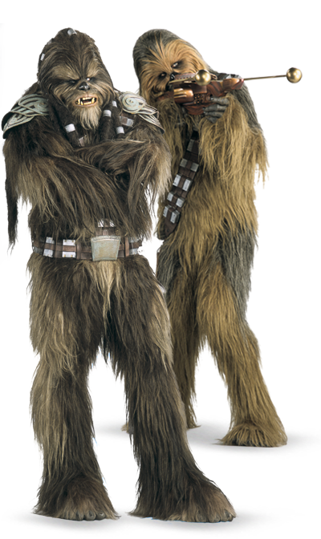

# Wookiee

#### Visual Characteristics

|:--|:--|
|***Skin Color***|Gray|
|***Hair Color***|Different shades of black, brown, and white in varying combinations|
|***Eye Color***|Blue, green, yellow, golden, brown, or red|
|***Distinctions***|Tall, hair covered, retractable climbing claws, long life spans|

#### Physical Characteristics

|:--|:--|:--:|
|***Height***|6'3"|+2d12"|
|***Weight***|190 lb.|x(2d6) lb.|

#### Sociocultural Characteristics

|:--|:--|
|***Homeworld***|Kashyyyk|
|***Language***|Shyriiwook|

## Biology and Appearance
Wookiees are a tall species of furry giants from the planet Kashyyyk, who can grow to a height of over eight feet. They are covered from head to toe in a thick, shaggy coat of hair with water-shedding properties that notably came in shades of brown, black, gray, and white. The species has two sexes, female and male. The latter grows long beards in adult life. Wookiee eye colors are usually blue, green, yellow, golden, brown, or red.

## Society and Culture
Wookiees greatly value honor and loyalty. Therefore, their notion of "family" encompassed much more than just blood ties. A part of that most sacred tradition was the social institution of life debt: when a wookiee's life was saved by someone else, regardless of the species, they would frequently devote themselves to a lifetime of service to their savior and their family. Through the mechanism of the life debt, the People of the Trees used to develop unbreakable bonds with their boon companions and true friends, forming a "honor family."

## Names
Wookiee names are diverse; some names are simple and short while others are long and complicated. The majority of names often have softer big sounds and more melodic tones to them. Since offworlders have trouble using wookiees' real names, they often adopt simpler nicknames to go by.

**Male Names.** Fubbodrrl, Gurrfupayyc, Kioerrr, Lavgaeffoak, Snrowbishutchuh, Zufiaarkaykkk

**Female Names.** Bulabba, Bonbaegnh, Hopakleupo, Keumnebheu, Onninh, Osstatiemmyock

## Wookiee Traits
As a wookiee, you have the following special traits.

***Ability Score Increase***   Your Strength score increases by 2, and your Constitution score increases by 1.

***Age***   Wookiees reach adulthood at about 40 and can live to be 400.

***Alignment***   Wookiees tend toward the light side, though there are exceptions.

***Size***   Wookiees tend to tower over other species, reaching heights over 8 feet and weighing 300 pounds. Regardless of your position in that range, your size is Medium.

***Speed***   Your base walking speed is 30 feet.

***Claws***   Your claws are natural weapons, which you can use to make unarmed strikes. Additionally, your unarmed strikes deal 1d4 kinetic damage.

***Darkvision***   Your vision can easily cut through darkness. You can see in dim light within 60 feet of you as if it were bright light, and in darkness as if it were dim light. You can’t discern color in darkness, only shades of gray.

***Hide***   You have a thick hide. While you are unarmored or wearing light armor, your AC is 13 + your Dexterity modifier. Additionally, you have advantage on Constitution saving throws made to avoid exhaustion due to extreme cold.

***Menacing***   You have proficiency in the Intimidation skill.

***Powerful Build***   Your carrying capacity and the weight you can push, drag, or lift doubles. If it would already double, it instead triples.

***Treeclimber***   You have a climbing speed of 30 feet. You have advantage on Strength saving throws and Strength (Athletics) checks that involve climbing.

***Languages***   You can speak, read, and write Shyriiwook. You can understand spoken and written Galactic Basic, but your vocal cords do not allow you to speak it.
