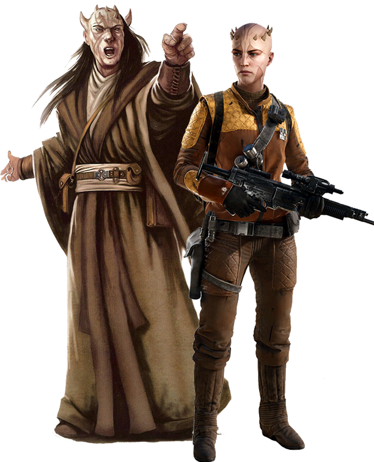

# Zabrak

#### Visual Characteristics

|:--|:--|
|***Skin Color***|Pale to dark brown, red, orange and yellow|
|***Hair Color***|Black, blonde, brown, red, or purple|
|***Eye Color***|Yellow, green, orange, brown, blue, red, or purple|
|***Distinctions***|Horns, two hearts, facial tattoos|

#### Physical Characteristics

|:--|:--|:--:|
|***Height***|5'1"|+2d12"|
|***Weight***|120 lb.|x(2d4) lb.|

#### Sociocultural Characteristics

|:--|:--|
|***Homeworlds***|Iridonia, Dathomir|
|***Language***|Zabraki|

## Biology and Appearance
Zabrak are near-human, but have a number of significant physical characteristics that set them apart from baseline Humanity. The most striking of these are a series of vestigial horns that crown the heads of both males and females. These horns grow at puberty in varying patterns and signified that their rite of passage is drawing near.

In addition to their horns, another of the traits that make zabrak instantly recognizable are their facial tattoos, which are made up of thin lines received during their rite of passage. These could symbolize many things, including but not limited to family lineage, place of birth, or even a design that reflected their individual personalities.

Lastly, zabraks possess a second heart.

## Society and Culture
Zabrak are often seen by most other species as being single-minded, an observation that is not terribly incorrect. This single-minded determination comes from the fact that they are a species with a strong sense of self-assuredness, confident that they are able to accomplish any task that they set out to do. However, this does not lead a zabrak to develop a sense of prideful superiority towards others. Though it is not uncommon to see competition between colonies, this is not seen as a negative. The zabraks believe that the various experiences of the different colonies only serve to add to the species' overall value throughout the galaxy.

## Names
Zabrak names are usually derived from the animals living on their planet. Zabraks don't use surnames.

**Male Names.** Kadro, Muraa, Neqama, Ruvroo, Xadra

**Female Names.** Blostopa, Mega, Novrar, Rebroke

## Zabrak Traits
As a zabrak, you have the following special traits.

***Ability Score Increase***   Your Constitution score increases by 2, and your Strength or Dexterity score increases by 1.

***Age***   Zabraks reach adulthood in their late teens and live less than a century.

***Alignment***   Zabraks tend toward no particular alignment. The best and worst are found among them.

***Size***   Zabraks stand anywhere from 5 to 7 feet tall and weigh up to 300 lbs. Regardless of your position in that range, your size is Medium.

***Speed***   Your base walking speed is 30 feet.

***Coercive***   You have proficiency with Persuasion or Intimidation (your choice).

***Crafters***   You have proficiency with one set of artisan’s implements of your choice.

***Second Heart***   When you are reduced to 0 hit points but not killed outright, you can drop to 1 hit point instead. You can’t use this feature again until you finish a long rest.

***Toughness***   Your hit point maximum increases by 1, and it increases by 1 every time you gain a level.

***Unarmed Combatant***   Your unarmed strikes deal 1d4 kinetic damage and have the finesse property.

***Languages***   You can speak, read, and write Galactic Basic and Zabraki.
