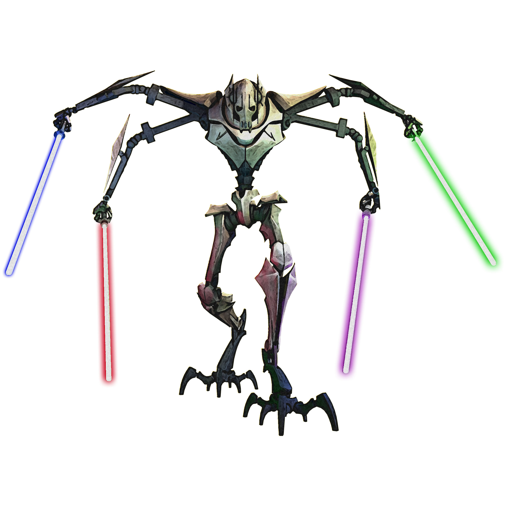

## Cyclone Approach

The Cyclone Approach empowers the berserker's ability to fight with weapons in each hand. Followers of this approach learn to move quickly to avoid attacks and can become a whirlwind of fury and steel, cleaving through hordes of enemies.

### Dual Wielder
_**Cyclone Approach:** 3rd level_ 
When you engage in Two-Weapon Fighting, you can add your Strength or Dexterity modifier (your choice) to the damage of your Two-Weapon Fighting attack as long as it doesn't already include that modifier.

### Double Swing
_**Cyclone Approach:** 3rd level_ 
Once on each of your turns when you miss with an attack while raging, you can immediately make a melee weapon attack with a weapon wielded in a different hand. 

### Twisting Winds
_**Cyclone Approach:** 6th level_ 
Your unpredictable movement makes you harder to hit and pin down. When you make a saving throw or ability checks to avoid being knocked prone, pushed, grappled, or restrained, you can add your Strength or Dexterity modifier (your choice).

### Mighty Leap
_**Cyclone Approach:** 10th level_ 
The distance you can jump is doubled, and you do not provoke attacks of opportunity if you leave a hostile creature's reach while jumping.

### Tornado
_**Cyclone Approach:** 14th and 17th level_ 
Once on each of your turns, you can become a tornado of attacks. When you take the Attack action on your turn, you can forgo one of your regular attacks to make a melee attack against any number of creatures within 5 feet of you, with a separate attack roll for each target. If you are wielding a separate melee weapon in each hand, each successful hit against a target deals damage equal to the damage dice of both weapons + your ability modifier + any other modifiers.

You can use this feature five times. You gain an additional use at 17th level. You regain all expended uses when you finish a short or long rest.
