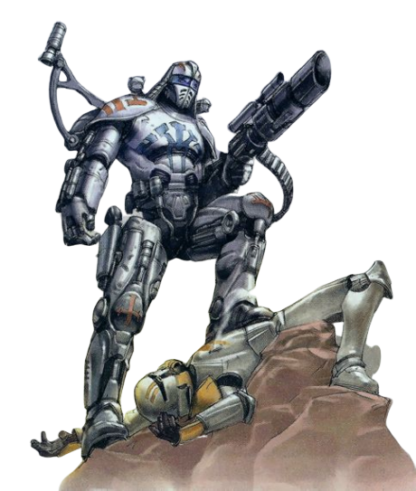

## Juggernaut Approach

Certain berserkers find that the strongest offense is a good defense. Berserkers of the Juggernaut Approach wear the heaviest of armor not because they fear injury, but to strike fear in their hapless attackers.

### Armored Brute
_**Juggernaut Approach:** 3rd level_ 
You've learned to fight in the heaviest of armors, using your weight to your advantage. You gain proficiency in heavy armor, you can enter a rage while wearing heavy armor, and you can gain the benefits of your Rage feature while wearing heavy armor. 

### Unstoppable Force
_**Juggernaut Approach:** 3rd level_ 
Your momentum makes you nigh unstoppable. While raging, you can move through a hostile creature's space regardless of that creature's size. When you do so, you must make a Strength (Athletics) check contested by the target's Strength (Athletics) check. If you move at least 10 feet before moving through a hostile creature's space, and that creature is your size or smaller, they have disadvantage on the check. If you succeed, you don't treat the movement as difficult terrain, the creature is pushed 5 feet in a direction of your choice, and you don't provoke opportunity attacks from that creature until the end of your turn.

### Raging Bulwark
_**Juggernaut Approach:** 6th level_ 
Your imposing form acts as a shield for your allies. When a friendly creature you can see is the target of a ranged attack, or forced to make a Dexterity saving throw, and you can see the source of the effect, you can use your reaction to move up to half your speed towards the friendly creature. You must end this move closer to the ally than you started. If you end this movement between your ally and the source of the effect, you provide cover for the attack.

Additionally, you provide three-quarters cover, instead of half-cover, to creatures of the same size category, and you provide full cover, instead of three-quarters cover, to creatures one size smaller than you.

### Overwhelming Cleave
_**Juggernaut Approach:** 10th level_ 
When you successfully push a creature into a surface or another creature while raging, the pushed creature takes kinetic damage equal to your Rage Damage. Additionally, the first time you hit with a melee weapon attack using Strength each turn, you can attempt to damage another creature with the same attack. Choose another creature within 5 feet of the original target and within your reach. If the original attack roll would hit the second creature, it takes damage equal to your Strength modifier. The damage is of the same type dealt by the original attack.

### Relentless Assault
_**Juggernaut Approach:** 14th level_ 
You're able to charge in unerring bursts. As an action, you can charge up to twice your speed in a straight line without provoking opportunity attacks. Each creature within 5 feet of your path must make a Strength or Dexterity saving throw (DC = 8 + your proficiency bonus + your Strength modifier, the target chooses the ability they use use). On a failed save, a creature takes damage equal to your Strength modifier + your Rage damage and, if it is no more than one size category larger than you, is pushed back 5 feet in a direction of your choice. Creatures smaller than you make this save with disadvantage. When you end this movement, if a creature is within 5 feet of you, you can make one melee weapon attack (no action required). On a hit, the creature takes additional damage equal to your berserker level.

Once you've used this feature, you must complete a short or long rest before you can use it again.
