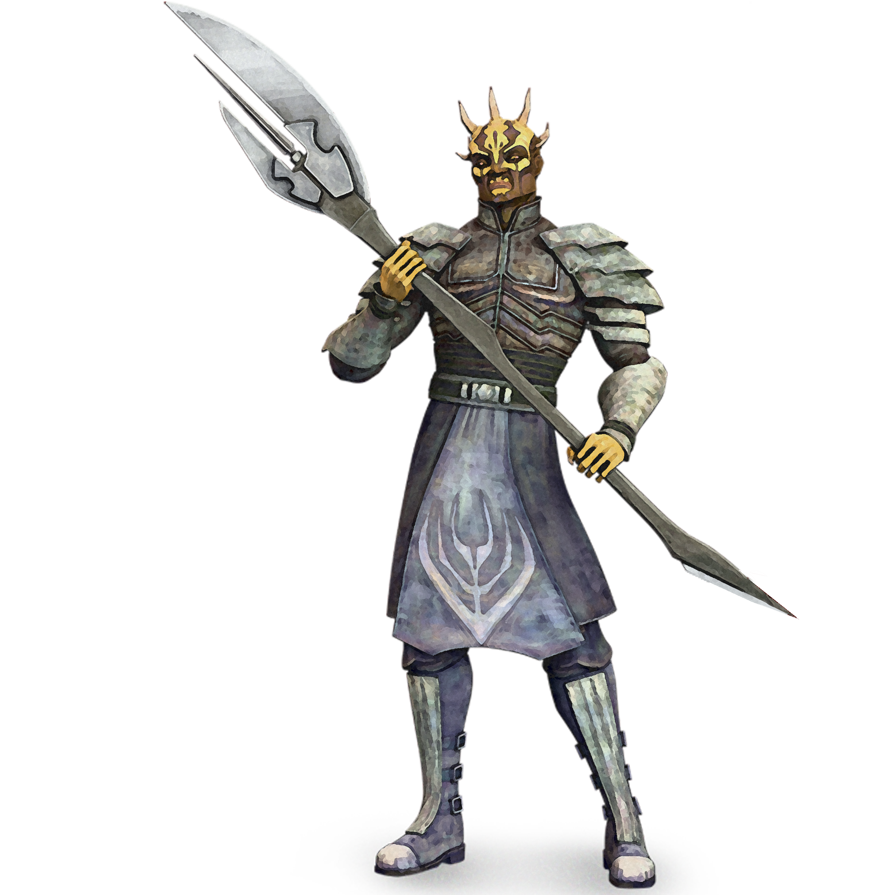

## Marauder Approach

Few things are more terrifying than being in the path of a Berserker who has learned the ways of the Force. Those who follow this path unlock something deep within them, a well of untamed power from the depths of their fury. When a marauder unleashes their rage, they channel their brute strength into primal might, and uses it to devastate his foes in a hail of fire, blades, and blood. Due to the uncontrolled nature of their powers, marauders have a dangerous predilection for the strength and raw power offered by the dark side, and many fall into it's clutches. Even those who do not are always temped by the voices of fury barely contained within.

### Forcecasting
_**Marauder Approach:** 3rd level_ 
You have derived powers from your primal connection to the Force. See chapter 10 for the general rules of forcecasting and chapter 11 for the force powers list.

#### Force Powers Known
You learn 4 force powers of your choice, and you learn more at higher levels, as shown in the Force Powers Known column of the Marauder Approach Forcecasting table. You may not learn a force power of a level higher than your Max Power Level, and you may learn a force power at the same time you learn its prerequisite.

#### Force Points
You have a number of force points equal to your berserker level, as shown in the Force Points column of the Marauder Approach Forcecasting table, + your Wisdom or Charisma modifier (your choice). You use these force points to cast force powers. You regain all expended force points when you finish a long rest.

#### Max Power Level
Many force powers can be overpowered, consuming more force points to create a greater effect. You can overpower these abilities to a maximum level, which increases at higher levels, as shown in the Max Power Level column of the Marauder Approach Forcecasting table.

You may only cast force powers at 4th-level once. You regain the ability to do so after a long rest.

#### Forcecasting Ability
Your forcecasting ability varies based on the alignment of the powers you cast. You use Wisdom for light side powers, Charisma for dark side powers, and Wisdom or Charisma for universal powers (your choice). You use this ability whenever a power refers to your forcecasting ability. Additionally, you use this ability modifier when setting the saving throw DC for a force power you cast and when making an attack roll with one.

___

**Force save DC** = 8 + your proficiency bonus + your forcecasting ability modifier

___

**Force attack modifier** = your proficiency bonus + your forcecasting ability modifier

___

##### Marauder Forcecasting

| Level | Force Powers  Known | Force  Points | Max Power  Level |
|:---:|:---:|:---:|:---:|
| 3rd| 4| 3|1st|
| 4th| 6| 4|1st|
| 5th| 7| 5|1st|
| 6th| 8| 6|1st|
| 7th|10| 7|2nd|
| 8th|11| 8|2nd|
| 9th|12| 9|2nd|
|10th|13|10|2nd|
|11th|14|11|2nd|
|12th|15|12|2nd|
|13th|17|13|3rd|
|14th|18|14|3rd|
|15th|19|15|3rd|
|16th|20|16|3rd|
|17th|22|17|4th|
|18th|23|18|4th|
|19th|24|19|4th|
|20th|25|20|4th|

### Furious Force
_**Marauder Approach:** 3rd level_ 
You can cast force powers while raging as long as the power's casting time is no more than 1 action, the power does not require concentration, and you are not wearing heavy armor. While raging, you add your rage damage to damage rolls from force powers you cast that require a force attack or saving throw. If a force power damages more than one target, you may only apply your rage damage to one of them. 

Casting force powers during rage counts as attacking for the purposes of maintaining rage, and you can use your Reckless Attack feature to gain advantage when casting a force power that requires a force attack.

<!--- image here  

 --->

### Reckless Power
_**Marauder Approach:** 6th level_ 
Weapons and the force are equally an extension of your rage. While you are raging and you use your action to cast a force power, you can make a single melee weapon attack as a bonus action.

### Powerful Presence
_**Marauder Approach:** 10th level_ 
As a bonus action, you unleash a battle cry infused with force energy. Choose up to ten other creatures of within 60 feet of you that can hear you. Friendly creatures have advantage on attack rolls and saving throws until the start of your next turn, and hostile creatures have disadvantage on attack rolls and saving throws until the end of your next turn.

Once you've used this feature, you can't use it again until you finish a long rest.

### Force Storm
_**Marauder Approach:** 14th level_ 
You can expel the might of your rage all at once to unleash a devastating storm of force energy. As an action, you can end your rage early, forcing each creature within 15 feet of you to make a Dexterity saving throw against your universal force save DC. On a failed save, a creature takes 1d12 force damage for each round you've spent in rage, or half as much on a successful one. 
