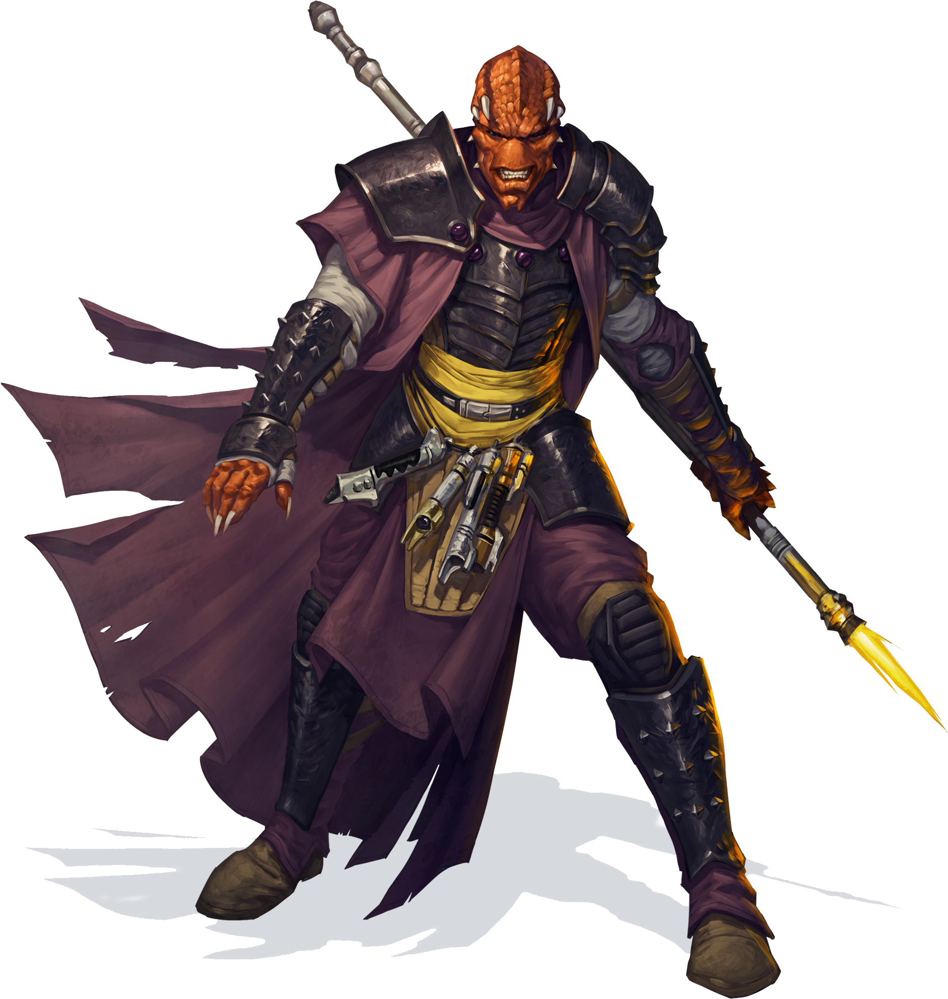

# Berserker

A massive wookiee hunter prowls through the forest, hefting his vibroaxe. With a roar he charges at the pair of trandoshans who dared poach his kin. 

A gamorrean snarls at the latest challenger to his authority over their savage tribe, ready to break his neck with his bare hands as he did to the last six rivals. 

Frothing at the mouth, a nikto slams his helmet into the face of his foe, then turns to drive his armored elbow into the gut of another.

These berserkers, different as they might be, are defined by their rage: unbridled, unquenchable, and unthinking fury. More than a mere emotion, their anger is the ferocity of a cornered predator, the unrelenting assault of a storm, the churning turmoil of the sea. For every berserker, rage is a power that fuels not just a battle frenzy but also uncanny reflexes, resilience, and feats of strength.

## Primal Instinct
People of towns and cities take pride in how their civilized ways set them apart from animals, as if denying one's own nature was a mark of superiority. To a berserker, though, civilization is no virtue, but a sign of weakness. The strong embrace their animal nature keen instincts, primal physicality, and ferocious rage. Berserkers are uncomfortable when hedged in by walls and crowds. They thrive where the civilized don't.

Berserkers come alive in the chaos of combat. They can enter a berserk state where rage takes over, giving them superhuman strength and resilience. A berserker can draw on this reservoir of fury only a few times without resting, but those few rages are usually sufficient to defeat whatever threats arise.

## A Life of Danger
Not every person deemed "berserkers" by scions of civilized society has the berserker class. A true berserker among these people is as uncommon as a skilled fighter in a town, and he or she plays a similar role as a protector of the people and a leader in times of war. Life in the wild places of the world is fraught with peril: rival tribes, deadly weather, and terrifying monsters. Berserkers charge headlong into that danger so that their people don't have to.

Their courage in the face of danger makes berserkers perfectly suited for adventuring. Wandering is often a way of life for their native tribes, and the rootless life of the adventurer is little hardship for a berserker. Some berserkers miss the close-knit family structures of the tribe, but eventually find them replaced by the bonds formed among the members of their adventuring parties.

<!--- image here  --->

## Creating a Berserker
When creating a berserker character, think about where your character comes from and his or her place in the world. Talk with your GM about an appropriate origin for your berserker. Did you come from a remote planet, making you a stranger in the area of the campaign? Or is the campaign set in a rough-and-tumble frontier where berserkers are common?

What led you to take up the adventuring life? Were you lured to settled planets by the promise of riches? Did you join forces with soldiers of those lands to face a shared threat? Did monsters or an invading horde drive you out of your homeland, making you a rootless refugee? Perhaps you were a prisoner of war, brought in chains to "civilized" lands and only now able to win your freedom. Or you might have been cast out from your people because of a crime you committed, a taboo you violated, or a coup that removed you from a position of authority.

### Quick Build
You can make a berserker quickly by following these suggestions. First, put your highest ability score in Strength, followed by Constitution. Second, choose the mercenary background.

## The Berserker

|	Level	|	Proficiency  Bonus	|	Features	|	Rages	|	Rage  Damage	| Berserker  Instincts |
|	:--:	|	:--:	|	:--	|	:--:	|	:--:	| :--: |
|	 1st	|	+2	|	Rage, Unarmored Defense     	        |	2	|	+2	| - |
|	 2nd	|	+2	|	Reckless Attack, Berserker Instincts	|	2	|	+2	| 2 |
|	 3rd	|	+2	|	Danger Sense, Berserker Approach        |	3	|	+2	| 2 |
|	 4th	|	+2	|	Ability Score Improvement   	        |	3	|	+2	| 2 |
|	 5th	|	+3	|	Extra Attack                            |	3	|	+2	| 2 |
|	 6th	|	+3	|	Approach feature                	    |	4	|	+2	| 2 |
|	 7th	|	+3	|	Feral Impulse	                        |	4	|	+2	| 3 |
|	 8th	|	+3	|	Ability Score Improvement   	        |	4	|	+2	| 3 |
|    9th	|	+4	|	Brutal Critical (one die)	            |	4	|	+3	| 3 |
|	10th	|	+4	|	Approach feature	                    |	4	|	+3	| 3 |
|	11th	|	+4	|	Relentless Rage	                        |	4	|	+3	| 3 |
|	12th	|	+4	|	Ability Score Improvement   	        |	5	|	+3	| 3 |
|	13th	|	+5	|	Brutal Critical (two dice)    	        |	5	|	+4	| 4 |
|	14th	|	+5	|	Approach feature                	    |	5	|	+4	| 4 |
|	15th	|	+5	|	Persistent Rage	                        |	5	|	+4	| 4 |
|	16th	|	+5	|	Ability Score Improvement   	        |	5	|	+4	| 4 |
|	17th	|	+6	|	Brutal Critical (three dice)	        |	6	|	+5	| 5 |
|	18th	|	+6	|	Indomitable Might           	        |	6	|	+5	| 5 |
|	19th	|	+6	|	Ability Score Improvement   	        |	6	|	+5	| 5 |
|	20th	|	+6	|	Primal Champion	                        | Unlimited	|	+5	| 5 |

## Class Features
As a berserker, you gain the follow class features.

### Hit Points
- **Hit Dice:** 1d12 per berserker level
- **Hit Points at 1st Level:** 12 + your Constitution modifier
- **Hit Points at Higher Levels:** 1d12 (or 7) + your Constitution modifier per berserker level after 1st

### Proficiencies
- **Armor:** Light armor, medium armor
- **Weapons:** All vibroweapons, simple blasters
- **Tools:** None
- **Saving Throws:** Strength, Constitution
- **Skills:** Choose two from Animal Handling, Athletics, Intimidation, Nature, Perception, Survival

### Equipment
You start with the following equipment, in addition to the equipment granted by your background:
- *(a)* a vibroweapon and a light or medium physical shield or *(b)* two vibroweapons
- *(a)* two techaxes or *(b)* two vibrospears
- *(a)* a dungeoneer's pack or *(b)* an explorer's pack

### Variant: Starting Wealth 
In lieu of the equipment granted by your class and background, you can elect to purchase your starting gear. If you do so, you receive no equipment from your class and background, and instead roll for your starting wealth using the criteria below:

|	&emsp;&emsp;Class		|	Funds&emsp;&emsp;	|
|	:--			|	--:			|
|   &emsp;Berserker |   5d4 x 100 cr&emsp;  |

### Rage
_**Berserker:** 1st level_ 
In battle, you fight with primal ferocity. On your turn, you can enter a rage as a bonus action if you aren't wearing heavy armor.

While raging, you gain the following benefits:
- You have advantage on Strength checks and Strength saving throws.
- When you make a melee weapon attack using Strength, you gain a bonus to the damage roll that increases as you gain levels as a berserker, as shown in the Rage Damage column of the berserker table.
- You have resistance to kinetic and energy damage.

If you are able to cast powers, you can't cast them or concentrate on them while raging.

Your rage lasts for 1 minute. It ends early if you are knocked unconscious, you don heavy armor, or if your turn ends and you haven't taken a hostile action or taken damage since your last turn. You can also end your rage on your turn as a bonus action.

You can enter a rage a number of times as shown in the Rages column of the berserker table. You regain all expended uses when you complete a long rest.

### Unarmored Defense
_**Berserker:** 1st level_ 
While you are not wearing any armor, your Armor Class equals 10 + your Dexterity modifier + your Constitution modifier. You can use a shield and still gain this benefit.

### Reckless Attack 
_**Berserker:** 2nd level_ 
You can throw aside all concern for defense to attack with fierce desperation. When you make your first attack on your turn, you can decide to attack recklessly. Doing so gives you advantage on melee weapon attack rolls using Strength during this turn, but attack rolls against you have advantage until your next turn.

### Berserker Instincts
_**Berserker:** 2nd level_ 
You've honed two instincts, as detailed at the end of the class description, and you hone more at higher levels, as shown in the Berserker Instincts column of the berserker table.

### Danger Sense
_**Berserker:** 3rd level_ 
You gain an uncanny sense of when things nearby aren't as they should be, giving you an edge when you dodge away from danger. You have advantage on Dexterity saving throws against effects that you can see, such as traps and powers. To gain this benefit, you can't be blinded, deafened, or incapacitated.

### Berserker Approach
_**Berserker:** 3rd, 6th, 10th, and 14th level_ 
You choose an approach that shapes the nature of your rage which is detailed at the end of the class description. 

### Ability Score Improvement
_**Berserker:** 4th, 8th, 12th, 16th, and 19th level_ 
You can increase one ability score by 2, or you can increase two ability scores by 1. You can't increase an ability score above 20 using this feature.

### Extra Attack
_**Berserker:** 5th level_ 
You can attack twice, instead of once, whenever you take the Attack action on your turn.

### Feral Impulse
_**Berserker:** 7th level_ 
Your instincts are so honed that you have advantage on initiative checks.

Additionally, if you are surprised at the start of combat and aren't incapacitated, you can act normally on your first turn, but only if you enter your rage before doing anything else on that turn.

### Brutal Critical
_**Berserker:** 9th, 13th, and 17th level_ 
You can roll one additional weapon damage die when determining the extra damage for a critical hit with a melee attack. 

This increases to two additional dice at 13th level and three additional dice at 17th level.

### Relentless Rage
_**Berserker:** 11th level_ 
Your rage can keep you fighting despite grievous wounds. If you drop to 0 hit points while you're raging and don't die outright, you can make a DC 10 Constitution saving throw. If you succeed, you drop to 1 hit point instead. Each time you use this feature after the first, the DC increases by 5. When you finish a short or long rest, the DC resets to 10.

### Persistent Rage
_**Berserker:** 15th level_ 
Your rage is so fierce that it ends early only if you fall unconscious or if you choose to end it.

### Indomitable Might
_**Berserker:** 18th level_ 
If your total for a Strength check is less than your Strength score, you can use that score in place of the total.

### Primal Champion
_**Berserker:** 20th level_ 
You embody the power of the wilds. Your Strength or Dexterity score increases by 2, and your Constitution score increases by 2. Your maximum for those scores increases by 2.

Additionally, you can enter rage an unlimited number of times, and entering rage no longer requires your bonus action on your turn.

## Berserker Instincts
The instincts are presented in alphabetical order. 

### Acklay's Instinct
While raging, you have advantage on Constitution saving throws.

### Bantha's Instinct
_**Prerequisite:** 7th level_ 
Your carrying capacity and the weight you can push, drag, or lift doubles. If it would already double, it instead triples. Additionally, you have advantage on Strength checks made to push, pull, lift, or break objects.

### Blurrg's Instinct
Whether mounted or on foot, your travel pace is doubled, as is the travel pace of up to ten companions while they're within 60 feet of you and you're not incapacitated. 

### Boggdo's Instinct
_**Prerequisite:** 13th level_ 
While raging you have a flying speed equal to your current walking speed, though you fall if you end your turn in the air and nothing else is holding you aloft.

### Chirodactyl's Instinct
_**Prerequisite:** 7th level_ 
While raging, you have blindsight to a range of 30 feet, and you have advantage on Wisdom (Perception) checks that rely on sound, as long as you aren't deafened.

### Dewback's Instinct
Choose three damage types other than true damage. While raging, you have resistance to the chosen damage types.

### Fighter's Instinct
You adopt a particular style of fighting as your specialty. Choose one of the Fighting Style options, detailed in Chapter 6. 

### Fyrnock's Instinct
While raging, you can use your bonus action to leap up to 30 feet to an empty space you can see. When you land you deal kinetic damage equal to your Strength modifier to each creature within 5 feet of where you land. You can use this feature twice. You gain an additional use at 5th, 9th, 13th, and 17th level. You regain all expended uses when you complete a long rest.

### Hawk's Instinct
_**Prerequisite:** 7th level_ 
You can see up to 1 mile away with no difficulty. You are able to discern even fine details as though looking at something no more than 100 feet away from you. Additionally, dim light doesn't impose disadvantage on your Wisdom (Perception) checks.

### Katarn's Instinct
You gain a climbing speed equal to your movement speed.

### Loth-cat's Instinct
While you're raging, other creatures have disadvantage on opportunity attack rolls against you, and you can take the Dash action as a bonus action on your turn.

### Predator's Instinct
Your speed increases by 10 feet.

### Rancor's Instinct
_**Prerequisite:** 13th level_ 
While you're raging any creature within 5 feet of you that's hostile to you has disadvantage on attack rolls against targets other than you or another character with this feature. An enemy is immune to this effect if it can't see or hear you or if it can't be frightened.

### Tactician's Instinct
When you use your Reckless Attack feature, you can choose to not have advantage on your attack rolls this turn. If you do so, friendly creatures within 5 feet of a hostile creature that is within 5 feet of you have advantage on attack rolls against that creature.

### Tracker's Instinct
_**Prerequisite:** 7th level_ 
You can track other creatures while traveling at a fast pace, and you can move stealthily while traveling at a normal pace.

### Terentatek's Instinct
_**Prerequisite:** 13th level_ 
When you are forced to make a saving throw against a force power, you can immediately use your reaction to move up to half your speed towards the source power's caster. If you end this movement within 5 feet of the target, you can immediately make one melee weapon attack against the target as a part of that reaction.

### Varactyl's Instinct
_**Prerequisite:** 13th level_ 
While raging, you have advantage on Dexterity checks, your attack rolls can't suffer from disadvantage, and each slowed level only reduces your speed by 5 feet, unless it would reduce your speed to 0.
