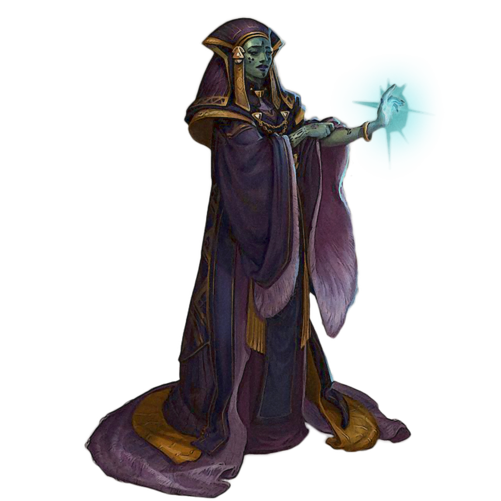

## Way of Balance

There is serenity in balance, and no one knows this better than the consular. Those consulars who follow the Way of Balance focus on utilizing the Force to equalize the battlefield. They bend the Force to shield their allies and expose their foes.

### Force Barrier
_**Way of Balance:** 3rd level_ 
You can weave the Force around yourself for protection. When you cast a universal power of 1st level or higher, you can simultaneously manipulate the Force to create a barrier on yourself that lasts until you finish a long rest. The barrier has hit points equal to twice your consular level + your Wisdom or Charisma modifier (your choice). Your barrier can never have hit points greater than twice your consular level + your Wisdom or Charisma modifier (your choice).

Whenever you take damage, the barrier takes the damage instead. If this damage reduces the barrier to 0 hit points, you take any remaining damage.

While the barrier has 0 hit points, it can't absorb damage, but its power remains. Whenever you cast a universal power of 1st level or higher, the barrier regains a number of hit points equal to twice the level of the power.

Once you create the barrier, you can't create it again until you finish a long rest.

### Projected Barrier
_**Way of Balance:** 6th level_ 
When a creature that you can see within 30 feet of you takes damage, you can use your reaction to cause your Force Barrier to absorb that damage. If this damage reduces the barrier to 0 hit points, the warded creature takes any remaining damage.

### At-Will Barrier
_**Way of Balance:** 10th level_ 
Your at-will universal powers grant a small boost to your Force Barrier. When you cast an at-will universal power, the barrier regains 1 hit point. You can't restore your barrier above half its maximum hit points in this way.

### Improved Suppression
_**Way of Balance:** 14th level_ 
When you cast a force power that requires you to make an ability check as a part of casting that power, such as *sever force* or *force suppression*, you add your proficiency bonus to that ability check.

### Force Resistance
_**Way of Balance:** 18th level_ 
You have advantage on saving throws against force powers. Additionally, you have resistance against the damage of force powers.
