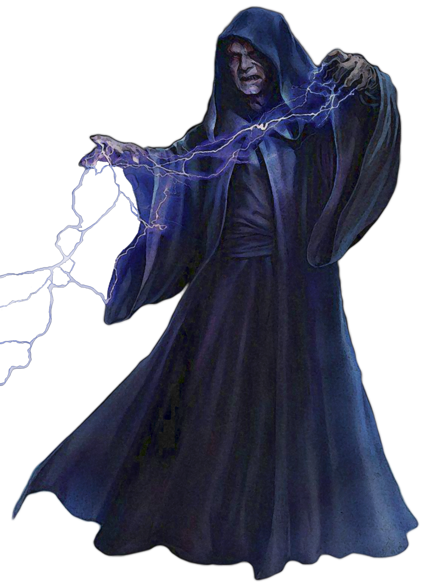

## Way of Lightning

Of all of the dark arts of the Force, little can match the spectacle and devastation of Force lightning. Those consulars who follow the Way of Lightning summon intense discharges of pure Force energy, overwhelming enemies with punishing damage from a distance, leaving them shaken and vulnerable -- if not dead.

### Shocking Affinity
_**Way of Lightning:** 3rd level_ 
When you cast a force power that deals lightning damage, you can use Wisdom or Charisma as your forcecasting ability for it.

Additionally, when you cast a damage-dealing force power that requires a force attack or saving throw, you can cause that power to instead deal lightning damage. If the power would call for a saving throw other than Dexterity, it instead calls for a Dexterity saving throw. If you hit with the power, or the target fails the power's saving throw, affected creatures become *shocked* until the start of your next turn. You can use this feature twice. You gain an additional use at 5th, 9th, 13th, and 17th level. You regain all expended uses when you finish a short or long rest.

### Potent Lightning
_**Way of Lightning:** 6th level_ 
You add your governing ability modifier (minimum of +1) to any damage you deal with force powers that deal lightning damage that don't already include that modifier.

### Blistering Rebuke
_**Way of Lightning:** 10th, 13th, and 17th level_ 
When a creature within 5 feet of you that you can see hits you with an attack, you can use your reaction to cause the creature to make a Dexterity saving throw against your universal force save DC. On a failed save, the creature takes 1d10 plus your consular level lightning damage, is pushed back 10 feet, and becomes *shocked* until the end of their next turn. On a successful save, the creature takes half as much damage and isn't moved or *shocked*.

You can use this feature four times. You gain an additional use at 13th and 17th level. You regain all expended uses when you finish a long rest.

### Electric Attunement
_**Way of Lightning:** 14th level_ 
You gain resistance to lightning damage, and force powers you cast ignore resistance to lightning damage.

### Unlimited Power
_**Way of Lightning:** 18th level_ 
You can increase the power of your simpler lightning force powers. When you cast a force power of 1st through 6th level that deals lightning damage, you can deal maximum damage with that power.

You can use this feature with no adverse effects a number of times equal to your proficiency bonus, as shown in the consular table. If you use this feature beyond this before you finish a long rest, you take 2d12 true damage for each level of the power, immediately after you cast it. Each time you use this feature again before finishing a long rest, the damage increases by 1d12. 
