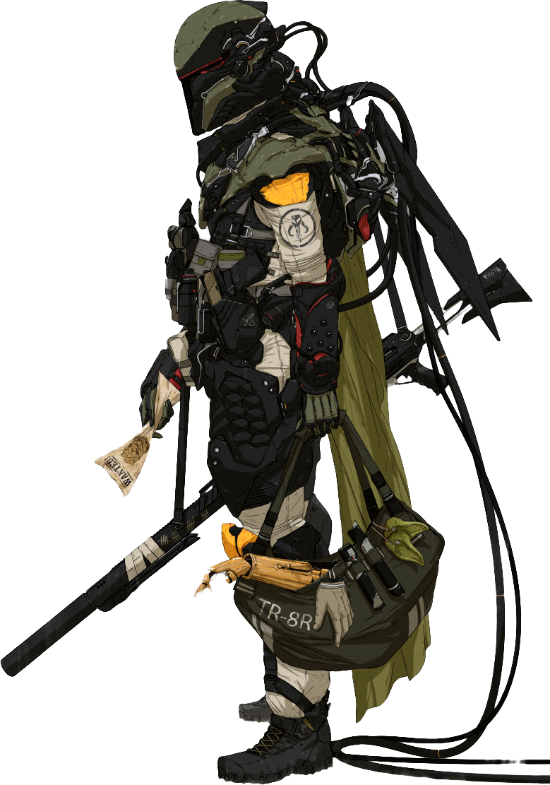

## Armormech Engineering

Those engineers who choose the Armormech Engineering discipline focus on the ability to work with hard metals and electronic shielding to construct and enhance all types of personal armor.

### Bonus Proficiencies
_**Armormech Engineering:** 3rd level_ 
You gain proficiency in armormech's implements, medium armor, and heavy armor. Additionally, when you engage in crafting with armormech's implements, the rate at which you craft doubles.

### Modified Armor
_**Armormech Engineering:** 3rd level_ 
You learn to modify one unenhanced suit of armor or shield utilizing your armormech knowledge. Over the course of a long rest, you can modify one suit of armor or a shield. You must have the armor or shield and armormech's implements in order to perform this modification.

Your modified armor or shield is enhanced, requires attunement, can only be used by you, and counts as a tech focus for your tech powers while you are attuned to it. Your modified armor has 4 modification slots, and it gains more at higher levels, as shown in the Modification Slots column of the engineer table. For each modification installed in excess of your proficiency bonus, your tech point maximum is reduced by 1. Over the course of a long rest, you can install, replace, or remove a number of modifications up to your Intelligence modifier (minimum of one).

Some modification effects require saving throws. When you use such an effect from this class, the DC equals your tech save DC.

At 9th level, you can maintain both a modified suit of armor and shield. Each modified item has modification slots as shown in the Modification Slots column of the engineer table.

### Damage Absorption
_**Armormech Engineering:** 3rd level_ 
When you take damage, you can use your reaction and expend one use of your Potent Aptitude to absorb some of that damage. When you do so, the damage you take from the attack is reduced by the amount rolled on the die + your Intelligence modifier (minimum of +1). You must be wearing your modified armor or wielding your modified shield to gain this benefit.

### Extra Attack
_**Armormech Engineering:** 6th level_ 
You can attack twice, instead of once, whenever you take the Attack action on your turn. You must be wearing your modified armor or wielding your modified shield to gain this benefit.

### Armormech's Celerity
_**Armormech Engineering:** 14th and 17th level_ 
When you take the Attack action or use your action to a cast a tech power of 1st-level or higher, you can make one weapon attack as a bonus action.

You can use this feature five times. You gain an additional use at 17th level. You regain all expended uses when you complete a long rest.

### Suit Reliability
_**Armormech Engineering:** 18th level_ 
Your suit is like a second skin. Ability checks and saving throws you make that use Strength, Dexterity, or Constitution gain a minimum roll threshold, discussed in chapter 7. You must be wearing your modified armor or wielding your modified shield to gain this benefit.

___

## Armormech Modifications
The modifications are presented in alphabetical order.

### Absorption Shield
_**Prerequisite:** Physical Shield_ 
You modify your physical shield to block incoming damage. As a bonus action you can activate this ability and gain temporary hit points equal to 1d4 + Intelligence modifier, which last for one hour.

You can use this feature twice. You gain an additional use at 5th, 9th, 13th, and 17th level. You regain any expended uses when you finish a long rest.

### Accelerated Movement
_**Prerequisite:** Armor_ 
You reduce the weight of your modified armor's bulk and increase the power to joints. If the armor has a Strength requirement, you ignore it. The modified armor's weight is reduced by 15 lbs. While wearing your modified armor your speed increases by 10 feet. This applies to all movement speeds you have while wearing your armor.

### Adaptable Armor
_**Prerequisite:** Armor_ 
You integrate deployable hooks and fins into your armor, augmenting its mobility. While wearing your modified armor, you gain a climbing speed equal to your walking speed, and you can move up, down, and across vertical surfaces and upside down along ceilings, while leaving your hands free. Additionally, you gain a swim speed equal to your walking speed.

### Advanced Power Fist
_**Prerequisite:** 11th level, Prototype Power Fist_ 
You further modify your modified armor's gauntlet with increased reinforcement and weight. Your modified armor's unarmed strike deals 1d8 kinetic damage. Additionally, your critical hit range with your unarmed strikes increases by 1.

### Artificially Intelligent
_**Prerequisite:** 9th level, Armor_ 
You install an artificial intelligence into your modified armor. While wearing your modified armor, when you make an ability check, your armor's artificial intelligence can take the Help action.

You can use this feature four times. You gain an additional use at 13th and 17th level. You regain all expended uses when you complete a long rest.

### Bonded Plates
_**Prerequisite:** 5th level_ 
You gain a +1 bonus to AC against melee attacks. This bonus increases to +2 at 9th level and +3 at 13th level.

### Collapsible Suit
_**Prerequisite:** 5th level, Armor_ 
Your modified armor can collapse into a case for easy storage. When transformed this way the armor is indistinguishable from a normal case and weighs one-third its normal weight. As an action you can don or doff the armor, allowing it to transform as needed.

### Darkvision Visor
_**Prerequisite:** Armor_ 
While wearing your modified armor, you have darkvision to a range of 60 feet. If you already have darkvision, this modification increases its range by 30 feet.

### Enhanced Endurance
_**Prerequisite:** Armor_ 
When you are reduced to 0 hit points while wearing your modified armor but not killed outright, you can drop to 1 hit point instead. You can't use this feature again until you finish a long rest.

### Electroshock Shield
_**Prerequisite:** Shield Generator_ 
You install electroshockers in your shield generator. Whenever an enemy misses you with a melee attack, you can use your reaction to do 1d4 + your Intelligence modifier lightning damage to the attacker.

### Flight
_**Prerequisite:** 9th level, Armor_ 
You integrate a propulsion system into your modified armor. While wearing your modified armor you have an enhanced flying speed of 30 feet.

### Grappling Harpoon
_**Prerequisite:** Armor_ 
Your modified armor gains an integrated grappling harpoon set into your gauntlet. With this harpoon, you can make a ranged weapon attack with a range of 30/60. On a hit, it deals 1d6 kinetic damage. This attack can target a surface, object, or creature.

A creature struck by this attack is impaled by the harpoon. As an action, a creature can attempt to remove the harpoon. Removing the harpoon requires a Strength check. While the harpoon is stuck in the target, you are connected to the target by a 60 foot cable.

While the harpoon is deployed, you can use your bonus action to activate the reel, pulling yourself to the location if the target is larger than you. A creature or object your size or smaller is pulled to you. Alternatively, you can opt to release the cable (no action required).

Once you've used this feature, you can't use it again until you recover and reinsert the harpoon as an action.

### Heavy Suit
_**Prerequisite:** 5th level, Armor_ 
You enhance your suit, making it difficult to move. As a bonus action, you can anchor or deanchor your feet to the ground. While anchored, your speed is 0, you have advantage on Strength checks and Strength saving throws, and your carrying capacity and the weight you can push, drag, or lift doubles. If it would already double, it instead triples.

#### Infiltration Suit
_**Prerequisite:** Armor_ 
You install a cloaking device in your modified armor. This device has 2 charges. As an action you can use 1 charge to cast _infiltrate_ targeting yourself.

The cloaking device regains all expended charges after a long rest.

#### Magnetized Shield
_**Prerequisite:** Physical Shield_ 
You modify your physical shield such that when a melee weapon attack misses you by an amount less than or equal to your bonus to AC from your shield, the attacking creature must make a Strength check against your tech save DC. On a failed save, the creature's weapon adheres to the shield. As an action, a creature can repeat this check. On a success, the weapon is freed. 

#### Overload Shield
_**Prerequisite:** Shield Generator_ 
You modify your shield generator to overload. As an action you can overload your shield. Each Large or smaller creature within 5 feet of you must make a Dexterity or Strength saving throw (their choice). On a failed save, they are pushed back 5 feet and knocked prone.

You can use this feature twice. You gain an additional use at 5th, 9th, 13th, and 17th level. You regain any expended uses when you finish a long rest.

#### Power Fist
_**Prerequisite:** Armor_ 
You modify your modified armor gauntlet with increased reinforcement and weight. Your modified armor's unarmed strike deals 1d4 kinetic damage.

Additionally, when you take the Attack action and make an unarmed strike, you can make an additional unarmed strike as a bonus action.

#### Prototype Power Fist
_**Prerequisite:** 5th level, Power Fist_ 
You further modify your modified armor gauntlet with increased reinforcement and weight. Your modified armor's unarmed strike deals 1d6 kinetic damage and has the following property.

If you or your target move at least 10 feet in a straight line immediately before making an unarmed strike, the first unarmed strike you make deals additional damage equal to your Intelligence modifier.

#### Reinforced Underlay
_**Prerequisite:** 5th level_ 
You gain a +1 bonus to AC against ranged attacks. This bonus increases to +2 at 9th level and +3 at 13th level.

#### Resistance
_**Prerequisite:** Armor_ 
You tune your modified armor against certain forms of damage. Choose acid, cold, fire, ion, lightning, or sonic damage. While wearing your modified armor you have resistance to that type of damage. 

You can select this modification multiple times. Each time you do so, you must choose a different damage type.

#### Sealed Suit
_**Prerequisite:** 5th level, Armor_ 
As a bonus action you can hermetically seal your modified armor, giving you an air supply for up to 1 hour and making you immune to poison (but not curing you of existing poisoned conditions). Your armor regains 1 minute of air for every minute that you are not submerged and the armor is not sealed.

Additionally, while you are wearing your modified armor you are considered adapted to cold and hot climates as well as high altitude, as described in chapter 5 of the Dungeon Master's Guide. 

#### Sentient Armor
_**Prerequisite:** 13th level, Artificially Intelligent_ 
Your artificial intelligence has learned to control the suit without you being in it. It is now a valid target of the _tracker droid interface_ tech power.

While your armor is acting independently, it uses your ability scores, saving throws, and skills, and it has hit points equal to your engineer level. If reduced to 0 hit points, it falls directly to the ground, and it can not be equipped again until you finish a long rest.

#### Shield Amplifier
_**Prerequisite:** Shield Generator_ 
You modify your shield generator to project outward. As a bonus action you can amplify your shield until the start of your next turn. Each creature within 5 feet of you gains a bonus to AC equal to your shield's bonus.

You can use this feature twice. You gain an additional use at 5th, 9th, 13th, and 17th level. You regain any expended uses when you finish a long rest.

#### Shield Anchor
_**Prerequisite:** Physical Shield_ 
You modify your shield to be used as a portable source of cover. As an action, you can anchor or deanchor the shield. While anchored, you gain no benefit from a shield, and it does not require the use of a hand. Instead, while anchored, a light shield provides one-quarter cover, a medium shield provides half cover, and a heavy shield provides three-quarters cover.

#### Tech Blast
_**Prerequisite:** Armor_ 
You modify your modified armor gauntlet with a blaster weapon with which you are proficient. The weapon uses your Intelligence modifier for its attack and damage rolls, and deals 1d8 energy damage on a hit. It has a normal range of 30 feet and a long range of 120 feet.

#### Weapon Integration Armoring
_**Prerequisite:** Armor_ 
You can integrate a single weapon that weighs no more than 8 lb. into your armor. While integrated, that weapon gains the hidden property. Additionally, you have advantage on Strength saving throws to avoid being disarmed.
