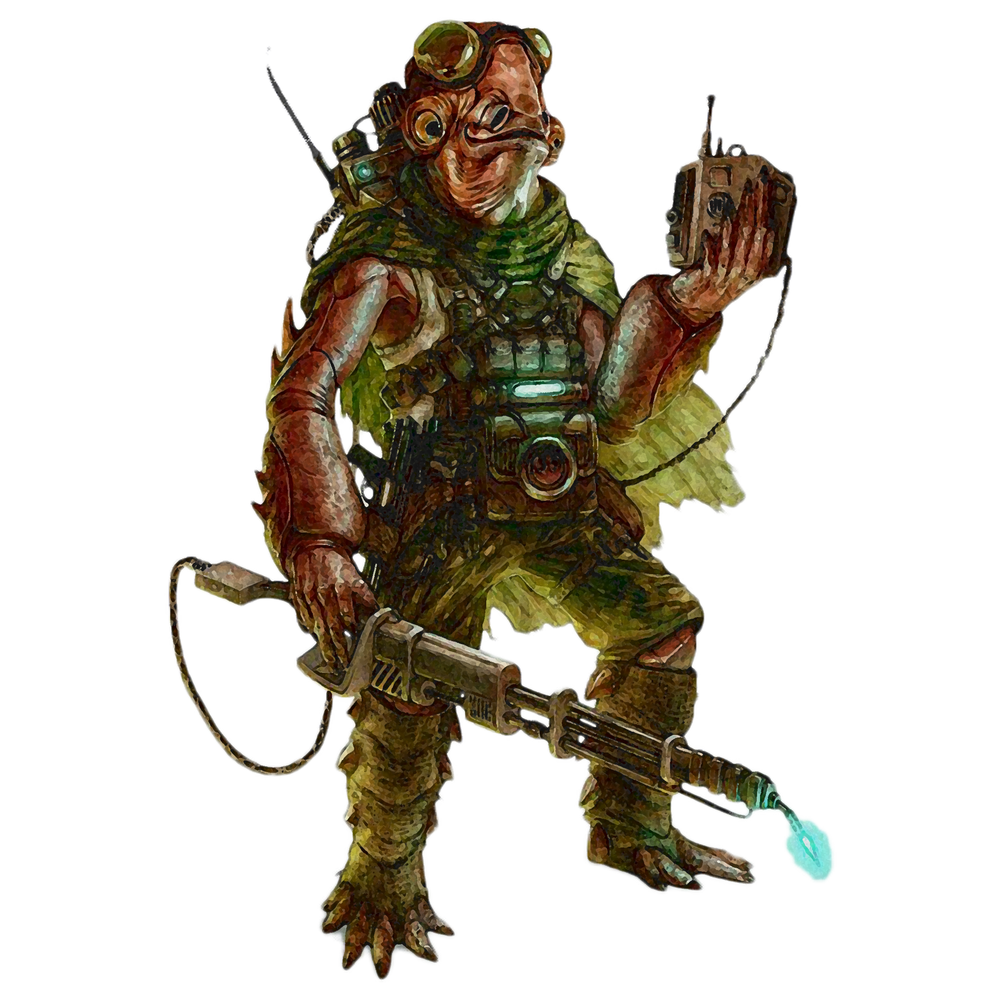

# Armstech Engineering

Those engineers who choose the Armstech Engineeering discipline focus on the skill of constructing and modifying blasters and vibroweapons.

## Bonus Proficiencies
_**Armstech Engineering:** 3rd level_ 
You gain proficiency in armstech's implements, medium armor, martial blasters, and martial vibroweapons. Additionally, when you engage in crafting with armstech's implements, the rate at which you craft doubles.

## Modified Weaponry
_**Armstech Engineering:** 3rd level_ 
You learn to modify one unenhanced weapon with which you are proficient utilizing your armstech experience. Over the course of a long rest, you can modify the weapon. You must have the weapon and armstech's implements in order to perform this modification.

Your modified weapon is enhanced, requires attunement, can only be used by you, and counts as a tech focus for your tech powers while you are attuned to it. Your modified weapon has 4 modification slots, and it gains more at higher levels, as shown in the Modification Slots column of the engineer table. For each modification installed in excess of your proficiency bonus, your tech point maximum is reduced by 1. Over the course of a long rest, you can install, replace, or remove a number of modifications up to your Intelligence modifier (minimum of one).

Some modification effects require saving throws. When you use such an effect from this class, the DC equals your tech save DC.

At 9th level, you can maintain two modified weapons. Each modified weapon has modification slots as shown in the Modification Slots column of the engineer table.

## Close Call
_**Armstech Engineering:** 3rd level_ 
When you make an attack roll with your modified weapon and miss, you can expend one use of your Potent Aptitude to attempt to turn that miss into a hit. Roll the die and add it to the attack roll. 

## Armstech's Strike
_**Armstech Engineering:** 6th level_ 
Once per round, when you deal damage to a creature with your modified weapon, you can increase the damage by 1d6. The damage is of the same type as the weapon's damage.

The damage increases to 2d6 at 11th level and 3d6 at 17th level.

## Targeting Matrix
_**Armstech Engineering:** 14th and 17th level_ 
When you cast a tech power that allows you to force creatures in an area to make a saving throw, you can instead make an attack roll with your modified weapon against a single target that would be in the range of the power. On a hit, the target suffers the effects as though they failed their saving throw. If the power would affect more than one creature, it instead affects only one.

You can use this feature five times. You gain an additional use at 17th level. You regain any expended uses when you finish a long rest.

## Armstech's Salvo
_**Armstech Engineering:** 18th level_ 
When you use your Targeting Matrix feature, and the tech power would affect more than one creature, you can instead attack each affected creature that would be in the range of the power. Make a separate attack roll for each target. On a hit, each target suffers the effects as though they failed their saving throw.

___

# Armstech Modifications
The modifications are presented in alphabetical order.

## Accuracy Focus
_**Prerequisite:** 5th level, Blaster_ 
You gain a +1 bonus to attack rolls made with this weapon. This bonus increases to +2 at 9th level and +3 at 13th level.

## Amplifying Barrel
_**Prerequisite:** 5th level, Blaster_ 
You gain a +1 bonus to damage rolls made with this weapon. This bonus increases to +2 at 9th level and +3 at 13th level.

## Bayonet
_**Prerequisite:** Blaster_ 
You affix a short blade to the barrel of your modified blaster weapon, allowing you to make a melee weapon attack with it. The blade is a vibroweapon weapon with the finesse property that you are proficient with, and deals 1d6 kinetic damage.

## Burst Core
_**Prerequisite:** Blaster_ 
Your weapon gains the burst property, with a burst number equal to its reload number.

## Booming Strikes
_**Prerequisite:** 5th level_ 
You pack extra power into your modified weapon. Once per turn, when you hit with the weapon, you can deal an additional 1d6 damage. If you do so, the weapon makes a loud boom which can be heard 100 feet away. If you are hidden, Intelligence (Investigation) and Wisdom (Perception) checks made to locate you that rely on sound have advantage.

## Celerity Oscillator
Once per turn, when you deal damage with your modified weapon, your walking speed increases by 10 feet until the start of your next turn, and the damaged creature can't make opportunity attacks against you for the rest of your turn.

## Collapsible Frame
_**Prerequisite:** Vibroweapon_ 
You install an expandable hilt on your modified weapon. Your modified weapon gains the reach property.

## Compensation Oscillator
_**Prerequisite:** Vibroweapon with the dexterity property_ 
You install a compensation oscillator in your modified vibroweapon, removing the dexterity property from it.

## Contoured Grip 
_**Prerequisite:** 5th level, Vibroweapon_ 
You gain a +1 bonus to attack rolls made with this weapon. This bonus increases to +2 at 9th level and +3 at 13th level.

## Expanded Magazine
_**Prerequisite:** Blaster_ 
Your modified weapon can be more efficiently reloaded. You can reload your modified weapon once without using an action. You can't use this feature again until you reload the weapon with an action.

## Flashlight
You affix a targeted light to your weapon. As a bonus action, you can toggle the light on or off. While on, your weapon sheds bright light in a 60-foot cone.

## Harpoon Reel
You install a secondary firemode that launches a harpoon attached to a tightly coiled cord. With this harpoon, you can make a ranged weapon attack with a range of 30/60. On a hit, it deals 1d6 kinetic damage. This attack can target a surface, object, or creature.

A creature struck by this attack is impaled by the harpoon. As an action, a creature can attempt to remove the harpoon. Removing the harpoon requires a Strength check. While the harpoon is stuck in the target, you are connected to the target by a 60 foot cable.

While connected in this manner, you can use your bonus action to activate the reel, pulling yourself to the location if the target is your size or larger. A creature or object smaller than you is pulled to you. Alternatively, you can opt to release the cable (no action required).

Once you've used this feature, you can't use it again until you recover and reinsert the harpoon as an action.

## Imbue Weapon
_**Prerequisite:** 9th level_ 
You modify your weapon to carry a charge. Over the course of a short rest, you can cast an at-will tech power, channeling it into your weapon. The next time you hit with your weapon, the stored power is released. If the power would require an attack roll, make a tech attack roll. If the power would require a saving throw, the target must make the saving throw as normal. On a hit, or a failure, the target suffers the power's normal effects. 

## Improved Burst Core
_**Prerequisite:** 9th level, Burst Core_ 
Your weapon's burst number is reduced to half its reload number.

## Integrated Magazine
_**Prerequisite:** Expanded Magazine_ 
Your modified weapon can be more efficiently reloaded. You can reload your modified weapon twice without using an action. You can't use this feature again until you reload the weapon with an action.

## Jagged Oscillator
_**Prerequisite:** Vibroweapon_ 
When you critically hit with the weapon, you deal an additional 1d8 kinetic damage.

## Keen Oscillator
_**Prerequisite:** 5th level, Jagged Oscillator_ 
Your weapon's critical hit range increases by 1.

## Neutronium Edge
_**Prerequisite:** 5th level, Vibroweapon_ 
You gain a +1 bonus to damage rolls made with this weapon. This bonus increases to +2 at 9th level and +3 at 13th level.

## Overcharge Weapon
_**Prerequisite:** 11th level, Booming Strikes_ 
You gain the ability to channel your tech power to enhance your weapon's damage. You can expend one tech slot to deal additional damage to the target. The extra damage is 1d6 for a 1st-level tech slot, plus 1d6 for each slot level higher than 1st, to a maximum of 5d6. The damage is the same type as the weapon damage. If you also use your Booming Strikes with an attack, you add this damage to the extra damage of your Booming Strikes.

## Power Loop
_**Prerequisite:** 9th level_ 
When you hit with the weapon, you can choose to channel the energy generated, gaining temporary hit points equal to half the damage dealt.

Once you've used this feature, you must complete a long rest before you can use it again.

## Recoil Dampener
_**Prerequisite:** Blaster with the strength property_ 
You install a recoil dampener in your modified blaster, removing the strength property from it.

## Returning Weapon Guard
_**Prerequisite:** Vibroweapon_ 
You install a retractible chain in your modified vibroweapon. If the weapon does not already have the thrown property, it gains it with a range of 20/60. Additionally, it gains the returning property.

## Screening Weapon
You modify your modified weapon with a sound dampening module. When you make a weapon attack with your weapon while hidden, Investigation and Perception checks made to locate you that rely on sound have disadvantage.

## Shock Absorber
You add a reclamation device to your modified weapon to gather energy from the surroundings when it is present. While wielding your modified weapon, you can cast the _absorb energy_ tech power and the power's extra damage applies to both melee and ranged weapon attacks.

## Siege Weapon
You modify your weapon to be more effective against barriers. Your weapon deals double damage against structures.

## Shocking Harpoon
_**Prerequisite:** 9th level, Harpoon Reel_ 
After hitting a creature with the harpoon fire mode, you can use the connection to deliver an at-will tech power. As a bonus action, you can cast an at-will tech power at the target with a range of touch. If the power requires an attack roll, you have advantage. If the target requires a saving throw, the target has disadvantage. 

Once you've used this feature, you can't use it again until you recover the harpoon.

## Shocking Oscillator
_**Prerequisite:** 9th level, Vibroweapon_ 
When you hit with the weapon, you can create an electronic burst. Each creature in a 15-foot cone centered on the creature you hit must make a Dexterity saving throw, taking 1d8 lightning damage on a failed save or half as much on a successful one.

Once you've used this feature, you must complete a long rest before you can use it again.

## Snap Fire
_**Prerequisite:** 9th level, Blaster_ 
You modify your modified blaster weapon for quick shots. You can use your reaction to take a opportunity attack with your modified weapon if an enemy comes within 10 feet of you. You have disadvantage on this attack. 

## Staggering Oscillator
_**Prerequisite:** Vibroweapon_ 
When you hit with the weapon, you can force the target to make a Strength saving throw. On a failed save, the creature is pushed back 10 feet and knocked prone.

Once you've used this feature, you must complete a short or long rest before you can use it again.

## Tracker
_**Prerequisite:** 5th level_ 
You add a tracking mechanism to your modified weapon. The tracker has 3 charges. As a bonus action you can use 1 charge to cast _target lock_. As an action you can use 2 charges to cast _detect invisibility_.

The tracker regains all expended charges after a long rest.

## Truelight
_**Prerequisite:** 11th level, Flashlight_ 
You modify your flashlight with a toggle allowing you to briefly gain enhanced sight. As a bonus action, you can activate the truesight feature of your flashlight. When toggled on, for the next minute your flashlight now automatically dispel illusions and can detect invisibility, as with truesight.

Once you've used this feature, you must complete a short or long rest before you can use it again.

## Venomous Oscillator
_**Prerequisite:** 9th level, Vibroweapon_ 
As a bonus action, you can coat your weapon in a thin layer of poison for 1 minute. The next time you hit with the weapon, the creature must make a Constitution saving throw against your tech save DC. On a failed save, a creature takes 1d10 poison damage and becomes poisoned for 1 minute.

Once you've used this feature, you must complete a long rest before you can use it again.
