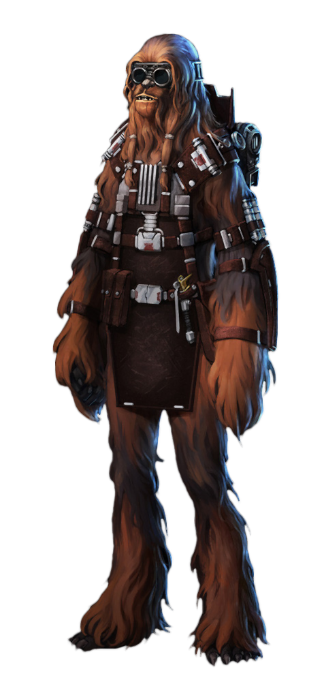

## Gadgeteer Engineering

Those engineers who choose the Gadgeteer discipline focus on the ability to craft reusable consumables and items that augment and complement their techcasting abilities.

### Bonus Proficiencies
_**Gadgeteer Engineering:** 3rd level_ 
You gain proficiency in gadgeteer's implements. Additionally, when you engage in crafting with gadgeteer's implements, the rate at which you craft doubles.

### Gadgeteer Harness
_**Gadgeteer Engineering:** 3rd level_ 
You learn to create and modify adventuring gear utilizing your gadgeteer experience. Over the course of a long rest, you can create your modified gadgeteer harness. You must have gadgeteer's implements in order to perform this modification.

Your gadgeteer harness is enhanced, requires attunement, can only be used by you, and counts as a tech focus for your tech powers while you are attuned to it. Your gadgeteer harness has 4 modification slots to which you can affix gadgets, and it gains more at higher levels, as shown in the Modification Slots column of the engineer table. For each modification installed in excess of your proficiency bonus, your tech point maximum is reduced by 1. Over the course of a long rest, you can install, replace, or remove a number of modifications up to your Intelligence modifier (minimum of one).

Some modification effects require saving throws. When you use such an effect from this class, the DC equals your tech save DC.

### Projected Barrier
_**Gadgeteer Engineering:** 3rd level_ 
As a bonus action while wearing your gadgeteer harness, you can expend a use of your Potent Aptitude to project a barrier on a friendly creature you can see within 30 feet. A creature can only have one barrier active at a time.

### Environmental Barrier
You project an environmental barrier that lasts until the end of your next short or long rest. The barrier has a number of hit points equal to the amount rolled on your Potent Aptitude die + your engineer level. Whenever a creature with this barrier takes damage (one of acid, cold, fire, force, lightning, necrotic, poison, psychic, or sonic, chosen by you when you activate the effect), the barrier takes the damage instead. If this damage reduces the barrier to 0 hit points, the creature take any remaining damage. 

### Physical Barrier
You project a physical barrier that lasts until the end of your next short or long rest. The barrier has a number of hit points equal to the amount rolled on your Potent Aptitude die + half your engineer level. Whenever a creature with this barrier takes damage (one of energy, ion, or kinetic, chosen by you when you activate the effect), the barrier takes the damage instead. If this damage reduces the barrier to 0 hit points, the creature take any remaining damage. 

### Versatile Direction
_**Gadgeteer Engineering:** 6th, 9th, 13th, and 17th level_ 
You can take a second bonus action on each of your turns. You can use this feature three times. You gain an additional use at 9th, 13th, and 17th level. You regain all expended uses when you finish a long rest.

### Reinforced Barriers
_**Gadgeteer Engineering:** 14th level_ 
When you cast a tech power while you have a barrier active, you can restore hit points to the barrier, provided it is within 30 feet of you. You restore a number of hit points equal to twice the power's level, or 1 hit point for an at-will power. This can't increase a barrier's hit points above its initial hit points. If you have multiple barriers active, you can divide these hit points between them as you see fit.

### Adaptive Barrier
_**Gadgeteer Engineering:** 18th level_ 
When a creature who has one of your barriers within 30 feet of you that you can see takes damage, and that damage is of a type that could be affected by that barrier, you can use your reaction to grant them resistance to the triggering damage. If that damage is the same type as the barrier's chosen damage, you instead grant them immunity. Whether resistance or immunity, the barrier immediately drops to 0 hit points.

___

## Gadgeteer Modifications
The modifications are presented in alphabetical order.

### Advanced Grounding System
_**Prerequisite:** 13th level, Prototype Grounding System_ 
While wearing your gadgeteer harness you have immunity to lightning damage.

### Auto-Injection Regenerator
_**Prerequisite:** 5th level_ 
You install a special kolto injector into your gadgeteer harness that can inject you with kolto in response to pain. When you take damage, you can use your reaction and expend a Hit Die to regain health as long as the damage would not reduce your hit points to 0.

### Autothrusters
_**Prerequisite:** Jet Pack_ 
You can take the Dash and Disengage actions as a bonus action while your jet pack is active.

### Climbing Gloves
You craft a set of gloves with a powerful assisted grip. While wearing these gloves, you have a climbing speed of 20 feet, and you have advantage on Strength saving throws and Strength (Athletics) checks that involve climbing.

### Darkvision Goggles
You craft a pair of sight-enhancing goggles. While wearing these goggles, you have darkvision to a range of 60 feet. If you already have darkvision, this modification increases its range by 30 feet.

### Extended Tank
_**Prerequisite:** 5th level, Jet Pack_ 
Your jet pack now lasts up to 10 minutes when activated.

### Flame Vents
_**Prerequisite:** 9th level, Jet Pack_ 
You learn the *flame sweep* tech power and can cast it at first level without using tech points. Once you have used this ability, you cannot use it again until you finish a short or long rest.

Additionally, while your jet pack is active, you can cast *flame sweep* using your bonus action instead of your action.

### Frailcasting Inhibitor
_**Prerequisite:** 5th level_ 
You gain a +1 bonus to the tech save DC of powers you cast that requires a Strength or Constitution saving throw. This bonus increases to +2 at 9th level and +3 at 13th level.

### Grounding System
While wearing your gadgeteer harness you are immune to the shocked condition.

### Integrated Amplifier
_**Prerequisite:** 5th level_ 
You gain a +1 bonus to melee tech attack rolls. This bonus increases to +2 at 9th level and +3 at 13th level.

### Integrated Rangefinder
_**Prerequisite:** 5th level_ 
You gain a +1 bonus to ranged tech attack rolls. This bonus increases to +2 at 9th level and +3 at 13th level.

### Intelligence Core Override
_**Prerequisite:** 9th level_ 
You can cast the *override interface* tech power at 5th level without spending tech points.

Once you've used this feature, you must complete a long rest before you can use it again.

### Jet Pack
You integrate a jet pack into your gadgeteer harness to grant you temporary, limited flight. Activating or deactivating the jets requires a bonus action and, while active, you have a flying speed of 30 feet. 

The jet pack last for 1 minute before deactivating. Once the jets have been activated, they can't be activated again until you finish a short or long rest.

Your jet pack's speed increases to 40 feet at 5th level, 50 feet at 9th level, 60 feet at 13th level, 70 feet at 17th level, and 80 feet at 20th level.

### Mechanical Arm
You create a mechanical arm which mounts to your shoulder, which you can use independently. You can only gain the benefit of items held by two of your arms at any given time.

You can choose this modification twice.

### Mimicker
_**Prerequisite:** 9th level_ 
You create a device that attaches to your gadgeteer harness. Your mimicker casts a shadow that makes you appear to be standing in a place near your actual location, causing any creature to have disadvantage on attack rolls against you. If you take damage, the property ceases to function for 1 minute. Your mimicker is suppressed while you are incapacitated, restrained, or otherwise unable to move.

### Miniaturized Hydraulics
Your gadgeteer harness can store 20 pounds of equipment without adding to your encumbrance.

### Oil Spill
As an action, you can cast the *oil slick* tech power without expending tech points. When you cast the power in this way, the oil will remain in place for the full duration of the power.

Once you've used this feature, you must complete a short or long rest before you can use it again.

### Powered Grappling Hook
_**Prerequisite:** 9th level, Wrist-Mounted Grappling Hook_ 
While your wrist-mounted grappling hook is deployed, when you cast a tech power with a range of touch, your hook can deliver the power as if it had cast it.

### Prototype Grounding System
_**Prerequisite:** 9th level, Grounding System_ 
While wearing your gadgeteer harness you have resistance to lightning damage.

### Rendcasting Inhibitor
_**Prerequisite:** 5th level_ 
You gain a +1 bonus to the tech save DC of powers you cast that requires a Dexterity or Intelligence saving throw. This bonus increases to +2 at 9th level and +3 at 13th level.

### Quick Start Engine
_**Prerequisite:** 5th level, Jet Pack_ 
You can now activate your Jet Pack as an object interaction rather than as a bonus action.

### Recycled Adrenals
You can augment a single adrenal to regain its charge. This adrenal can only be used by you, and it can only affect you. Once you've used this adrenal, you can't use it again until you finish a long rest.

### Recycled Explosives
You can augment a single explosive to regain its charge. This explosive can only be used by you, and it uses your tech save DC instead of its own, unless its own DC would be higher. Once you've used this explosive, you can't use it again until you finish a long rest.

### Recycled Stimpacs
You can augment a single stimpac to regain its charge. This stimpac can only be used by you, and it can only affect you. Once you've used this stimpac, you can't use it again until you finish a long rest.

### Sentry Turret
You learn how to craft small sentry turrets shaped like globes that can adhere to any surface. As an action or bonus action (your choice), you can throw a sentry to a point you can see within range (30 feet + your Strength modifier x 5). At the end of each of your turns, a deployed sentry automatically targets a hostile creature within 10 feet of it. If multiple targets are available, one is chosen at random. The target must make a Dexterity saving throw. On a failed save, it takes 1d4 energy damage and gains 1 slowed level until the end of your next turn. If a creature would be targeted by more than one of these sentries, it only makes this saving throw once, taking an additional d4 damage for each sentry beyond the first.

The sentries have 1 hit point, an armor class of 10, and can be repaired over the course of a long rest. Each sentry lasts for 1 minute before deactivating. You can maintain a number of sentries equal to your Intelligence modifier. Once a sentry has been activated, it can't be activated again until you finish a short or long rest.

### Shocking Hook
_**Prerequisite:** 9th level, Wrist-Mounted Grappling Hook_ 
After hitting a creature with your grappling hook, you can use the connection to deliver an at-will tech power. As a bonus action, you can cast an at-will tech power at the target with a range of touch. If the power requires an attack roll, you have advantage. If the target requires a saving throw, the target has disadvantage. 

Once you've used this feature, you can't use it again until you recover the hook.

### Stealth Field Generator
_**Prerequisite:** 9th level_ 
You create an augmented belt that functions as a portable, personal cloaking device. Activating or deactivating the generator requires a bonus action and, while active, you have advantage on Dexterity (Stealth) ability checks that rely on sight. The generator lasts for 1 minute. This effect ends early if you make an attack or cast a force- or tech- power.

Once the belt has been activated, it can't be activated again until you finish a short or long rest.

### Shocking Barrier
_**Prerequisite:** 5th level_ 
You enhanced your barriers. Whenever a creature with one of your barriers active takes damage from a creature within 5 feet of it, the damaged creature can roll your Potent Aptitude die, dealing the result of the die as lightning damage to the creature that damaged it.

### Truesight Goggles
_**Prerequisite:** 11th level, Darkvision Goggles_ 
You modify your goggles with a toggle allowing you to briefly gain enhanced sight. As a bonus action, you can activate the truesight feature of your goggles. When toggled on, for the next minute your goggles now automatically dispel illusions and can detect invisibility, as with truesight.

Once you've used this feature, you must complete a short or long rest before you can use it again.

### Weapon Integration
You can integrate a single weapon that weighs no more than 8 lb. into your gadgeteer harness. While integrated, that weapon gains the hidden and fixed properties. 

### Withercasting Inhibitor
_**Prerequisite:** 5th level_ 
You gain a +1 bonus to the tech save DC of powers you cast that requires a Wisdom or Charisma saving throw. This bonus increases to +2 at 9th level and +3 at 13th level.

### Wrist-Mounted Grappling Hook
You craft a wrist-mounted grappling hook weapon attached to a tightly coiled cord. With this contraption, you can make a ranged weapon attack with a range of 30/60. On a hit, it deals 1d4 kinetic damage. This attack can target a surface, object, or creature.

A creature struck by this attack is impaled by the hook. As an action, a creature can attempt to remove the hook. Removing the hook requires a Strength check. While the hook is stuck in the target, you are connected to the target by a 60 foot cable.

While the hook is deployed, you can use your bonus action to activate the reel, pulling yourself to the location if the target is your size or larger. A creature or object smaller than you is pulled to you. Alternatively, you can opt to release the cable (no action required).

Once you've used this feature, you can't use it again until you recover and reinsert the hook as an action.
