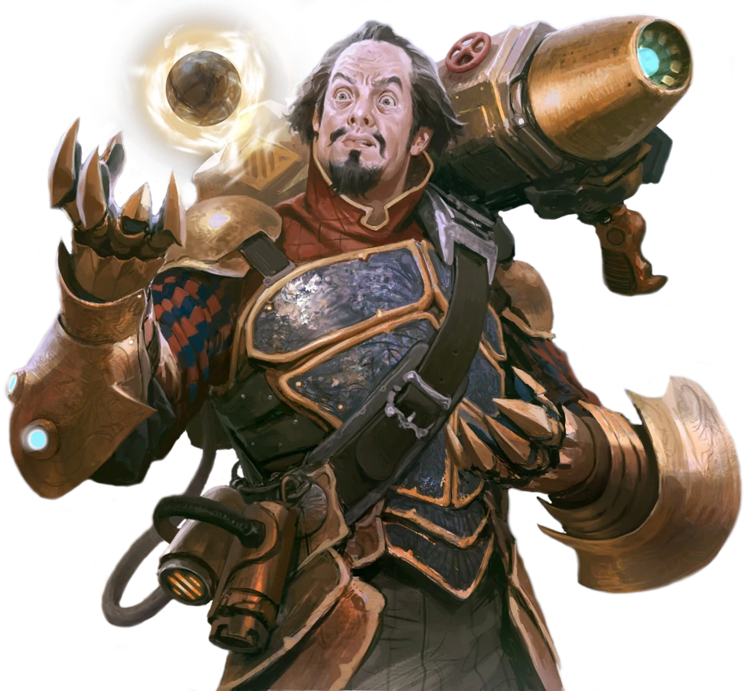

## Unstable Engineering

Those engineers who choose the Unstable Engineering discipline create and use untested combinations, resulting in powerful-and often unpredictable-effects.

### Bonus Proficiencies
_**Unstable Engineering:** 3rd level_ 
You gain proficiency in your choice of artisan's implements. Additionally, when you engage in crafting with tinker's implements, the rate at which you craft doubles.

### Modified Tinkercannon
_**Unstable Engineering:** 3rd, 9th, and 17th level_ 
You learn to enhance your tinker's implements with unstable science, modifying them into a harness with a cannon. Over the course of a long rest, you can modify your tinker's implements to create a tinkercannon. You must have tinker's implements in order to perform this modification.

Whenever you cast a tech power of 1st level or higher while wielding your tinkercannon, you risk unexpected complications. Your GM can have you roll a d20. If you roll a 1, roll on the Unstable Engineering Surge table to create a random effect. 

Additionally, your tinkercannon come equipped with four overrides, and they gain more at higher levels, as shown in the Modification Slots column of the engineer table. Each time you trigger an Unstable Engineering Surge, you can use an override to reroll the percentile dice. You must use the new result, you can only do this once per surge, and each time you do so in excess of your proficiency bonus (resetting on a long rest) your maximum tech points is reduced by 1 until you complete a long rest. You regain all expended overrides when you complete a long rest.

### Unstable Volley
_**Unstable Engineering:** 3rd, 9th, and 17th level_ 
While wielding your tinkercannon, as a bonus action you can expend one use of your Potent Aptitude to launch a volley of unstable energy at a surface located within 30 feet of you that you can see. This energy adheres to the surface for 1 minute, after which it erupts. As a part of this bonus action, or as a bonus action on a following turn, you can cause the energy to erupt early. Each creature within 5 feet of it must make a Dexterity saving throw against your tech save DC. A creature takes 1d6 lightning damage on a failed save, or half as much on a successful one. 

The range at which you can launch your volley increases to 60 feet at 9th level, and 120 feet at 17th level.

This damage increases when you reach certain levels in this class, increasing to 2d6 at 5th level, 3d6 at 11th level, and 4d6 at 17th level.

### Creative Destruction
_**Unstable Engineering:** 6th level_ 
You can add your governing ability modifier (minimum of +1) to any damage you deal with tech powers and class features that don't already include that modifier. If the tech power or class feature would damage multiple creatures, you can only deal this additional damage to one of them.

If you choose to deal this additional damage, your GM can have you roll on the Unstable Engineering Surge table.

### Experimental Overrides 
_**Unstable Engineering:** 14th level_ 
You gain a modicum of control over your surges. Whenever you roll on the Unstable Engineering Surge table and use one of your overrides, you can choose either total.

### Engineering Bombardment
_**Unstable Engineering:** 18th level_ 
The harmful energies of your tech powers and class features intensify. When you roll damage for a tech power or class feature and roll the highest number possible on any of the dice, you can roll it again and use both results. You can only use this ability once per tech power or class feature.

___

## Unstable Engineering Surge

|d100|Result|
|:--|:--|
|01-02|Roll on this table at the start of each of your turns for 1 minute, ignoring this result on subsequent rolls.	|
|03-04|For the next minute, you can see any invisible creature if you have line of sight to it.	|
|05-06|A DRK-1 tracker droid appears with 5 feet of you, then disappears 1 minute later.|
|07-08|You cast *explosion* at 3rd-level centered on yourself without expending tech points.|
|09-10|You cast *homing rockets* at 5th-level without expending tech points.|
|11-12|Roll a d10. Your height changes by a number of inches equal to the roll: if odd, you shrink; if even, you grow.	|
|13-14|You fall asleep standing for 1 minute or until you take damage.|
|15-16|For the next minute, you regain 5 hit points at the start of each of your turns|
|17-18|You grow a long beard made of feathers that remains until you sneeze.|
|19-20|You cast *oil slick* centered on yourself without expending tech points.|
|21-22|Creatures have disadvantage on the first saving throw they make against you in the next minute.|
|23-24|Your skin turns a vibrant shade of blue. Any effect that ends a curse ends this.|
|25-26|You grow an extra eye, granting advantage on Wisdom (Perception) checks that rely on sight for 1 minute.|
|27-28|For the next minute, all your tech powers with a casting time of 1 action have a casting time of 1 bonus action.|
|29-30|You teleport up to 60 feet to an unoccupied space of your choice that you can see.	|
|31-32|You take 2d10 lightning damage and are shocked for 1 minute.|
|33-34|Maximize the damage of the next damaging tech power you cast within the next minute.	|
|35-36|Roll a d10. Your age changes by a number of years equal to the roll: if odd, younger; if even, older.|
|37-38|You start running uncontrollably for 1 minute, moving your entire speed each turn.|
|39-40|You regain 2d10 hit points.|
|41-42|Each creature within 30 feet of you is subjected to the *gleaming outline* tech power for 1 minute.|
|43-44|For the next minute, you can teleport up to 20 feet as a bonus action on each of your turns.	|
|45-46|You are blinded and deafened for 1 minute.|
|47-48|You have disadvantage on the first ability check, attack roll, or saving throw you make each turn for 1 minute.|
|49-50|You can't speak for the next minute. Whenever you try, pink bubbles float out of your mouth.	|
|51-52|A shimmering energy barrier grants you a +2 bonus to AC for 1 minute.|
|53-54|You are immune to being intoxicated by alcohol for the next 5d6 days.|
|55-56|Your hair falls out but grows back within 24 hours. If you don't have hair, you instead grow it for 24 hours.|
|57-58|For 1 minute, any flammable object not worn or carried you touch bursts into flame.|
|59-60|You regain tech points equal to your Intelligence modifier (minimum of one).|
|61-62|For the next minute, you shout whenever you speak.|
|63-64|You cast *smoke cloud* centered on yourself without expending tech points.|
|65-66|Up to three creatures you choose within 30 feet of you take 4d10 lightning damage.|
|67-68|You are frightened by the nearest creature until the end of your next turn.|
|69-70|Each creature within 30 feet of you becomes invisible for 1 minute, or until it attacks or casts a power.|
|71-72|You gain resistance to all damage for the next minute.|
|73-74|A random creature within 60 feet of you becomes poisoned for 1d4 hours.|
|75-76|You emit bright light in a 30-foot radius for 1 minute.|
|77-78|Each creature within 30 feet of you except you gains the benefits of *mirror image* for 1 minute.
|79-80|Illusory butterflies and flower petals flutter in the air within 10 feet of you for the next minute.|
|81-82|You can take one additional action immediately.|
|83-84|Each creature within 30 feet of you takes 1d10 necrotic damage and you gain hit points equal to the damage.|
|85-86|You cast *mirror image* without expending tech points.|
|87-88|You are frozen in carbonite and paralyzed for 1 minute or until you take damage.|
|89-90|You turn invisible and can't make sound for 1 minute, or until you attack or cast a power.|
|91-92|If you die within the next minute, you immediately come back to life as if by the *defibrillate* power.|
|93-94|Your size increases by one size category for the next minute.|
|95-96|You and all creatures within 30 feet of you gain vulnerability to energy damage for the next minute.|
|97-98|You are surrounded by faint, ethereal music for the next minute.|
|99-100|You regain half your expended tech points.|
