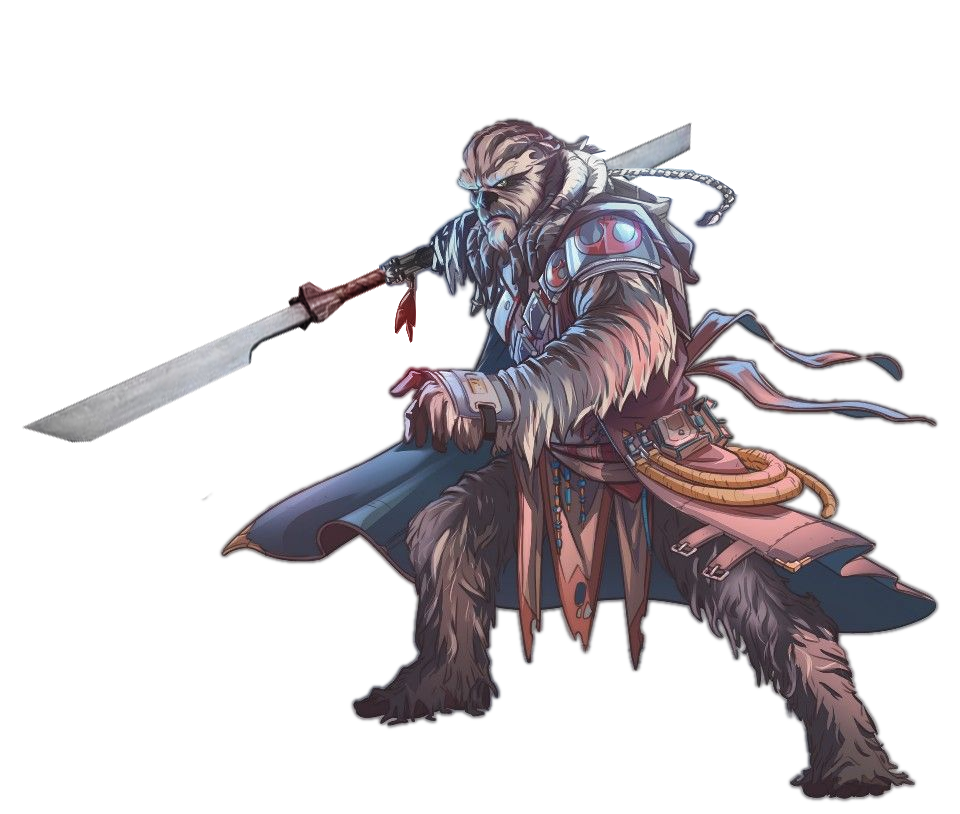

# Blademaster Specialist

Those fighters who choose to become Blademaster Specialists hone their focus to a blade's edge, becoming so in tune with their arsenal that it becomes both their weapon and their armor.

## Unarmored Defense
_**Blademaster Specialist:** 3rd level_ 
While you are wearing no armor and not wielding a shield, your AC equals 10 + your Dexterity modifier + your Strength modifier.

## Adaptive Fighting
_**Blademaster Specialist:** 3rd level_ 
You've learned to make adaptations to your fighting style on the fly. You have three such effects: Change Up, Draw, and Stow. When you use your Adaptive Fighting, you choose which effect to create.

You can use this feature twice. You gain an additional use at 5th, 9th, 13th, and 17th level. You regain all expended uses when you complete a short or long rest.

### Change Up
You can use your object interaction and expend a use of your Adaptive Fighting to change the Fighting Style option granted to you by your fighter class feature.

### Draw
When you use your object interaction to draw one or more weapons, you can expend a use of your Adaptive Fighting (no action required) to increase your critical hit range by 1 with the weapon(s) until the start of your next turn.

### Stow
When you use your object interaction to stow a weapon, you can expend a use of your Adaptive Fighting (no action required) to take the Disengage action.

## Dervish
_**Blademaster Specialist:** 7th level_ 
When you score a critical hit with a melee weapon attack, you regain an expended use of your Adaptive Fighting.

## Resilient Fighting
_**Blademaster Specialist:** 10th level_ 
When you expend a use of your Adaptive Fighting, you gain resistance to energy and kinetic damage dealt by weapons until the start of your next turn.

## Adrenaline Rush
_**Blademaster Specialist:** 15th level_ 
When you use your Action Surge feature, you can take an extra bonus action on top of the additional action.

## Bladestorm
_**Blademaster Specialist:** 18th level_ 
You can use your action to make a single melee weapon attack against each creature within your reach. Make a separate attack roll against each target. The first attack gains a +1 bonus to its attack roll, and each attack after the first gains an additional +1 bonus to its attack roll, cumulatively, to a maximum bonus of +6. If you are wielding two light- or vibro-weapons, or a weapon with the double property, you also add this bonus to your damage rolls, and you can use your bonus action to engage in Double- or Two-Weapon Fighting.

Once you've used this feature, you must complete a short or long rest before you can use it again.

<!--- image here  --->
