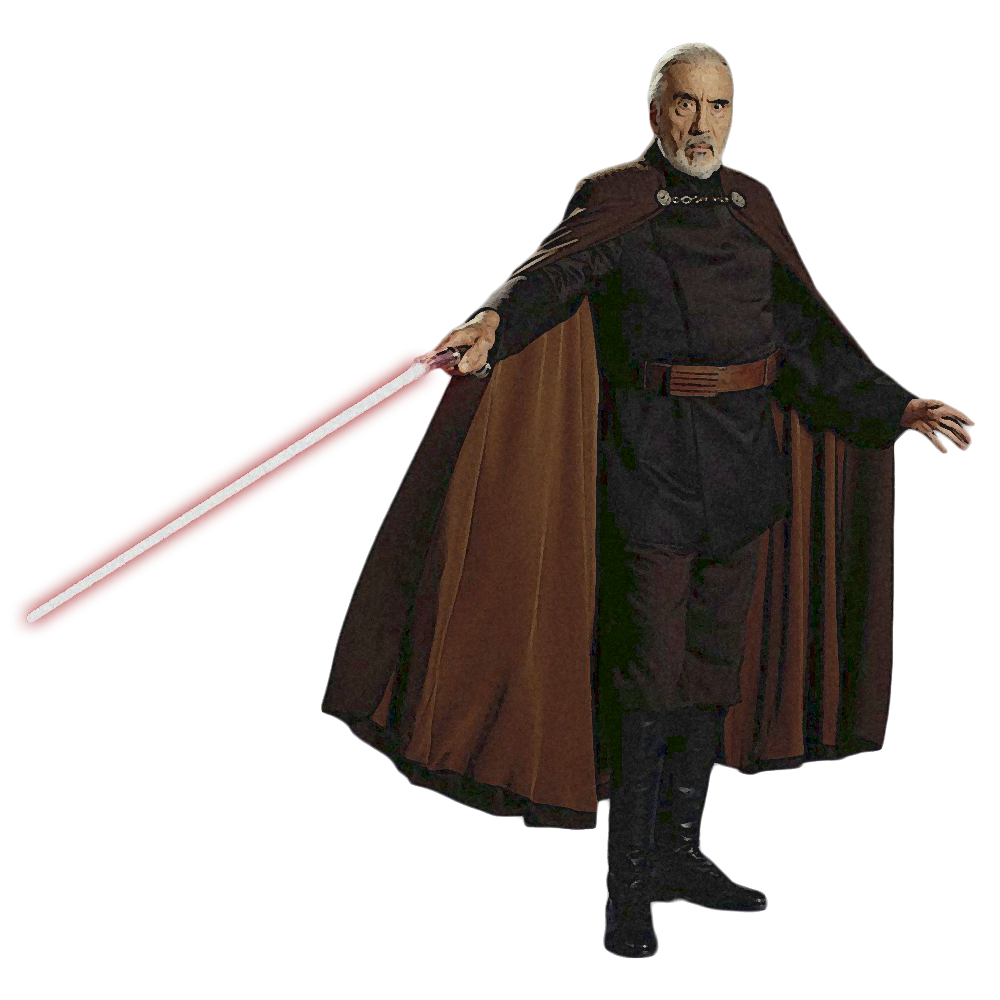

# Makashi Form 

Makashi Form, also known as Contention Form, encourages precision and efficiency over power, using jabs, parries and light cuts over slashes, blocks and chops. Those guardians who focus on Makashi Form utilize calculated blade manipulation, intense focus, and expert timing to confuse and trap their opponents.

## Form Basics
_**Makashi Form:** 3rd level_ 
You gain the Makashi lightsaber form, detailed in Chapter 6. If you already know this form, you can instead choose another lightsaber form.

## The Way of the Ysalamiri
_**Makashi Form:** 3rd level_ 
As a bonus action, you can enter an offensive stance for one minute. While in this stance, you add your Wisdom or Charisma modifier (your choice) to the first melee weapon attack and damage rolls you make each turn.

This effect ends early if you are incapacitated or die. Once you've used this feature, you can't use it again until you finish a long rest.

## Channel the Force
_**Makashi Form:** 3rd level_ 
You gain the following Channel the Force option.

### Makashi Riposte
When another creature damages you with a melee attack, you can expend a use of your Channel the Force and use your reaction to attempt to deflect the attack. When you do so, the damage you take from the attack is reduced by 1d10 + your Dexterity modifier + your guardian level.

If you reduce the damage to 0, you can immediately make a single melee weapon attack against that creature as a part of the reaction.

## Force-Empowered Reflexes
_**Makashi Form:** 7th level_ 
You can take a second reaction each round.

## Glancing Blow
_**Makashi Form:** 15th level_ 
When an attacker that you can see hits you with an attack, you can use your reaction to halve the attack's damage against you.

## Master of Contention
_**Makashi Form:** 20th level_ 
You are a duelist of the highest caliber.  Your Dexterity and Wisdom or Charisma scores (your choice) increase by 2. Your maximum for those scores increases by 2. Additionally, you can use your action to gain the following benefits for 1 minute:
- You have resistance to kinetic and energy damage, and you ignore resistance to kinetic and energy damage.
- All melee attacks have disadvantage against you.
- Your melee weapon attacks inflict an additional damage die.

This effect ends early if you are incapacitated or die. Once you've used this feature, you can't use it again until you finish a long rest.
