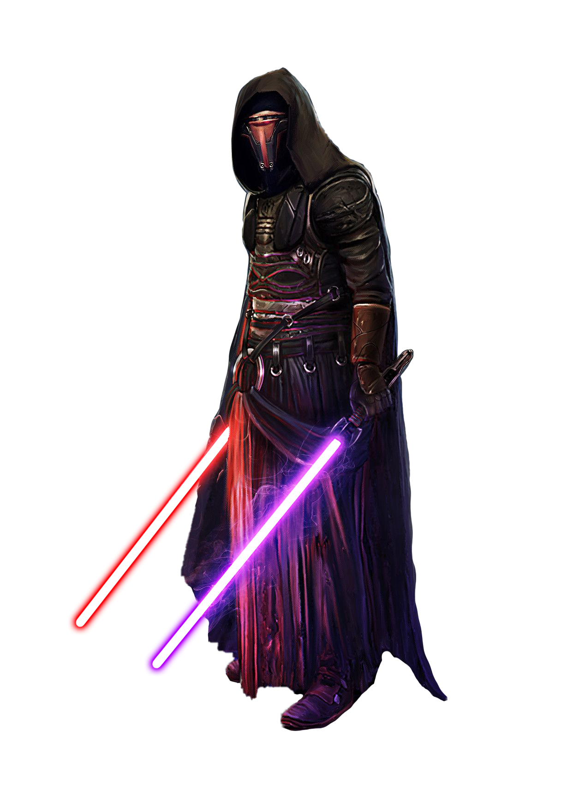

# Niman Form

Niman Form, also known as Moderation Form, strikes a balance between bladework and force powers. Those guardians who focus on Niman Form weave Force manipulation with their melee weapon strikes, pushing their opponents off-balance to create an opening.

## Form Basics
_**Niman Form:** 3rd level_ 
You gain the Niman lightsaber form, detailed in Chapter 6. If you already know this form, you can instead choose another lightsaber form.

## The Way of the Rancor
_**Niman Form:** 3rd level_ 
As a bonus action, you can enter a balanced stance for one minute. As a part of this bonus action, and as a bonus action on each of your turns, when you use your action to cast a force power, you can make one melee weapon attack. Additionally, for the duration, you can use Wisdom or Charisma instead of Strength or Dexterity for the attack and damage rolls of your melee weapon attacks. You must use the same modifier for both rolls.

This effect ends early if you are incapacitated or die. Once you've used this feature, you can't use it again until you finish a long rest.

## Channel the Force
_**Niman Form:** 3rd level_ 
You gain the following Channel the Force option.

### Telekinetic Slash
When you deal damage with an at-will force power that requires a force attack or a saving throw, you can expend a use of your Channel the Force and expend force points to deal additional damage to the target, which is the same type as the power's damage. The additional damage is 1d8 for each point spent in this way. You can't deal more additional damage than the amount shown in the Focused Strikes column of the guardian table.

## Enlightenment
_**Niman Form:** 7th level_ 
When you reduce a hostile creature to 0 hit points with a force power, or you restore hit points to a friendly creature that is at 0 hit points with a force power, you gain temporary force points equal to your Wisdom or Charisma modifier (your choice, minimum of one). Once you've done so, you can't do so again until you complete a short or long rest.

## Redirect
_**Niman Form:** 15th level_ 
When you would be affected by a weapon or force power that requires a Dexterity saving throw or attack roll and would affect only you, you can use your reaction to redirect that power to another target within 30 feet. If the weapon or power required a melee or ranged attack, make a melee or ranged force attack against the new target, as appropriate. If it required a Dexterity saving throw, the new target must make a Dexterity saving throw against your universal force save DC.

Once you've used this feature, you must complete a short or long rest before you can use it again.

## Master of Moderation
_**Niman Form:** 20th level_ 
The Force flows in perfect concert with your weapon attacks. Your Dexterity and Wisdom or Charisma scores (your choice) increase by 2. Your maximum for these scores increases by 2. Additionally, you can use your action to gain the following benefits for 1 minute:
- You have resistance to kinetic and energy damage from unenhanced weapons.
- You have advantage on saving throws against force powers. Additionally, you have resistance against the damage of force powers.
- When you use your action to cast an at-will force power that targets only one creature, you can target an additional creature within 5 feet of the original target and within the power's range.

This effect ends early if you are incapacitated or die. Once you've used this feature, you can't use it again until you finish a long rest.
