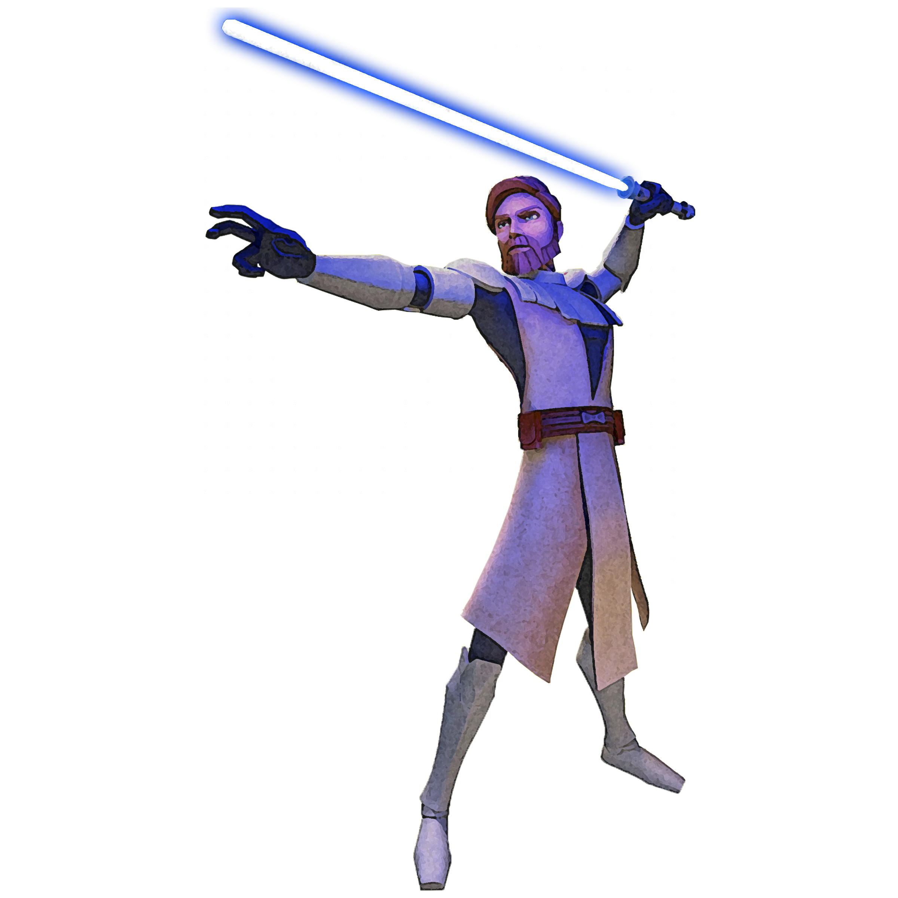

# Soresu Form
Soresu Form, also known as Resilience Form, relies on tight bladework and subtle dodges to provide maximum defensive coverage, minimizing exposure to ranged weaponry. Those guardians who focus on Soresu Form use broad footwork to move around the playing field, making broad, short sweeping motions that protect the body.

## Bonus Proficiencies
_**Soresu Form:** 3rd level_ 
You gain proficiency in heavy armor.

## Form Basics
_**Soresu Form:** 3rd level_ 
You gain the Soresu lightsaber form, detailed in Chapter 6. If you already know this form, you can instead choose another lightsaber form.

## The Way of the Mynock
_**Soresu Form:** 3rd level_ 
As a bonus action, you can enter a defensive stance for one minute. As a part of this bonus action, and as a bonus action on each of your turns, you can cast the *saber ward* power. When you do so, you have a number of special reactions equal to your proficiency bonus that you can only use to cast the *saber reflect* force power. 

This effect ends early if you are incapacitated or die. Once you've used this feature, you can't use it again until you finish a long rest.

## Channel the Force
_**Soresu Form:** 3rd level_ 
You gain the following Channel the Force option.

### Advancing Defender
When you cast the *saber reflect* power, you can expend a use of your Channel the Force to move up to 10 feet as a part of that same reaction. This movement does not provoke opportunity attacks.

## Circle of Shelter
_**Soresu Form:** 7th, 9th, 13th, and 17th level_ 
You learn to fend off strikes directed at you or other creatures nearby. If you or a creature you can see within 5 feet of you is hit by an attack, you can use your reaction to ward the creature if you're wielding a melee weapon or a shield. Roll 1d8 and add the number rolled to the target's AC against that attack. If the attack still hits, the target has resistance against the attack's damage. 

You can use this feature three times. You gain an additional use at 9th, 13th, and 17th level. You regain all expended uses when you finish a long rest.

## Stand Against the Tide
_**Soresu Form:** 15th level_ 
When a hostile creature misses you with a melee attack, you can use your reaction to force that creature to repeat the same attack against another creature (other than itself) of your choice.

## Master of Resilience
_**Soresu Form:** 20th level_ 
Your presence on the field of battle is an inspiration to your allies. Your Constitution and Wisdom or Charisma scores (your choice) increase by 2. Your maximum for those scores increases by 2. Additionally, you can use your action to gain the following benefits for 1 minute:
- You have resistance to kinetic and energy damage from unenhanced weapons.
- When you use the *saber reflect* force power, you can make a single melee attack on an enemy within 5ft of you as a part of that same reaction.
- You have advantage on Dexterity saving throws, as do your allies within 30 feet of you.

This effect ends early if you are incapacitated or die. Once you've used this feature, you can't use it again until you finish a long rest.
