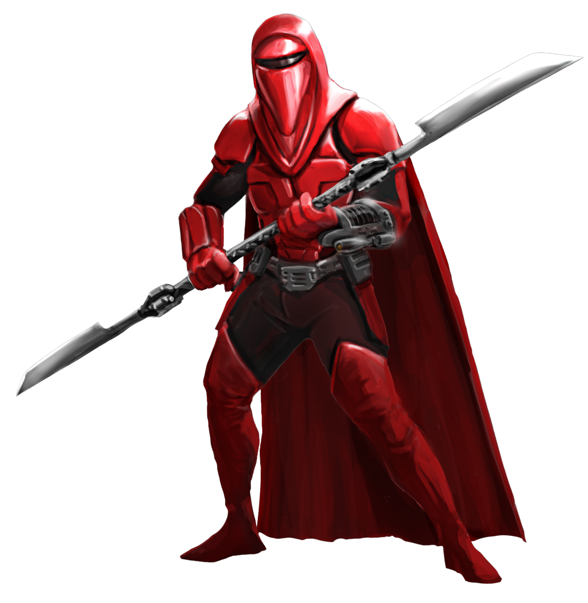

## Crimson Order

Monks of the Crimson Order are unyielding in their resolve. They pledge themselves to a singular entity or belief, and uphold their service with solemnity and diligence. 

### Crimson Armaments
_**Crimson Order:** 3rd level_ 
You gain proficiency in light and medium armor. If you are already proficient in light and medium armor, you instead gain proficiency in heavy armor. Additionally, you can now gain the benefits of your Martial Arts and Unarmored Movement features while wearing armor as long as you are not wielding a shield.

Additionally, you've learned to adapt to new weaponry. Over the course of an hour, which can be performed during a short rest, you can perform a kata with a weapon of your choice. You gain proficiency in that weapon if you do not already have proficiency, and it becomes a monk weapon for you. You can only adapt to one weapon at a time, and if you attempt to adapt to another weapon you immediately lose your proficiency with the chosen weapon.

### Crimson Squall
_**Crimson Order:** 6th, 11th, and 17th level_ 
You've learned to enhance your kata. As a bonus action while wielding a monk weapon, you can expend 1 focus point to cause the area within 5 feet of you to become difficult terrain for hostile creatures for 1 minute. This area travels with you, and affected creatures within the area can not make opportunity attacks.

At 11th level, the range of this area increases to 15 feet, and at 17th level, the range of this area increases to 30 feet.

### Vigilant Sentinel
_**Crimson Order:** 11th level_ 
When you attempt to perceive your surroundings on your turn, you can opt to not move on that turn. If you avoid moving, you gain a +10 bonus to your Wisdom (Perception) checks until the start of your next turn. You lose this benefit if you move or fall prone, either voluntarily or because of some external effect.

### Sovereign Protector
_**Crimson Order:** 17th level_ 
Your mastery of focus has allowed you to unlock your fullest potential in combat. As a bonus action, you can gain the following effects for 1 minute.
- Your speed is doubled.
- Your AC increases by 2.
- You have advantage on Dexterity saving throws.
- You gain an additional action of each of your turns. This action can be used only to take the Attack (one weapon attack only), Dash, Disengage, Hide, or Use an Object action.

This effect ends early if you are incapacitated or die. Once you've used this feature, you can't use it again until you finish a long rest.
