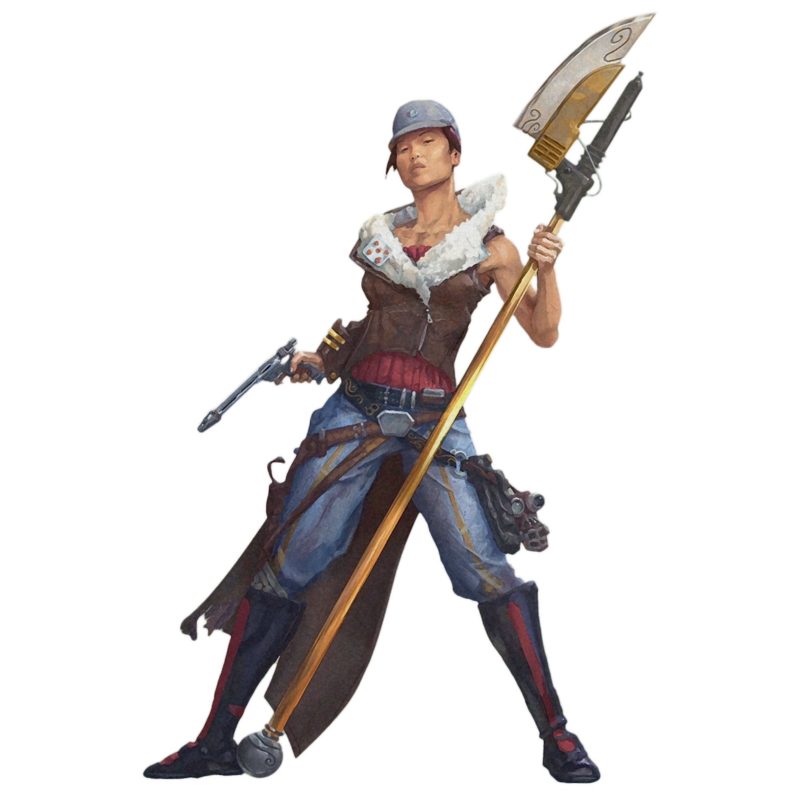

# Echani Order

Monks of the Echani Order train relentlessly both with and without their weapons, to the point where the weapon becomes an extension of the body. Founded on a mastery of sword fighting, the tradition has expanded to include many different weapons.

## Echani Weapons
_**Echani Order:** 3rd level_ 
Your special martial arts training leads you to master the use of certain weapons. You gain the following benefits. Choose two types of weapons to be your Echani weapons: one vibroweapon and one blaster. Each of these weapons can be any simple or martial weapon that lacks the special property. You gain proficiency with these weapons if you don't already have it. Weapons of the chosen types are monk weapons for you. Many of this order's features work only with your Echani weapons. When you reach 6th, 11th, and 17th level in this class, you can choose another type of weapon to be an Echani weapon for you, following the criteria above.

### Agile Parry
If you make an unarmed strike as part of the Attack action on your turn and are holding an Echani weapon, you can use it to defend yourself if it is a melee weapon. You gain a +2 bonus to AC until the start of your next turn, while the weapon is in your hand and you aren't incapacitated.

### Echani's Shot
You can use a bonus action on your turn to make your ranged attacks with an Echani weapon more deadly. When you do so, any target you hit with a ranged attack using an Echani weapon takes an extra 1d4 damage of the weapon's type. You retain this benefit until the end of the current turn.

## One with the Blade
_**Echani Order:** 6th level_ 
You extend your focus into your Echani weapons, granting you the following benefits.

### Enhanced Echani Weapons
Your attacks with your Echani weapons count as enhanced for the purpose of overcoming resistance and immunity to unenhanced attacks and damage.

### Deft Strike
When you hit a target with an Echani weapon, you can spend 1 focus point to cause the weapon to deal extra damage to the target equal to your Martial Arts die. You can use this feature only once on each of your turns.

## Sharpen the Blade
_**Echani Order:** 11th level_ 
You gain the ability to augment your weapons further with your focus. As a bonus action, you can expend up to 3 focus points to grant one Echani weapon you touch a bonus to attack and damage rolls when you attack with it. The bonus equals the number of points you spent. This bonus lasts for 1 minute or until you use this feature again. This feature has no effect on an enhanced weapon that already has a bonus to attack and damage rolls.

## Unerring Accuracy
_**Echani Order:** 17th level_ 
Your mastery of weapons grants you extraordinary accuracy. If you miss with an attack roll using a monk weapon on your turn, you can reroll it. You can use this feature only once on each of your turns. 
