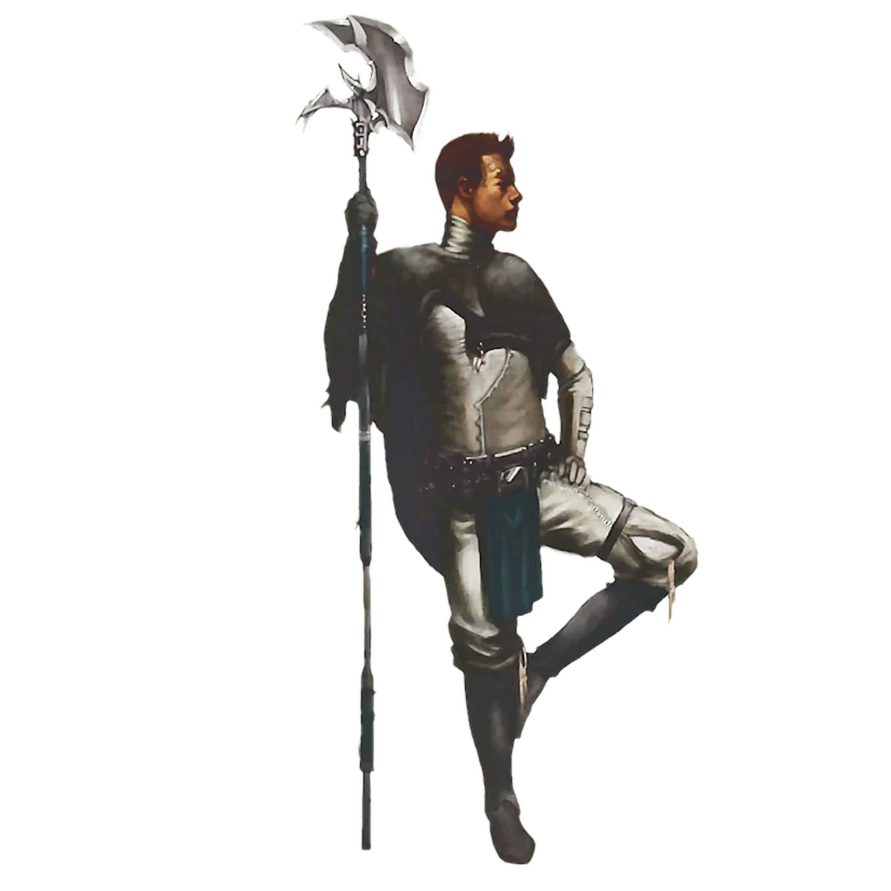

# Matukai Order

Monks of the Matukai Order center their philosophy around  a balance and harmony between the spiritual Force and the physical body, using exercise as a form of meditation. They channel the Force through their bodies, turning themselves into exceptional warriors.

## Force-Enhanced Strikes
_**Matukai Order:** 3rd level_ 
You learn to channel the Force into your unarmed strikes and monk weapons, further enhancing your melee strikes. When you hit a creature with an unarmed strike or melee weapon attack with a monk weapon, you can spend 1 focus point to force the creature to make a Strength saving throw against your focus save DC. On a failed save, it takes 2d6 force damage and is pushed up to 15 feet away from you. On a successful save, the creature only takes half as much damage and isn't pushed.

## Instinctive Leap
_**Matukai Order:** 6th level_ 
When a hostile creatures moves to within 5 feet of you, you can use your reaction to disengage and leap up to half your speed. If you end this movement in the air, you immediately fall to the ground.

## Absorb Damage
_**Matukai Order:** 11th, 13th, and 17th level_ 
You learn to channel the Force into your skin and bones, greatly enhancing your durability. You can use a bonus action to channel the Force throughout your body. Until the start of your next turn, you have resistance to kinetic and energy damage.

You can use this feature four times. You gain an additional use at 13th and 17th level. You regain all expended uses when you finish a long rest.

## Control the Field
_**Matukai Order:** 17th level_ 
Whenever you use your Instinctive Leap feature, you can leap your entire movement speed instead of only half. Additionally, when you land, you can make an unarmed strike with advantage against a creature within 5 feet of you as part of the same reaction. On a hit, this attack deals an additional 2d6 force damage.
