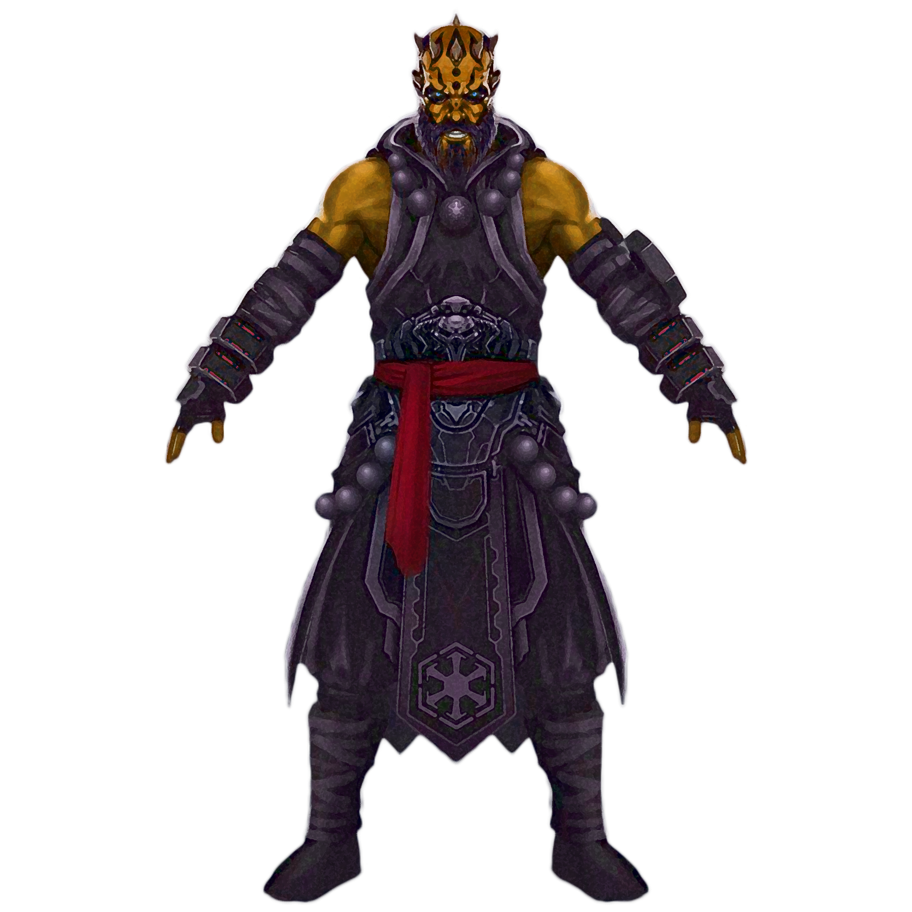

# Monk

Her vibrostaff a blur as they deflect an incoming hail of blaster bolts, a human springs over a barricade and throws herself into the massed ranks of pirates on the other side. She whirls among them, knocking their blows aside and sending them reeling, until at last she stands alone.

Taking a deep breath, a zabrak covered in tattoos settles into a battle stance. As the first charging mercenaries reach him, he exhales and a blast of negative energy courses from his hands, engulfing his foes.

Moving with the silence of the night, a black-clad mirialan steps into a shadow beneath an arch and nimbly climbs to the balcony a stone's throw above her. She slides her blade free of its cloth-wrapped scabbard and peers through the open window at the warlord, so vulnerable in the grip of sleep.

Whatever their discipline, monks are united in their ability to harness the energy that flows in their bodies. Whether channeled as a striking display of combat prowess or a subtler focus of defensive ability and speed, this energy infuses all that a monk does.

### The Power of Focus
Monks make careful study of a mystical energy that most monastic orders call focus. This energy is an element of the power that suffuses the galaxy-specifically, the element that flows through living bodies. Monks harness this energy within themselves to create powerful effects and exceed their bodies' physical capabilities, and some of their special attacks can hinder the flow of focus in their opponents. Using this energy, monks channel uncanny speed and strength into their unarmed strikes. As they gain experience, their martial training and their mastery of focus gives them more power over their bodies and the bodies of their foes.

### Training and Asceticism
Most monks live entirely apart from the surrounding population, secluded from anything that might impede their spiritual progress. Others are sworn to isolation, emerging only to serve as spies or assassins at the command of their leader, a noble patron, or some other power.

The majority of monks don't shun their neighbors, making frequent visits to nearby towns or villages and exchanging their service for food and other goods. As versatile warriors, monks often end up protecting their neighbors from monsters or brigands.

For a monk, becoming an adventurer means leaving a structured, communal lifestyle to become a wanderer. This can be a harsh transition, and monks don't undertake it lightly. Those who leave their cloisters take their work seriously, approaching their adventures as personal tests of their physical and spiritual growth. 

<!--- image here  --->

## Creating a Monk
As you make your monk character, think about your connection to the monastery where you learned your skills and spent your formative years. Were you an orphan or a child left on the monastery's threshold? Did your parents promise you to the monastery in gratitude for a service performed by the monks? Did you enter this secluded life to hide from a crime you committed? Or did you choose the monastic life for yourself?

Consider why you left. Did the head of your monastery choose you for a particularly important mission beyond the cloister? Perhaps you were cast out because of some violation of the community's rules. Did you dread leaving, or were you happy to go? Is there something you hope to accomplish outside the monastery? Are you eager to return to your home?

As a result of the structured life of a monastic community and the discipline required to harness focus, monks are typically lawful in alignment.

### Quick Build
You can make a monk quickly by following these suggestions. First, make Dexterity your highest ability score, followed by Wisdom. Second, choose the agent background.

## The Monk

| Level | Proficiency  Bonus | Features | Martial  Arts | Focus  Points | Monastic  Vows | Unarmored  Movement |
|:-----:|:-----------------:|:------------|:---------:|:------------------:|:---------:|:--:|
|	1st	|+2	|	Martial Arts, Unarmored Defense	                    |	d4	|	-	|   -   |	-	|
|	2nd	|+2	|	Focus, Monastic Vows                                |	d4	|	2	|   2   |   -	|
|	3rd	|+2	|	Unarmored Movement, Deflect Missiles, Monastic Order|	d4	|	3	|   2   |+10 ft.|
|	4th	|+2	|	Ability Score Improvement, Slow Fall	            |	d4	|	4	|   2   |+10 ft.|
|	5th	|+3	|	Extra Attack, Stunning Strike	                    |	d6	|	5	|   2   |+15 ft.|
|	6th	|+3	|	Enhanced Strikes, Order feature	                    |	d6	|	6	|   2   |+15 ft.|
|	7th	|+3	|	Evasion, Stillness of Mind	                        |	d6	|	7	|   3   |+15 ft.|
|	8th	|+3	|	Ability Score Improvement	                        |	d6	|	8	|   3   |+15 ft.|
|	9th	|+4	|	Unarmored Movement Improvement	                    |	d8	|	9	|   3   |+20 ft.|
|	10th|+4	|	Ability Score Improvement	                        |	d8	|	10	|   3   |+20 ft.|
|	11th|+4	|	Order feature	                                    |	d8	|	11	|   3   |+20 ft.|
|	12th|+4	|	Ability Score Improvement   	                    |	d8	|	12	|   3   |+20 ft.|
|	13th|+5	|	Purity of Body	                                    |	d10	|	13	|   4   |+25 ft.|
|	14th|+5 |	Diamond Soul	                                    |	d10	|	14	|   4   |+25 ft.|
|	15th|+5	|	Timeless Vessel	                                    |	d10	|	15	|   4   |+25 ft.|
|	16th|+5	|	Ability Score Improvement	                        |	d10	|	16	|   4   |+25 ft.|
|	17th|+6	|	Order feature	                                    |	d12	|	17	|   5   |+30 ft.|
|	18th|+6 |	Empty Body	                                        |	d12	|	18	|   5   |+30 ft.|
|	19th|+6	|	Ability Score Improvement	                        |	d12	|	19	|   5   |+30 ft.|
|	20th|+6	|	Perfect Self	                                    |	d12	|	20	|   5   |+30 ft.|

## Class Features
As a monk, you gain the following class features.

### Hit Points
- **Hit Dice:** 1d8 per monk level
- **Hit Points at 1st Level:** 8 + your Constitution modifier
- **Hit Points at Higher Levels:** 1d8 (or 5) + your Constitution modifier per monk level after 1st

### Proficiencies
- **Armor:** None
- **Weapons:** Simple blasters, simple vibroweapons, martial vibroweapons that lack the dexterity, heavy, special, and two-handed properties
- **Tools:** None
- **Saving Throws:** Strength, Dexterity
- **Skills:** Choose two from Acrobatics, Athletics, Insight, Lore, Perception, and Stealth

### Equipment
You start with the following equipment, in addition to the equipment granted by your background:
- *(a)* a vibroweapon with which you are proficient or *(b)* a simple blaster and a power cell
- *(a)* a dungeoneer's pack or *(b)* an explorer's pack
- 10 vibrodarts

### Variant: Starting Wealth 
In lieu of the equipment granted by your class and background, you can elect to purchase your starting gear. If you do so, you receive no equipment from your class and background, and instead roll for your starting wealth using the criteria below:

|	&emsp;&emsp;Class		|	Funds&emsp;&emsp;	|
|	:--			|	--:			|
|   &emsp;Monk      |	4d4 x 100 cr&emsp;  |

### Martial Arts
_**Monk:** 1st level_  
Your practice of martial arts gives you mastery of combat styles that use unarmed strikes and monk weapons, which are vibroweapons with which you are proficient that lack the dexterity, heavy, special, and two-handed properties.

You gain the following benefits while you are unarmed or wielding only monk weapons and you aren't wearing armor or wielding a shield:
- Your unarmed strikes and monk weapons gain the finesse property.
- You can roll a d4 in place of the normal damage of your unarmed strike or monk weapon. This die changes as you gain monk levels, as shown in the Martial Arts column of the monk table.
- You can use Dexterity instead of Strength whenever you would make a Strength (Athletics) check to grapple, shove, or trip a creature.
- When you use the Attack action with an unarmed strike or a monk weapon on your turn, you can make one unarmed strike as a bonus action. 
- You can take the Dash or Disengage actions as a bonus action.

> #### Variant: Monks with Lightweapons
> If monks gain lightweapon proficiency, consider letting them use lightweapons as monk weapons, provided the weapon lacks the dexterity, heavy, special, and two-handed properties.

### Unarmored Defense
_**Monk:** 1st level_ 
While you are wearing no armor and not wielding a shield, your AC equals 10 + your Dexterity modifier + your Wisdom or Charisma modifier (your choice).

### Focus
_**Monk:** 2nd and 11th level_ 
Your training allows you to harness the mystic energy of focus. Your access to this energy is represented by a number of focus points. Your monk level determines the number of points you have, as shown in the Focus Points column of the monk table.

You can spend these points to fuel various focus features. You start knowing three such features: Flurry of Blows, Patient Defense, and Step of the Wind. You learn more focus features as you gain levels in this class.

When you spend a focus point, it is unavailable until you finish a short or long rest, at the end of which you draw all of your expended focus back into yourself. You must spend at least 30 minutes of the rest meditating to regain your focus points.

You use your choice of Wisdom or Charisma for your focus ability. You use the chosen ability modifier whenever a feature refers to your focus ability. Additionally, you use the chosen ability modifier when making an attack with a focus feature or setting the saving throw DC for one.

___

**Focus save DC** = 8 + your proficiency bonus + your Wisdom or Charisma modifier (your choice)

___

**Focus attack modifier** = your proficiency bonus + your Wisdom or Charisma modifier (your choice)

___

#### Flurry of Blows
When you make your Martial Arts bonus action attack, you can spend 1 focus point to make an additional unarmed strike (no action required). At 11th level, you can instead spend 2 focus points to make two additional unarmed strikes.

#### Patient Defense
When you use your bonus action to Disengage, you can spend 1 focus point to also Dodge (no action required). At 11th level, you can instead spend 2 focus points to Dodge and gain an additional reaction until the start of your next turn. 

#### Step of the Wind
When you use your bonus action to Dash, you can spend 1 focus point to double your jump distance for the turn. At 11th level, you can instead spend 2 focus points to gain a flying speed equal to your walking speed until the end of your turn, though you fall if you end your speed in the air and nothing else is holding you aloft.

### Monastic Vows
_**Monk:** 2nd level_ 
You've sworn two vows, as detailed at the end of the class description. You swear an additional vow at 7th, 13th, and 17th level.

### Unarmored Movement
_**Monk:** 3rd and 9th level_ 
Your speed increases by 10 feet while you are not wearing armor or wielding a shield. This bonus increases when you reach certain monk levels, as shown in the Unarmored Movement column of the monk table.

At 9th level, you gain the ability to move along vertical surfaces and across liquids on your turn without falling during the move.

### Deflect Missiles
_**Monk:** 3rd level_ 
You can use your reaction to deflect a projectile when you are dealt damage by a ranged weapon attack. When you do so, the damage you take from the attack is reduced by 1d10 + your Dexterity modifier + your monk level.

If you reduce the damage to 0, and the damage is kinetic, energy, or ion, you can redirect it at another target if you have a weapon capable of doing so. You can spend 1 focus point to make a ranged attack with a range of 20/60 as you deflect the projectile, as part of the same reaction. You make this attack with proficiency, regardless of your weapon proficiencies, and the projectile counts as a monk weapon for the attack.

### Monastic Order
_**Monk:** 3rd, 6th, 11th, and 17th level_ 
You commit yourself to one monastic order, which is detailed at the end of the class description. 

### Ability Score Improvement
_**Monk:** 4th, 8th, 10th, 12th, 16th, and 19th level_ 
You can increase one ability score by 2, or you can increase two ability scores by 1. You can't increase an ability score above 20 using this feature.

### Slow Fall
_**Monk:** 4th level_ 
You can use your reaction when you fall to reduce any falling damage you take by an amount equal to five times your monk level.

### Extra Attack
_**Monk:** 5th level_ 
You can attack twice, instead of once, whenever you take the Attack action on your turn.

### Stunning Strike
_**Monk:** 5th level_ 
You can interfere with an opponent's body. When you hit another creature with a melee weapon attack, you can spend 1 focus point to attempt a stunning strike. The target must succeed on a Constitution saving throw or be stunned until the end of your next turn.

### Enhanced Strikes
_**Monk:** 6th level_ 
Your unarmed strikes count as enhanced for the purpose of overcoming resistance and immunity to unenhanced attacks and damage.

### Evasion
_**Monk:** 7th level_ 
Your instinctive agility lets you dodge out of the way of certain area effects. When you are subjected to an effect that allows you to make a Dexterity saving throw to take only half damage, you instead take no damage if you succeed on a saving throw, and only half damage if you fail.

### Stillness of Mind
_**Monk:** 7th level_ 
You can use your action or bonus action to end one effect on yourself that is causing you to be charmed or frightened.

### Purity of Body
_**Monk:** 13th level_ 
You are immune to disease and poison and resistant to poison damage.

### Diamond Soul
_**Monk:** 14th level_ 
Your mastery of focus grants you proficiency in all saving throws, and when you fail a saving throw, you can spend 1 focus point to reroll it, taking the new roll.

### Timeless Vessel
_**Monk:** 15th level_ 
Your focus sustains you so that you suffer none of the frailty of old age, and you can't be aged abnormally. You can still die of old age, however. Additionally, when you complete a short rest, you can expend a Hit Die to remove 1 level of exhaustion or slowed.

### Empty Body
_**Monk:** 18th level_ 
You can use your action to spend 4 focus points to become invisible for 1 minute. During that time, you also have resistance to all damage but force damage.

### Perfect Self
_**Monk:** 20th level_ 
You've gained perfect control over your body. Your Dexterity and Wisdom or Charisma scores (your choice) increase by 2. Your maximum for those scores increases by 2. Additionally, when you roll for initiative and have fewer than 6 focus points remaining, you regain up to 6 focus points.

___

## Monastic Vows
The vows are presented in alphabetical order.

### Vow of Deflection
You can use your reaction to divert a strike when you are dealt damage by a melee weapon attack. When you do so, the damage taken by the attack is reduced by 1d10 + your Dexterity modifier + your monk level.

### Vow of the Devoted
You gain a limited ability to manipulate the Force. See chapter 10 for the general rules of forcecasting and chapter 11 for the force powers list.

***Force Powers Known.*** You learn 2 force powers of your choice. You learn an additional power at 3rd, 5th, 7th, 9th, 11th, 13th, 15th, and 17th level. You may not learn a force power of a level higher than your Max Power Level, and you may learn a force power at the same time you learn its prerequisite. You may only learn universal powers in this way.

***Force Points.*** Rather than force points, powers you learn through this vow are cast using your focus points, at 1 focus point per power level. You may only cast universal powers in this way.

***Max Power Level.*** Many force powers can be overpowered, consuming more focus points to create a greater effect. You can overpower these abilities to a maximum level, which increases at higher levels. Your Max Power Level is 1st. It increases to 2nd at 7th level, 3rd at 13th level, and 4th at 17th level. You may only cast force powers at 4th-level once. You regain the ability to do so after a long rest.

***Forcecasting Ability.*** You use your focus ability whenever a power refers to your forcecasting ability. If a power you cast with focus points calls for a saving throw, you use your focus save DC. If a power you cast with focus points calls for an attack roll, you use your focus attack modifier.

### Vow of Fate
_**Prerequisite:** 7th level_ 
When you finish a short or long rest, roll a d20 and record the number rolled. Once before your next short or long rest, you can replace any attack roll, saving throw, or ability check made by you or a creature within 5 feet of you with this roll. You must choose to do so before the roll. 

### Vow of the Fighter
You adopt a particular style of fighting as your specialty. Choose one of the fighting Style options, detailed in Chapter 6. 

### Vow of the Focused
You can substitute Strength, Constitution, or Intelligence (chosen when you take this vow) for Wisdom or Charisma for your monk class features, except for other vows and Monastic Tradition features.

### Vow of Fortitude
_**Prerequisite:** 7th level_ 
You can use your action or bonus action to end one effect on yourself that is causing you to be blinded or deafened. 

### Vow of Freedom
You ignore unenhanced difficult terrain, and when you would use your action to break free of an effect that is grappling or restraining you, you can instead use your bonus action.

### Vow of Intuition
You can no longer have disadvantage on attack rolls against creatures within 10 feet of you due to not being able to see them.

### Vow of the Limber
_**Prerequisite:** 7th level_ 
When you make your first unarmed strike on your turn, you can choose to spend 1 focus point. If you do so, your reach with your unarmed strikes increases by 5 feet until the end of your turn.

### Vow of the Nemesis
_**Prerequisite:** 13th level_ 
As a bonus action, you can choose one creature within 30 feet that you can see. The creature must make a Wisdom saving throw against your focus save DC. On a successful save, the creature becomes immune to this feature for 24 hours. On a failed save, for the next minute, the creature has disadvantage on attack rolls against creatures other than you, and it must make an additional Wisdom saving throw each time it attempts to move to a space that is more than 30 feet away from you; if it succeeds on this saving throw, this feature doesn't restrict its movement for that turn. 

This feature ends early if you attack another creature, if you target another hostile creature with a power or class feature, if a friendly creature damages the target, if a friendly creature targets it with a power or class feature, or if you target another creature with this feature.

### Vow of the Open Mind
You gain proficiency in a skill of your choice. Additionally, you can spend 1 focus point and 10 minutes meditating on a skill in which you are proficient. If you do so, when you make an ability check with the chosen skill, you can add your Wisdom or Charisma modifier to the check. You can only have one instance of this feature active at a time.

### Vow of Precision
_**Prerequisite:** 13th level_ 
Your critical hit range with unarmed strikes increases by 1.

### Vow of Requital
_**Prerequisite:** 13th level_ 
When you take the Dodge action and an attack made by a creature within 5 feet of you misses you before the start of your next turn, you can use your reaction to make one melee weapon attack with a monk weapon or unarmed strike against that creature.

### Vow of Restoration
When you would make an unarmed strike, you can spend 1 focus point to instead touch a willing creature within your reach. Roll your Martial Arts die. The target gains hit points equal to the amount rolled + your Wisdom or Charisma modifier (your choice, minimum of +1).

### Vow of the Sentry
You gain proficiency in light and medium armor. Additionally, you can now gain the benefits of your Martial Arts and Unarmored Movement features while wearing light or medium armor as long as you are not wielding a shield.

### Vow of Serenity
Your maximum focus increases by an amount equal to half your Wisdom or Charisma modifier (your choice, minimum of +1).

### Vow of Spirit
You can use your choice of Wisdom or Charisma instead of Strength or Dexterity for the attack and damage rolls of your unarmed strikes and monk weapons. You must use the same modifier for both rolls.

### Vow of the Versatile
When you would make an unarmed strike as part of your Martial Arts bonus action attack or your Flurry of Blows, you can instead make a weapon attack with a monk weapon you are wielding, using your Martial Arts die in place of the weapon's damage.

___

## Monastic Orders
Orders of monastic pursuit are common in the locales scattered across the galaxy. Each order is based in a specific culture and is mutually exclusive, despite relying on the same basic techniques. Your order grants you features at 3rd, 6th, 11th, and 17th level.
