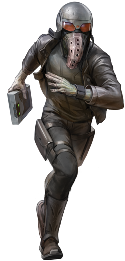

## Acquisitions Practice
Many operatives are hired for the procurement of valuable artifacts, but only the true masters of the art can slip through the tightest security and make off with untold riches, whether they do it for a profit, or for sport. Those operatives who choose the Acquisitions Practice apply a mixture of stealth and impressive acrobatics to surpass any kind of defenses they are met with.

### Fast and Agile
_**Acquisitions Practice:** 3rd level_ 
You can use the bonus action granted by your Cunning Action to make a Dexterity (Sleight of Hand) check, use your demolitions kit or security kit to disarm a trap or open a lock, or take the Use an Object action.

Additionally, climbing no longer costs you extra movement, and you gain the ability to move in flying leaps with incredible speed, precision, and power. When you move, instead of using your walking speed, you may take two short movements by flying. Each movement is at half your speed, and you must end each one on a solid object, a surface, or on the ground. If you do not, you fall and your movement ends. If you Dash, your bonus movement is applied to your normal speed, not this movement. 

### Deft Hands
_**Acquisitions Practice:** 3rd level_ 
You learn a number of techniques to distract and confuse your opponents. When you deal Sneak Attack damage, you may choose to forgo two of your Sneak Attack dice to perform a deft hand maneuver.

Some of your deft hand maneuvers require your target to make a saving throw to resist the deft hand maneuver's effects. The saving throw DC is as follows:

___

**Deft Hands save DC** = 8 + your proficiency bonus + your Dexterity modifier

___

#### Hinder
You attempt to distract your target in order to hinder their movement. The target must make a Constitution saving throw. On a failed save, it gains 1 slowed level until the end of its next turn and it makes the first Dexterity saving throw before the end of its next turn with disadvantage.

#### Pilfer
You attempt to pick your target's pockets. The target must make a Wisdom saving throw. On a failed save, you have advantage on the first Dexterity (Sleight of Hand) check you make against the target before the end of your next turn.

#### Tumble
You attempt to nimbly roll away. You immediately move 10 feet in a direction of your choice, and the target must make a Dexterity saving throw. On a failed save, this movement does not provoke opportunity attacks from the creature.

### Supreme Sneak
_**Acquisitions Practice:** 9th level_ 
You have advantage on a Dexterity (Stealth) check if you move no more than half your speed on the same turn. Additionally, as long as you aren't incapacitated, you no longer take damage from falling less than 100 feet, and have resistance to falling damage.

### Aerial Agility
_**Acquisitions Practice:** 13th level_ 
Your agility in the air grants you the following benefits:
- When you move, you can instead take 3 short movements by flying.
- Whenever you end your flying movement and you are within 5 feet of a climbable surface, you can grab onto that surface as though you were climbing upon it.

### Thief's Reflexes
_**Acquisitions Practice:** 17th level_ 
You can take two turns during the first round of any combat. You take your first turn at your normal initiative and your second turn at your initiative minus 10. You can't use this feature when you are surprised.

Additionally, you learn to utilize the momentum of your fall to make deadly vertical strikes. Whenever you fall at least 50 feet and land within 5 feet of an enemy creature you can use your reaction to make one weapon attack against that creature. If the attack is a Sneak Attack, you can deal three additional weapon dice worth of damage and the creature must succeed on a Dexterity saving throw against your Deft Hands save DC or be knocked prone.
