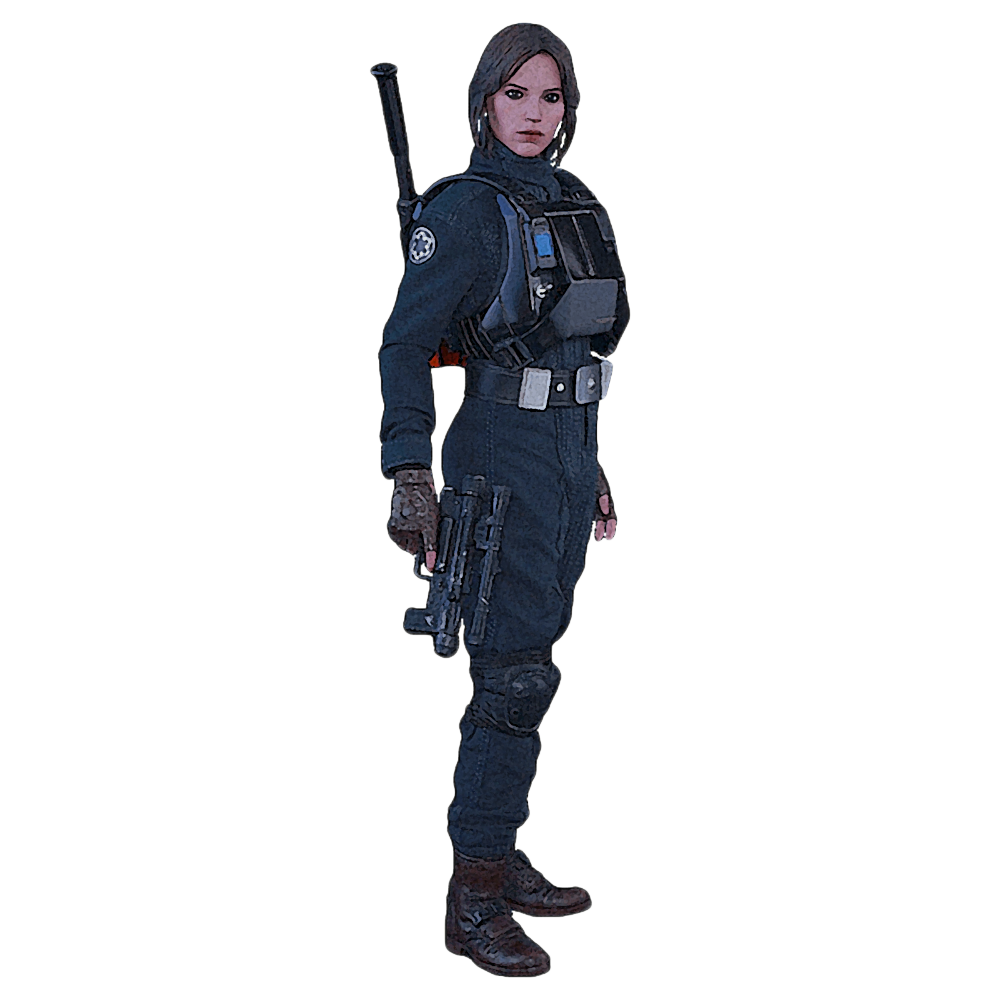

# Lethality Practice

Those operatives who choose the Lethality Practice hone their skills in the art of death. They use precise and surprising attacks to dispatch their foes with fatal efficiency.

## Assassinate
_**Lethality Practice:** 3rd level_ 
When you hit a creature that you are hidden from with a weapon attack, you can choose to turn that hit into a critical hit. If the attack reduces the creature to 0 hit points, it does not automatically reveal your presence to any remaining creatures. Make a Dexterity (Stealth) check contested by the creatures' Wisdom (Perception) check. On a success, you remain hidden. If you would already be able to make a Dexterity (Stealth) check to remain hidden as part of the attack, you instead gain advantage on the check.

You can use this feature once. You gain an additional use at 9th and 17th level. You regain all expended uses when you finish a long rest.

## Lethal Strikes
_**Lethality Practice:** 3rd level_ 
You learn how to read your foes and strikes their weak points. When you deal Sneak Attack damage to a creature, you may choose to forgo two of your Sneak Attack dice to make the attack a lethal strike. 

Some of your lethal strikes require your target to make a saving throw to resist the lethal strike's effects. The saving throw DC is calculated as follows: 

___

**Lethal Strike save DC** = 8 + your proficiency bonus + your Dexterity modifier

___

### Priming Attack
You attempt to prime the target. The target must make a Dexterity, Constitution, or Wisdom saving throw (your choice). On a failed save, the next time you deal Sneak Attack damage against the target before the end of your next turn, you roll four additional Sneak Attack dice.

### Target Assessment
You attempt to infer crucial details about your foe. The creature must make a Charisma saving throw. On a failed save, the GM tells you two of the following characteristics of your choice:
- Highest ability score
- Lowest ability score
- Strongest saving throw
- Weakest saving throw

### Vulnerable Strike
You attempt to stagger the target. The target must make a Wisdom saving throw. On a failed save, the next time you would make an attack roll against the target before the end of your next turn, you can instead force the target to make a saving throw with the ability score of your choice. On a failed save, the creature takes normal weapon damage, is subjected to any additional effects that would occur on a hit, and you can apply your Sneak Attack damage to the roll.

## Infiltrator
_**Lethality Practice:** 9th level_ 
You have become a master at avoiding detection.

When you or a creature within 5 feet of you fails a Dexterity (Stealth) check, you can use your reaction to allow that creature to reroll the check. It must use the new roll.

## Bushmaster
_**Lethality Practice:** 13th level_ 
You excel at leading ambushes and acting first in a fight.

You have advantage on initiative checks. Additionally, the first creature you hit during the first round of a combat becomes easier for you and others to strike; attack rolls against that target have advantage until the start of your next turn.

## Death Strike
_**Lethality Practice:** 17th level_ 
You've become a master of instant death. When you deal weapon damage to a creature that you are hidden from or that is surprised, you can force it to make a Constitution saving throw against your lethal strike save DC. On a failed save, double the damage of your attack against the creature, and you can't use this feature again until you finish a long rest.
