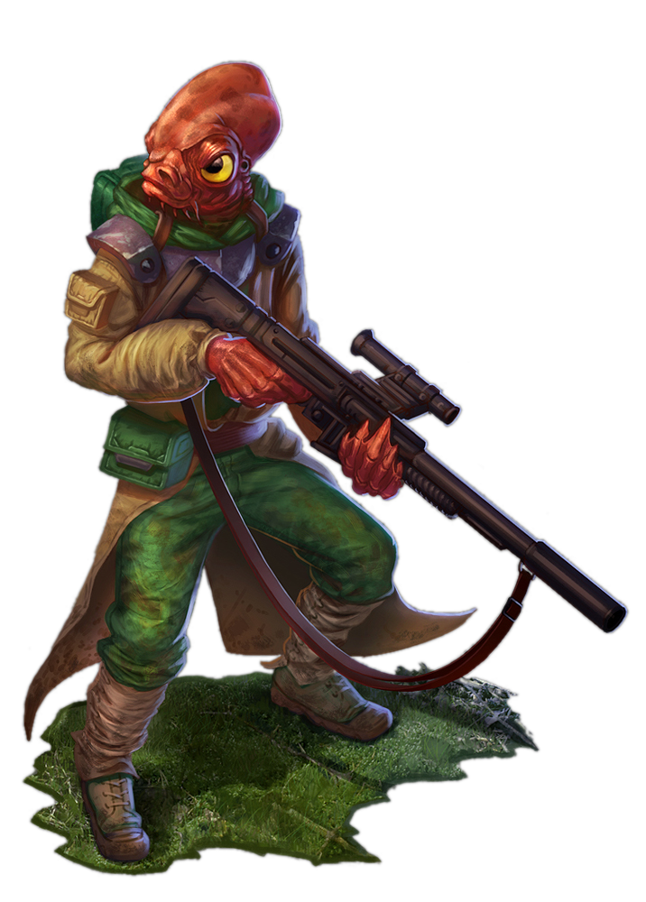

# Sharpshooter Practice
Those operatives who choose the Sharpshooter Practice are bringers of death. Striking from a safe distance, the Sharpshooter uses precision shooting to control the battlefield and bring targets down quickly.

## Assume the Position
_**Sharpshooter Practice:** 3rd level_ 
You don't need advantage on your attack roll to use your Sneak Attack if your target is greater than 30 feet from you and no enemies are within 5 feet of you. Additionally, standing up from prone now only costs 5 feet of movement.

Additionally, you gain proficiency with two martial blasters of your choice.

## Placed Shots
_**Sharpshooter Practice:** 3rd level_ 
You perfect the art of placing distant shots for maximum effectiveness in debilitating and controlling your enemies. When you deal Sneak Attack damage to a creature, you may choose to forgo two of your Sneak Attack dice to make the attack a placed shot. 

Some of your placed shots require your target to make a saving throw to resist the placed shot's effects. The saving throw DC is calculated as follows: 

___

**Placed Shot save DC** = 8 + your proficiency bonus + your Dexterity modifier

___

### Disarming Shot
You attempt to disarm a creature with your attack. The target must succeed on a Strength saving throw or be forced to drop one item of your choice that it's holding. The object lands at its feet.

### Penetrating Shot
You attempt to damage another target with the same attack. Choose a second target within 15 feet of and directly behind your initial target. If the original attack roll would hit the second target, it takes two dice worth of Sneak Attack damage.

The damage is of the same type dealt by the original attack.

### Suppressive Shot
You attempt to pin the target to its location. The target must succeed on a Wisdom saving throw or be frightened of you until the end of its next turn.

## Head Shot
_**Sharpshooter Practice:** 9th level_ 
You are at your deadliest when your enemies are unaware of the danger they are in. You have advantage on attack rolls against any creature that hasn't taken a turn in combat yet. 

Additionally, any hit you score against a creature that is surprised is a critical hit.

## Distracting Shot
_**Sharpshooter Practice:** 13th level_ 
You are able to defend your compatriots from afar. When a friendly creature you can see within your weapon's normal range is the target of a ranged attack, or forced to make a saving throw, and the source of the effect is within your weapon's normal range, you can use your reaction to make a ranged weapon attack against the source. On a hit, instead of dealing damage, the target of your attack has disadvantage on the attack roll against your ally, or your ally has advantage on the saving throw to resist the effect.

## Double Tap
_**Sharpshooter Practice:** 17th level_ 
You've learned to capitalize when you have the advantage. When you take the Attack action and make an attack with advantage, you can choose to forgo the advantage. If you do, you can make an additional attack against the target or another creature within 5 feet of it (no action required). Both attacks can benefit from your Sneak Attack damage, instead of only one.
