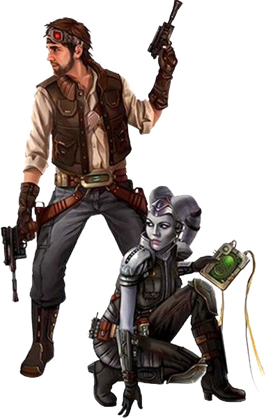

# Operative

A Bothan spy takes a moment to adjust her infrared goggles. Nimbly sidestepping the laser grid in the room, she slips to the computer at the far end. Counting down the seconds in her head, she slices the mainframe. Twenty seconds. Ten seconds. A handful of soldiers bursts into the room, but she is already gone ñ with the data in hand. 

With a wary eye on the door, a scruffy-looking Duros plays pazaak in a seedy cantina. When two city guards appear at the exit, he smiles and reaches under the table. Before they can move in, the smuggler flips the table and opens fire. The crowd scatters in panic, giving him just enough cover to escape. 

A gorgeous young human dances before an intoxicated senator in his parlor. She winks enticingly through her golden blonde hair as she sways closer. Leaning in for a kiss, the senator is instead surprised by the barrel of a hold-out blaster pistol shoved into his mouth. He has no time to shout before the assassin pulls the trigger. 

Operatives, whether good, bad, or neutral, are those who focus on a specific practice and utilize it to get the upper hand. They can come from any world or region in the galaxy, with origins from the lowliest scoundrel to the once social elite.

## Evading Danger
Operatives have a knack for getting out of trouble. They have an instinct for self-preservation that keeps them alive, but it's usually tempered with a need to experience the thrills that their profession has to offer, and many adventurous operatives are also saddled with a sense of honor that sometimes makes them go against their natural inclinations. No matter what their immediate concerns may be, survival is the name of the game.

## Outside the Law
Operatives don't often start out seeking to defy authority and break the law. Some are thrust into the profession as a means of rebellion. Others wind up on the wrong side of the law due to bad luck, poor decisions, or circumstances beyond their control. The skills they pick up along the way make them great members of any mission team.

<!---  --->

## Creating an Operative
While creating your operative character, consider how you first started on your path. Maybe you were raised on the street and fell into the criminal element as a means of survival. You could be a simple trader who decided to strike against the Sith Empire when it encroached on your business. What would you say is your greatest skill set? What is your core, the truest essence about yourself that keeps you focused? Why would society treat you as a criminal, yet your allies hold you as a loyal companion?

### Quick Build
You can make an operative quickly by following these suggestions. First, make Dexterity your highest ability score, followed by Intelligence or Charisma. Second, choose the gambler background.

## The Operative

|	Level	|	Proficiency Bonus	|	Features	|   Sneak Attack	|Operative  Exploits|
|	:--:	|	:--:	|	:--	|	:--:	|   :--:|
|	 1st	|	+2	|   Expertise, Sneak Attack	            |   1d6 | - |
|	 2nd	|	+2	|   Cunning Action, Operative Exploits	|   1d6 | 2 |
|	 3rd	|	+2	|   Bad Feeling, Operative Practice     |   2d6 | 2 |
|	 4th	|	+2	|   Ability Score Improvement       	|   2d6 | 2 |
|	 5th	|	+3	|   Uncanny Dodge       	            |   3d6 | 2 |
|	 6th	|	+3	|   Expertise	                        |   3d6 | 2 |
|	 7th	|	+3	|   Evasion	                            |   4d6 | 3 |
|	 8th	|	+3	|   Ability Score Improvement       	|   4d6 | 3 |
|	 9th	|	+4	|   Practice feature                	|   5d6 | 3 |
|	10th	|	+4	|   Ability Score Improvement       	|   5d6 | 3 |
|	11th	|	+4	|   Reliable Talent                  	|   6d6 | 3 |
|	12th	|	+4	|   Ability Score Improvement       	|   6d6 | 3 |
|	13th	|	+5	|   Practice feature                	|   7d6 | 4 |
|	14th	|	+5	|   Blindsense	                        |   7d6 | 4 |
|	15th	|	+5	|   Slippery Mind	                    |   8d6 | 4 |
|	16th	|	+5	|   Ability Score Improvement       	|   8d6 | 4 |
|	17th	|	+6	|   Practice feature             	    |   9d6 | 5 |
|	18th	|	+6	|   Elusive	                            |   9d6 | 5 |
|	19th	|	+6	|   Ability Score Improvement       	|  10d6 | 5 |
|	20th	|	+6	|   Stroke of Luck	                    |  10d6 | 5 |

## Class Features
As an operative, you have the following class features.

### Hit Points
- **Hit Dice:** 1d8 per operative level
- **Hit Points at 1st Level:** 8 + your Constitution modifier
- **Hit Points at Higher Levels:** 1d8 (or 5) + your Constitution modifier per operative level after 1st

### Proficiencies
- **Armor:** Light armor
- **Weapons:** Simple blasters, simple vibroweapons, martial blasters that lack the auto, special, strength, and two-handed properties, martial vibroweapons with the finesse property
- **Tools:** One specialist's kit of your choice
- **Saving Throws:** Dexterity, Intelligence
- **Skills:** Choose any four

### Equipment
You start with the following equipment, in addition to the equipment granted by your background:
- *(a)* a vibroweapon with which you are proficient or *(b)* a simple blaster and a power cell
- *(a)* a simple blaster and two power cells or *(b)* a simple vibroweapon and a light physical shield
- *(a)* a burglar's pack, *(b)* a dungeoneer's pack, or *(c)* an explorer's pack
- A tool with which you are proficient
- A combat suit and a vibrodagger

### Variant: Starting Wealth 
In lieu of the equipment granted by your class and background, you can elect to purchase your starting gear. If you do so, you receive no equipment from your class and background, and instead roll for your starting wealth using the criteria below:

|	&emsp;&emsp;Class		|	Funds&emsp;&emsp;	|
|	:--			|	--:			|
|   &emsp;Operative |	7d4 x 100 cr&emsp;  |

### Expertise
_**Operative:** 1st and 6th level_ 
Choose two of your skill proficiencies, or one of skill proficiencies and one of your tool proficiencies, or two of your tool proficiencies. You gain expertise in those skills or tools.

At 6th level, you can choose two more of your proficiencies (in skills or tools) to gain this benefit.

### Sneak Attack
_**Operative:** 1st level_ 
You know how to strike subtly and exploit a foe's distraction. Once per turn, you can deal an extra 1d6 damage to one creature you hit with a weapon attack if you have advantage on the attack roll. This damage is the same as the weapon's damage, and the attack must use a finesse or a ranged weapon. 

You don't need advantage on the attack roll if another enemy of the target is within 5 feet of it, that enemy isn't incapacitated, and you don't have disadvantage on the attack roll.

The amount of the extra damage increases as you gain levels in this class, as shown in the Sneak Attack column of the operative table.

### Cunning Action
_**Operative:** 2nd level_ 
Your quick thinking and agility allow you to move and act quickly. You can take the Dash, Disengage, or Hide actions as a bonus action.

### Operative Exploits
_**Operative:** 2nd level_ 
You've adopted two exploits, as detailed at the end of the class description. You adopt an additional exploit at 7th, 13th, and 17th level.

### Bad Feeling
_**Operative:** 3rd level_ 
You have a wary eye, bordering on paranoia. When you roll for initiative, you can move up to your speed. This movement happens before the initiative order is determined. 

Once you've used this feature, you can't use it again until you finish a long rest.

### Operative Practice
_**Operative:** 3rd, 9th, 13th, and 17th level_ 
You choose a practice that you emulate in the exercise of your operative abilities, which is detailed at the end of the class description. Your practice choice grants you features at 3rd level and then again at 9th, 13th, and 17th level.

### Ability Score Improvement
_**Operative:** 4th, 8th, 10th, 12th, 16th, and 19th level_ 
You can increase one ability score by 2, or you can increase two ability scores by 1. You can't increase an ability score above 20 using this feature.

### Uncanny Dodge
_**Operative:** 5th level_ 
When an attacker that you can see deals damage to you with an attack, you can use your reaction to halve the attack's damage against you.

### Evasion
_**Operative:** 7th level_ 
When you are subjected to an effect that allows you to make a Dexterity saving throw to take only half damage, you instead take no damage if you succeed on a saving throw, and only half damage if you fail.

### Reliable Talent
_**Operative:** 11th level_ 
You have refined your chosen skills until they approach perfection. Ability checks you make that let you add your proficiency bonus gain a minimum roll threshold, discussed in chapter 7.

### Blindsense
_**Operative:** 14th level_ 
If you are able to hear, you are aware of the location of any hidden or invisible creature within 10 feet of you.

### Slippery Mind
_**Operative:** 15th level_ 
You have acquired greater mental strength. You gain proficiency in Wisdom saving throws. 

### Elusive
_**Operative:** 18th level_ 
You are so evasive that attackers rarely gain the upper hand against you. No attack roll has advantage against you while you aren't incapacitated.

### Stroke of Luck
_**Operative:** 20th level_ 
You have an uncanny knack for succeeding when you need to. Your Dexterity and Intelligence scores increase by 2. Your maximum for those scores increases by 2. Additionally, if your attack misses a target within range, you can turn the miss into a hit. Alternatively, if you fail an ability check, you can treat the d20 roll as a 20.

Once you've used this feature, you can't use it again until you finish a short or long rest.

___

## Operative Exploits
The exploits are presented in alphabetical order. 

### Commander's Exploit
You gain proficiency in medium armor.

### Explorer's Exploit
You can hold your breath twice as long as you are normally able to, and take half as much damage from fall damage.

### Fate's Exploit
_**Prerequisite:** 7th level_ 
When you finish a short or long rest, roll a d20 and record the number rolled. Once before your next short or long rest, you can replace any attack roll, saving throw, or ability check made by you or a creature within 5 feet of you with this roll. You must choose to do so before the roll. 

### Fighter's Exploit
You adopt a particular style of fighting as your specialty. Choose one of the fighting Style options, detailed in Chapter 6. 

### Freedom's Exploit
You ignore unenhanced difficult terrain, and when you would use your action to break free of an effect that is grappling or restraining you, you can instead use your bonus action.

### Guerrilla's Exploit
You only need 3 hours of sleep during a long rest to gain its benefits, instead of 6. Additionally, if your long rest would be interrupted, you only need to complete the long rest instead of restarting it to gain its benefits. Lastly, you have advantage on saving throws against exhaustion.

### Learner's Exploit
You gain proficiency in a skill and a tool, or two tools.

You can select this exploit multiple times, each time choosing a new skill and a tool, or two new tools.

### Mentor's Exploit
_**Prerequisite:** 13th level_ 
Once per turn, whenever both you and a friendly creature within 60 feet that can see and hear you both have to make a saving throw to resist the same effect, you can choose to have disadvantage on the save. If you do so, the friendly creature gains advantage on the save. You can use this feature before or after you both make the saving throw, but you must do so before the GM says whether the save succeeds or fails.

### Skill's Exploit
You learn an exploit that enhances your ability to apply your knowledge to combat situations. You can take this exploit multiple times.

When you take the Attack action, you can use one of your skill exploits granted by this feature. You can use these features a combined two times. You gain an additional use at 5th, 9th, 13th, and 17th level. You regain any expended uses when you finish a long rest.

Choose from the following. You must be proficient in the skill in order to take that skill's exploit. 

***Aim (Stealth).*** You attempt to line up a strike against a creature you can see that you are hidden from. Make a Dexterity (Stealth) check contested by the target's Wisdom (Perception) check. If your check succeeds, you gain a +10 bonus to the first attack roll you make against the target before the end of your next turn. If your check fails, you are no longer hidden from the target.

***Angle (Perception).*** You attempt to predict the behavior of a humanoid you can see within 30 feet. Make a Wisdom (Perception) check contested by the target's Dexterity (Sleight of Hand) check. If your check succeeds, the first attack roll the target makes before the start of your next turn has disadvantage, and the first saving throw the creature makes before the start of your next turn has disadvantage. If your check fails, you can't use this feature on this target again for 1 hour.

***Battle Cry (Intimidation).*** You attempt to demoralize one humanoid you can see within 30 feet of you that can see and hear you. Make a Charisma (Intimidation) check contested by the target's Wisdom (Insight) check. If your check succeeds, the target is frightened until the end of your next turn. If the target was already frightened of you, it must immediately drop whatever it is holding. On its next turn, if it is still frightened of you, it must take the Dash action and move away from you by the safest available route on its turn, unless there is nowhere to move. If your check fails, you can't use this feature on this target again for 1 hour.

***Charm (Persuasion).*** You attempt to convince one humanoid you can see within 30 feet that can hear and understand you. Make a Charisma (Persuasion) check contested by the target's Wisdom (Insight) check. If you have dealt damage to the creature in the last hour, it has advantage on the check. If your check succeeds, the target is charmed by you until the start of your next turn, and it has disadvantage on the first attack roll it makes against a creature before the end of its next turn. If your check fails, you can't use this feature on this target again for 1 hour.

***Confuse Beast (Animal Handling).*** You attempt to confuse one beast on the battlefield. Make a Wisdom (Animal Handling) check contested by the target's Wisdom (Insight) check. If your check succeeds, the beast cannot take actions or reactions until the end of your next turn. If your check fails, you can't use this feature on this target again for 1 hour.

***Distract (Performance).*** You attempt to distract one beast or humanoid you can see within 30 feet of you that can see and hear you. Make a Charisma (Performance) check contested by the target's Wisdom (Insight) check. If your check succeeds, the next attack roll made against the target before the start of its next turn has advantage. If your check fails, you can't use this feature on this target again for 1 hour.

***Emulate Predator (Nature).*** You attempt to emulate the sounds of a natural predator of a beast or plant you can see within 30 feet. Make an Intelligence (Nature) check contested by the target's Wisdom (Insight) check. If your check succeeds, the target must take the Dash action and move away from you by the safest available route on its turn, unless there is nowhere to move. If your check fails, you can't use this feature on this target again for 1 hour.

***Feint (Deception).*** You attempt to divert the attention of a target you can see within 30 feet. Make a Charisma (Deception) check contested by the target's Wisdom (Insight) check. If your check succeeds, the first attack roll made against the target before the start of your next turn by someone other than you has advantage, and the target has disadvantage on the first saving throw they make against an effect caused by a creature other than you before the start of your next turn. If your check fails, the target can't be deceived by you in this way for 1 hour.

***Hacktivate (Technology).*** You attempt to determine the weaknesses in a droid you can see within 30 feet. Make an Intelligence (Technology) check contested by the target's Intelligence (Technology) check. If your check succeeds, you have advantage on the next attack roll you make against the target before the end of your turn, and if you hit, you deal additional damage equal to your Intelligence modifier. If your check fails, you can't use this feature on this target again for 1 hour.

***Instruct (Investigation).*** You attempt to find a weakness in your target. Make an Intelligence (Investigation) check contested by the target's Charisma (Deception) check. If your check succeeds, if a friendly creature makes an attack roll against the target and they can see and hear you, you can use your reaction to grant them advantage on the roll. If you do so, and they hit, they deal additional damage equal to your bonus to Investigation checks. This damage is the same type as the attack's damage. If your check fails, you can't use this feature on this target again for 1 hour.

***Intuit (Insight).*** You attempt to determine the motivations of one humanoid you can see within 30 feet. Make a Wisdom (Insight) check contested by the target's Charisma (Deception) check. If your check succeeds, the target can't have advantage on ability checks, attack rolls, or saving throws against you until the end of your next turn. If your check fails, the target instead can't have disadvantage on ability checks, attack rolls, or saving throws against you until the end of your next turn.

***Pocket Sand (Sleight of Hand).*** You attempt to blind one beast or humanoid you can see within 15 feet of you. Make a Dexterity (Sleight of Hand) check contested by the target's Wisdom (Perception) check. If your check succeeds, the target is blinded until the end of your turn. If your check fails, you can't use this feature on this target again for 1 hour.

***Precision Strike (Medicine).*** You attempt to strike a pressure point in one humanoid within your reach. Make a Wisdom (Medicine) check contested by the target's Strength (Athletics) or Dexterity (Acrobatics) check (the target chooses the ability to use). If your check succeeds, they are incapacitated until the end of their next turn. If your check fails, you can't use this feature on this target again for 1 hour.

***Snare (Survival).*** You attempt to cause a creature within 30 feet of you to stumble. Make a Wisdom (Survival) check contested by the target's Wisdom (Perception) check. If your check succeeds, and the target moves towards you before the start of your next turn, it gains 1 slowed level, and you can use your reaction to cause it to fall prone. If your check fails, you can't use this feature on this target again for 1 hour.

***Spin (Piloting).*** You attempt to confound a piloted construct you can see within 30 feet. Make an Intelligence (Piloting) check contested by the target's Intelligence (Piloting) check. If your check succeeds, the target has disadvantage on attack rolls against you, and you have advantage on Dexterity saving throws against the target, until the start of your next turn. If your check fails, the target instead has advantage on attack rolls against you, and you have disadvantage on Dexterity saving throws against the target, until the start of your next turn.

***Study (Lore).*** You attempt to anticipate your target's action. Make an Intelligence (Lore) check contested by the target's Charisma (Deception) check. If your check succeeds, you have advantage on the first ability check, attack roll or saving throw you make against that creature before the end of your next turn. Alternatively, before the end of your next turn, you can use your reaction to grant disadvantage on the first ability check, attack roll, or saving throw the target makes against you. If your check fails, you instead have disadvantage on the first ability check, attack roll or saving throw you make against that creature before the end of your next turn.

***Tumble (Acrobatics).*** You attempt to make a quick tumble, immediately moving 10 feet. If you begin or end this movement within a creature's reach, make a Dexterity (Acrobatics) check contested by it's Strength (Athletics) or Dexterity (Acrobatics) check (the target chooses the ability to use). If your check succeeds, this movement does not provoke opportunity attacks from it, and you have advantage on the first attack roll you make against it before the end of your turn. If your check fails, you immediately fall prone.

***Wrestle (Athletics).*** You attempt to grab and pin a creature within 5 feet of you with at least one free hand. The target must be no more than one size larger than you. Make a Strength (Athletics) check contested by the target's Strength (Athletics) or Dexterity (Acrobatics) check (the target chooses the ability to use). If your check succeeds, the target is both grappled and restrained by you. If the target stops being grappled, it also stops being restrained. If your check fails, you can't use this feature on this target again for 1 hour.

### Technologist's Exploit
You learn and can cast one 1st-level tech power once per long rest. Your techcasting ability is Intelligence. You require use of a wristpad for this power.

You can select this exploit multiple times. Each time you do so, you must choose a different power.

### Weaponmaster's Exploit
You gain proficiency in three blasters or vibroweapons that lack the heavy and strength properties.

You can select this exploit multiple times. Each time you do so, you must choose different weapons.

___

## Operative Practices
Operatives share, including their emphasis on perfecting their skills, their precise and deadly approach to combat, and their increasingly quick reflexes, though their practices differ. Your practice grants you features at 3rd, 9th, 13th, and 17th level.
