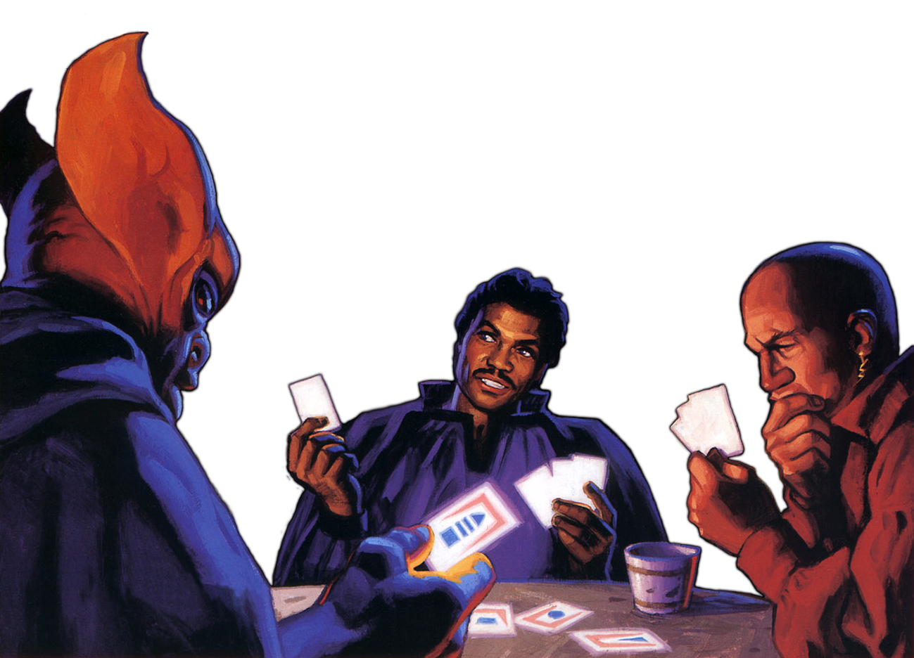

## Gambler Pursuit

Not all studied men and women use their intelligence and skill for the pursuit of knowledge, but instead turn to the various casinos and betting halls of the galaxy. Those scholars who choose the Gambler Pursuit use their knowledge of probability and risk to attempt to master games of chance and build their fortune, or lose it all along the way.

### Gambler's Aptitude
_**Gambler Pursuit:** 3rd level_ 
You gain proficiency with your choice of gaming set and your choice of the Insight, Deception, Persuasion, or Sleight of Hand skills. Additionally, you can't have disadvantage on checks you make with them.

### Risk versus Reward
_**Gambler Pursuit:** 3rd, 9th, 13th, and 17th level_ 
When you make your first attack on your turn against the target of your Critical Analysis feature, you can decide to gamble by rolling a d6. On a roll of 4 or higher, you have advantage on attack rolls against that creature until the start of your next turn. On a roll of 3 or lower, that creature instead has advantage on attack rolls against you until the start of your next turn.

This die increases to d8 at 9th level, d10 at 13th level, and d12 at 17th level.

### Lucky Number 7
_**Gambler Pursuit:** 6th level_ 
Whenever you roll a 7 on an attack roll against the target of your Critical Analysis feature, the attack automatically hits and you regain an expended superiority die. 

When attacking with advantage or disadvantage, this effect applies if either roll is a 7. If both rolls are a 7, the attack is a critical hit.

### Tell Me the Odds
_**Gambler Pursuit:** 9th, 13th, and 17th level_ 
If the target of your Critical Analysis hits you with a weapon attack roll, you can use your reaction to roll a d8. On a 4 or higher, you impose disadvantage on the roll. If the target already had disadvantage, they must instead reroll one of the dice once (your choice).

This die increases to d10 at 13th level and d12 at 17th level.

### Borrowed Luck
_**Gambler Pursuit:** 17th level_ 
You have gained the ability to unnaturally alter luck in your favor. Once per round, after an attack roll, saving throw, or ability check is rolled by you or a creature that you can see, you can replace the number on the d20 with a 7. Note the number on the d20 of the roll that you replaced. That number becomes your borrowed luck roll.

While you have a borrowed luck roll, you can expend it and replace any ability check, attack roll, or saving throw made by you or a creature that you can see with the value of the borrowed luck roll. You can only have one borrowed luck roll at a time, and you lose any unused borrowed luck rolls when you complete a short or long rest.

___

## Gambler Discoveries
When you select this pursuit, you gain access to new discoveries which reflect your deep understanding of chance. Whenever you learn a new discovery, you can choose from any of the following as well. The discoveries are listed in alphabetical order. 

#### Ace Up Your Sleeve
Whenever you make a Dexterity (Sleight of Hand) or Charisma (Deception) check, you can expend a superiority die, adding the result to your total for the check.

#### Against the House
Whenever you would make a Charisma (Persuasion) check involving haggling, you can instead challenge the target to a game of chance. If they accept your offer, you can make an ability check with an available gaming set. If you win the challenge, you automatically succeed on the Charisma (Persuasion) check.

#### Ante Up
When you roll initiative, are not surprised, and end up first in the initiative order, you can take one additional action on top of your regular action and a possible bonus action during your first turn in combat.

#### Calculated Bluff
When you make an ability check using Charisma, you can choose to instead make the check using your Intelligence or Wisdom modifier (your choice).

#### Cold Read
_**Prerequisite:** 5th level_ 
As an action, you may make a Wisdom (Insight) check contested by a target's Charisma (Deception) check. On a success, you know the next action the target intends to take, so long as the situation does not change dramatically.

#### Feeling the Pressure
_**Prerequisite:** 13th level_ 
Whenever you roll a 4 or higher on your Risk Versus Reward feature, the target of your Critical Analysis feature also has disadvantage on attack rolls made against you until the start of your next turn.

#### Take a Chance
_**Prerequisite:** 9th level_ 
Before making an attack roll, you can expend a superiority die. On a miss, you lose that superiority die and do not benefit from it in any way. On a hit, you can choose two other maneuvers that you know, and subject the target to both maneuvers, without expending additional superiority dice.

#### The Magic Number
_**Prerequisite:** 7th level_ 
Whenever you roll a 7 on an ability check or saving throw, you can reroll the ability check or saving throw with advantage.
