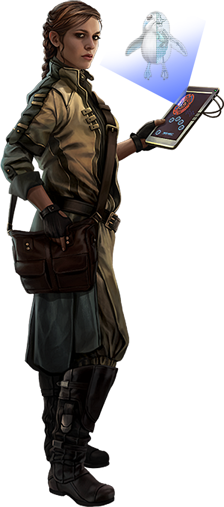

# Physician Pursuit

Physicians study the medical, anatomical, and biological sciences. Those scholars who choose the Physician Pursuit use their knowledge to mend their allies on the field and deal crippling blows with surgical precision.

## Medical Practitioner
_**Physician Pursuit:** 3rd level_ 
You gain proficiency with biochemist's kits and your choice of the Medicine or Nature skills. Additionally, you can't have disadvantage on checks you make with them.

## Remote Healer
_**Physician Pursuit:** 3rd level_ 
You have learned to deploy medicine from a range. When you use a maneuver targeting an ally that is the target of your Critical Analysis feature, that maneuver's range becomes 30 feet.

## Field Surgeon
_**Physician Pursuit:** 6th and 11th level_ 
Whenever you expend superiority dice to restore hit points or grant temporary hit points to a creature, you can roll an additional d6 and add it to the roll. This die increases to d8 at 9th level, d10 at 13th level, and d12 at 17th level.

Additionally, whenever you expend superiority dice to restore hit points or grant temporary hit points to a creature, if the creature is the target of your Critical Analysis, you can instead choose the maximum on both dice. Once you've used this feature, you must finish a short or long rest before you can use it again. Starting at 11th level, you can use it twice before a rest, but only once on the same turn.

## Resuscitate
_**Physician Pursuit:** 9th level_ 
Through your medical studies you have learned to delay seemingly inevitable death. As a bonus action, you can stabilize a creature you can touch that has 0 hit points. 

Additionally, as an action, you can tend to a creature you can touch that has died since the end of your last turn. The creature immediately regains 1 hit point and stabilizes. Once you've used this feature, you must complete a short or long rest before you can use it again.

## Panacea
_**Physician Pursuit:** 17th level_ 
You've developed the formula to concoct a cure-all miracle solution: a panacea. Over the course of 10 minutes, you can expend rare medical supplies worth 1,000 cr to create your panacea in a simple syringe. The panacea retains its potency for 24 hours. As a bonus action, a creature can use the panacea. Alternatively, as an action, they can administer it to another creature within 5 feet.

The target has its exhaustion level reduced by one and regains all of its hit points. If the target is diseased, poisoned, paralyzed, or stunned, the condition ends.

Once you create a panacea, you can't create another until you finish a long rest.

___

# Physician Discoveries
When you select this pursuit, you gain access to new discoveries which reflect the progress of your studies into the medical arts. Whenever you learn a new discovery, you can choose from any of the following as well. The discoveries are listed in alphabetical order.

## Advanced Remote Healer
_**Prerequisite:** 11th level_ 
The range of your Remote Healer feature increases to 60 feet.

## Experimental Treatments
Your medication and treatments are known to be untested and unstable. Immediately after you use a maneuver that causes a creature to regain hit points or gain temporary hit points, you can choose to roll on the Side Effects table to the right. The condition or effect lasts until the creature completes a long rest, or you use this feature again.

You can use this feature twice. You gain an additional use at 5th, 9th, 13th, and 17th level. You regain all expended uses when you finish a short or long rest.

## From the Brink
_**Prerequisite:** 7th level_ 
If the target of your Critical Analysis feature would be reduced to 0 hp, you may use your reaction and end your Critical Analysis feature to have them be reduced to 1 hp instead. Once a creature has benefited from this feature, they must complete a long rest before they can do so again.

## Health Advisor
Whenever a creature that is a target of your Critical Analysis feature begins their turn, you can use your reaction to give them temporary hit points equal to one-fourth your scholar level + your proficiency bonus, as shown in the scholar table, which last until the start of their next turn.

## Patient Protector
_**Prerequisite:** 5th level_ 
You can treat creatures within 5 feet of the target of your Critical Analysis feature as if they were also targets of your Critical Analysis.

## Surgical Precision
_**Prerequisite:** 5th level_  
When you hit a creature that is the target of your Critical Analysis feature with a weapon attack, it takes additional damage equal to your Dexterity modifier.

## Tend the Wounded
If you or any friendly creatures you can touch regain hit points by spending one or more Hit Dice at the end of a short rest, each of those creatures regain 1d4 extra hit points.

This die increases when you reach certain levels in this class: 1d6 at 5th level, 1d8 at 9th level, 1d10 at 13th level, and to 1d12 at 17th level.

### Side Effects

| d20 | Side Effects  |
|:----:|:-------------|
| 1  | The creature turns out to be allergic to this specific treatment. Every ability score is reduced by 1. |
| 2  | The creature starts sneezing uncontrollably. Any attack rolls with a die roll value of 19 results in a miss due to a poorly timed sneeze. |
| 3 | The creature's legs become swollen. The creature gains 1 slowed level. |
| 4 | The creature becomes one size larger or smaller. |
| 5 | The skin at their joints turns into a wooden material, giving them a bonus of +2 to AC. |
| 6 | The creature's body starts producing powerful stomach acid in high amounts. The creature can use an action to spew stomach acid in a 15 feet cone. The DC for this saving throw equals 8 + your proficiency bonus + your Constitution modifier. A creature takes 2d6 acid damage on a failed save, and half as much damage on a successful one. The damage increases to 3d6 at 5th level, 4d6 at 11th level, and 5d6 at 17th level. | 
| 7 | The creature becomes mute and has uncontrollable gas. They have disadvantage on Dexterity (Stealth) checks that rely on smell.|
| 8 | The creature's eyes glows bright red. The creature also gains darkvision, but if they already have darkvision they get a light headache instead. |
| 9 | The creature gains advantage on perception checks based on hearing, but everything seems uncomfortably loud to them. They gain vulnerability to sonic damage. |
| 10 | The treatment slows down their brain function, reducing their Intelligence by 4.|
| 11  | The creature's skin turns dark purple. If they are already purple, they turn bright pink instead.  |
| 12  |  The creature becomes covered in sickly, green pustules. When the creature is hit by a melee attack, the attacker takes 1d4 poison damage. |
| 13 | The creature's skin starts to seriously bloat up from internal pressure build-up, and a strong impact may cause it to explode. Whenever the creature takes damage, the creature has to pass a concentration check or the creature takes kinetic damage equal to half their maximum hit points. Other creatures within 10 feet of the explosion also take a fourth of the damage. Once this explosion occurs, their skin becomes very soft. |
| 14 | The creature rapidly grows body hair all over, including the face, until they resemble a wookiee. If they are already a wookiee, the reverse effect occurs; all hair immediately falls off, leaving the skin bare. |
| 15 | The creature's body temperature fluctuates to extremes. They gain resistance to cold and fire damage.|
| 16 | The creature becomes ravenous. Every hour they haven't eaten a meal they gain a level of exhaustion. |
| 17 | The creature believes they are the chosen one. |
| 18 | The creature has a difficult time resting. The amount they heal from Hit Dice is now halved. |
| 19 | The creature's movement speed is increased by 15 feet, and opportunity attacks on them have disadvantage. |
| 20 | The creature gains 10d10 hit points, and they feel happy and carefree. |
