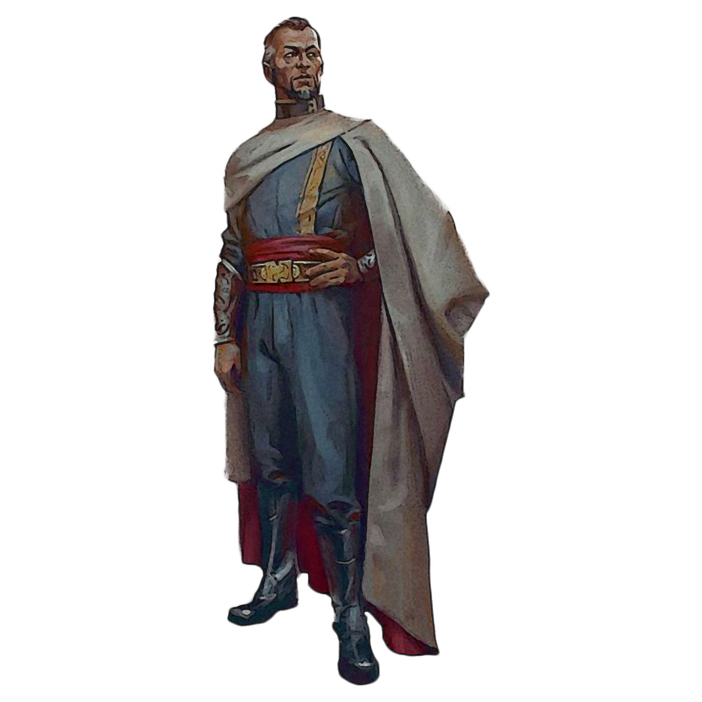

## Politician Pursuit

Politicians study social & political sciences. Those scholars who choose the Politician Pursuit know how to best present themselves to manipulate the masses into doing their bidding or allow them and their allies to carry out their business without impediment. They also understand the importance of self-preservation for a political figure.

### Silver Tongue
_**Politician Pursuit:** 3rd level_ 
You learn your choice of two languages and your choice of Charisma skill. Additionally, you can't have disadvantage on checks you make with it.

### Motivating Diplomat
_**Politician Pursuit:** 3rd level_ 
When you are the target of your Critical Analysis feature, you and all allies within 10 feet of you gain a bonus to their AC equal to half your Critical Analysis ability modifier.

### Force of Personality
_**Politician Pursuit:** 6th level_ 
As an action, you suggest a course of activity (limited to a sentence or two) to influence a creature you can see within range that can hear and understand you. Creatures that can't be charmed are immune to this effect. The suggestion must be worded in such a manner as to make the course of action sound reasonable. Asking the creature to stab itself, throw itself onto a spear, immolate itself, or do some other obviously harmful act ends the effect.

The target must make a Wisdom saving throw against your maneuver save DC. On a failed save, the target is charmed by you, and it pursues the course of action you described to the best of its ability. The suggested course of action can continue for up to 24 hours. If the suggested activity can be completed in a shorter time, the effect ends when the subject finishes what it was asked to do.

You can also specify conditions that will trigger a special activity during the duration. For example, you might suggest that an officer givers her gun to the first smuggler she meets. If the condition isn't met before the effect ends, the activity isn't performed.

If you or any of your companions damage the target, the effect ends.

You can use this feature three times. You gain an additional use at 9th, 13th, and 17th level. You regain all expended uses when you finish a long rest.

### Reassemble
_**Politician Pursuit:** 9th level_ 
You may use to a bonus action to call your allies towards you. When you do so, choose a number of creatures that you can see within 60 feet of you equal to your Critical Analysis ability modifier (minimum of one). They can use their reaction to immediately move a number of feet equal to their speed. This movement does not provoke opportunity attacks, and they must end this movement closer to you than they started.

Once you've used this feature, you must complete a short or long rest before you can use it again. 

### Beguiling Presence
_**Politician Pursuit:** 17th level_ 
Humanoids within 60 feet are particularly susceptible to your presence. Humanoids within range have disadvantage on saving throws against any charm or fear effects that originate from you. 

___

## Politician Discoveries
When you select this pursuit, you gain access to new discoveries which reflect the progress of your studies into the political world. Whenever you learn a new discovery, you can choose from any of the following as well. The discoveries are listed in alphabetical order.

### Charming Feint
Allies within range of your Motivating Diplomat feature also gain a bonus to their damage rolls equal to half your Critical Analysis ability modifier.

### Demanding Leader
_**Prerequisite:** 5th level_  
The range of each of your maneuvers increases by 10 feet. If the range is touch, it becomes 10 feet.

### Dominating Presence
_**Prerequisite:** 15th level_ 
As a bonus action, you can call out to a humanoid who can understand you that is charmed by you or frightened of you to direct their next action. The target must succeed a Wisdom saving throw against your maneuver save DC. On a failed save, until the end of your next turn, the creature takes only the actions you choose, and doesn't do anything that you don't allow it to do.

During this time you can use your reaction to force the creature to use its reaction.

Once you've used this feature, you must complete a short or long rest before you can use it again.

### Influencer
_**Prerequisite:** 5th level_ 
The range on the your Motivating Diplomat feature is increased to 15 feet. 

### Reliable Words
_**Prerequisite:** 9th level_ 
Charisma (Deception, Intimidation, or Persuasion) checks you make gain a minimum roll threshold, discussed in chapter 7.

### Social Opportunist
You can add half your proficiency bonus to any Charisma check you make that doesn't already include your proficiency bonus.

### Tyrant's Ferocity
You have advantage on any attack against a creature that is charmed by you or frightened of you.
