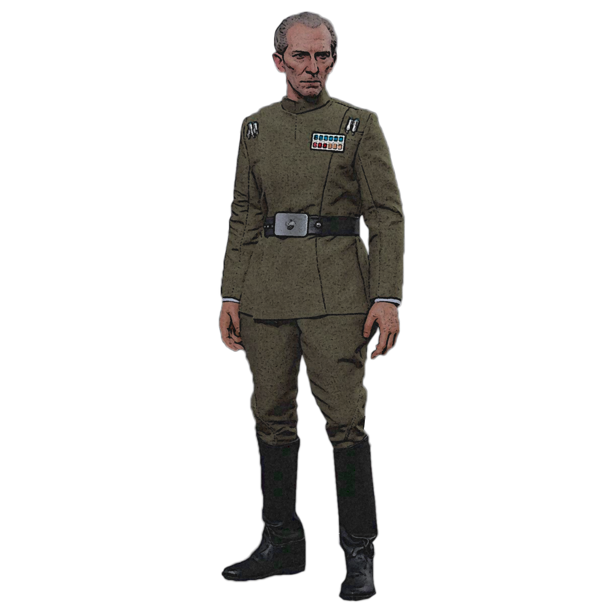

# Tactician Pursuit

Tacticians study strategy and the ways of war. Those scholars who choose the Tactician Pursuit train themselves and their allies in combat maneuvers to deftly eliminate their foes through clever positioning, and fierce, timely attacks.

## Battle Display
_**Tactician Pursuit:** 3rd level_ 
You gain proficiency in martial blasters and martial vibroweapons. 

## Tactical Mastery
_**Tactician Pursuit:** 3rd level_ 
You learn to better command your allies to victory from afar. Your Critical Analysis range is increased to 90 feet. 

## Fire as One
_**Tactician Pursuit:** 6th level_ 
You can focus your target down with the help with an ally. Once per round, whenever the creature that is the target of your Critical Analysis feature is attacked by someone other than you, you can use your reaction to make one weapon attack against them. 

## Battlefield Survey
_**Tactician Pursuit:** 9th level_ 
You become a master at leading your allies around in a battlefield you have studied. When you spend 10 minutes observing an area that is within 120 feet from you, or by using a detailed map, select a number of creatures up to your Critical Analysis ability modifier. You and those selected allies ignore unenhanced difficult terrain, and have advantage on Dexterity (Stealth) checks in that area. 

## All-Out Attack
_**Tactician Pursuit:** 17th level_ 
You can use your action to initiate an all-out attack. Choose a number of allies up to your Critical Analysis ability modifier within 60 feet who can see or hear you. The chosen allies may then immediately use their reaction to make one weapon attack against a target of your choice. You may choose the target for each attack separately.

Once you use this feature, you cannot use it again until you finish a short or long rest.

___

# Tactician Discoveries
When you select this pursuit, you gain access to new discoveries which reflect your mastery in the field of combat. Whenever you learn a new discovery, you can choose from any of the following as well. The discoveries are listed in alphabetical order.

## Commander's Armor
_**Prerequisite:** 5th level_ 
You gain proficiency in medium armor. If you are already proficient in medium armor, you instead gain proficiency in heavy armor.

## Contingency Plan
_**Prerequisite:** 9th level_ 
When the target of your Critical Analysis feature scores a critical hit, you can use your reaction and expend a superiority die to treat the attack as a normal hit instead.

## Fighting Style
You adopt a particular style of fighting as your specialty. Choose one of the fighting style options, detailed in Chapter 6. 

## Firing Command
You can take the Help action as a bonus action. Additionally, when you take the Help action to assist an ally attacking the target of your Critical Analysis, it has a range of 30 feet.

## Observant Leader
You have advantage Wisdom (Perception) checks that rely on sight.

## Studied Commander
When you make an Intelligence (Lore) or Intelligence (Technology) check related to battles, tactics, or weaponry, you may expend a superiority die and add it to the roll.

## Tactical Retreat
When you take the Dash action, opportunity attacks made against you are made at disadvantage.

## Unbound Commander
_**Prerequisite:** 12th level_ 
You learn to command your allies to victory from afar. Your Critical Analysis range is increased to 120 feet. 
