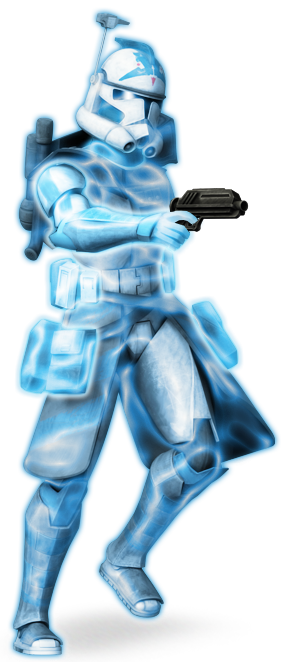

# Bulwark Technique

Some scouts find themselves far from civilization not to hunt, gather intelligence, or escape danger, but to venture forth simply to defend those unable to defend themselves. Followers of the Bulwark Technique make use of advanced technology to contain those that threaten the undeserving.

## Bonus Proficiencies
_**Bulwark Technique:** 3rd level_ 
You gain proficiency in heavy armor.

## Personal Barrier
_**Bulwark Technique:** 3rd level_ 
You gain access to a powerful personal barrier. Whenever you complete a short or long rest, you create a barrier on yourself that lasts until you finish a short or long rest. That barrier has hit points equal to twice your scout level + your Intelligence modifier. Your barrier can never have hit points greater than twice your scout level + your Intelligence modifier.

Whenever you take damage, the barrier takes the damage instead. If this damage reduces the barrier to 0 hit points, you take any remaining damage.

While the barrier has 0 hit points, it can't absorb damage, but its power remains. Whenever you cast a tech power of 1st level or higher, your barrier regains hit points equal to the number of tech points spent.

Additionally, for as long as your barrier has hit points, you gain the following benefits:
- You are considered proficient in Constitution saving throws for the purpose of maintaining concentration on tech powers.
- Hostile creatures that hit you with melee attacks take energy damage equal to your Intelligence modifier (minimum of one).

## Mark of the Bulwark
_**Bulwark Technique:** 3rd level_ 
When the target of your Ranger's Quarry feature makes a melee attack against a friendly creature within 5 feet of you, you can use your reaction to force the attack to target you instead. If the attack hits, and your Personal Barrier has hit points, the attacking creature takes bonus damage equal to your Ranger's Quarry Damage Die.

## Projected Barrier
_**Bulwark Technique:** 7th, 11th, and 17th level_ 
You've learned how to manipulate your barrier to create new effects. As an action, you can spend three of your barrier's hit points to create a unique effect. You have three such effects: Projected Sphere, Projected Maelstrom, and Projected Wave. When you use your Projected Barrier, you choose which effect to create.

Some Projected Barrier Effects require saving throws. When you use such an effect from this class, the DC equals your tech save DC.

If your barrier's hit points are reduced to 0, any Projected Barrier features immediately end.

### Projected Sphere
You create a protective spherical barrier in a 5-foot-radius sphere a point you can see within 30 feet that lasts until the start of your next turn. Creatures within the barrier have three-quarters cover from attacks originating from outside the barrier. You can maintain the barrier by spending an additional barrier hit point at the start of each of your turns (no action required).

### Projected Maelstrom
You create an unstable energy maelstrom in a 5-foot cube at a point you can see within 30 feet that lasts until the start of your next turn. A creature takes 4d4 energy damage when it enters the area for the first time on a turn or starts its turn there. You can maintain the barrier by spending an additional barrier hit point at the start of each of your turns (no action required). 

This feature's damage increases by 1d4 when you reach 11th level (5d4) and 17th level (6d4).

### Projected Wave
You create a wave of barrier energy in a 15-foot cone. Each creature within the cone must make a Dexterity saving throw. On a failed save, a creature takes 2d6 energy damage and is pushed back to the edge of the cone. On a success, they take half damage and  aren't pushed.

This feature's damage increases by 1d6 when you reach 11th level (3d6) and 17th level (4d6).

## Regenerative Shielding
_**Bulwark Technique:** 11th level_ 
When a hostile creature forces you to make a saving throw and you succeed, your personal barrier regains hit points equal to your Intelligence modifier.

## Adaptive Barrier
_**Bulwark Technique:** 15th level_ 
When your personal barrier takes damage, you can have it gain resistance to subsequent damage of that type until the start of your next turn (no action required). If it takes damage of more than one type simultaneously, you can choose which type it gains resistance to. Your barrier can only have resistance to one type of damage at a time.
