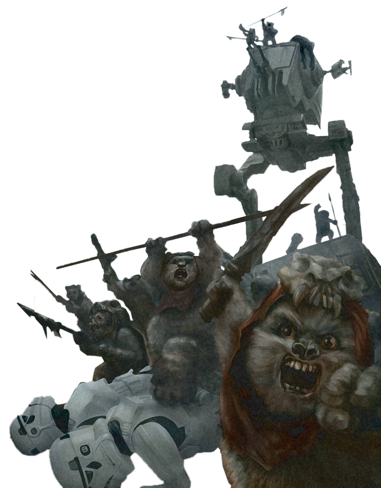

## Hunter Technique 

Some scouts seek to master weapons to better protect civilization from the terrors of their enemies. Followers of the Hunter Technique learn specialized fighting techniques for use against the most dire threats, from an onslaught of soldiers to towering walkers.

### Hunter's Prey
_**Hunter Technique:** 3rd level_ 
You gain one of the following features of your choice. 

#### Colossus Slayer
Your tenacity can wear down the most potent foes. When you hit a creature with a weapon attack, the creature takes an extra 1d8 damage if it's below its hit point maximum. You can deal this extra damage only once per turn, and this damage is the same type as the weapon's damage. 

#### Giant Killer
When a Large or larger creature within 5 feet of you hits or misses you with an attack, you can use your reaction to attack that creature immediately after its attack, provided that you can see the creature. 

#### Horde Breaker
Once on each of your turns when you make a weapon attack, you can make another attack with the same weapon against a different creature that is within 5 feet of the original target and within range of your weapon, no action required.

### Mark of the Hunter
_**Hunter Technique:** 3rd level_ 
When you use your Ranger's Quarry feature, the first time you make a tech or weapon attack against the target of your Ranger's Quarry each turn, roll your Ranger's Quarry die and add it to the roll.

### Defensive Tactics 
_**Hunter Technique:** 7th level_ 
You gain one of the following features of your choice. 

#### Escape the Horde
Opportunity attacks against you are made with disadvantage.

#### Multiattack Defense
When a creature hits you with an attack, you gain a +4 bonus to AC against all subsequent attacks made by that creature for the rest of the turn. 

#### Steel Will
You have advantage on saving throws against being frightened.

### Multiattack 
_**Hunter Technique:** 11th level_ 
You gain one of the following features of your choice. 

#### Volley
You can use your action to make a ranged attack against any number of creatures within 10 feet of a point you can see within your weapon's range. You must have ammunition for each target, as normal, and you make a separate attack roll for each target. 

#### Whirlwind Attack
You can use your action to make melee attacks against any number of creatures within 5 feet of you, with a separate attack roll for each target.

### Superior Hunter's Defense 
_**Hunter Technique:** 15th level_ 
You gain one of the following features of your choice. 

#### Evasion
When you are subjected to an effect that allows you to make a Dexterity saving throw to take only half damage, you instead take no damage if you succeed on a saving throw, and only half damage if you fail.

#### Stand Against the Tide
When a hostile creature misses you with a melee attack, you can use your reaction to force that creature to repeat the same attack against another creature of your choice. 

#### Uncanny Dodge
When an attacker that you can see hits you with an attack, you can use your reaction to halve the attack's damage against you.
