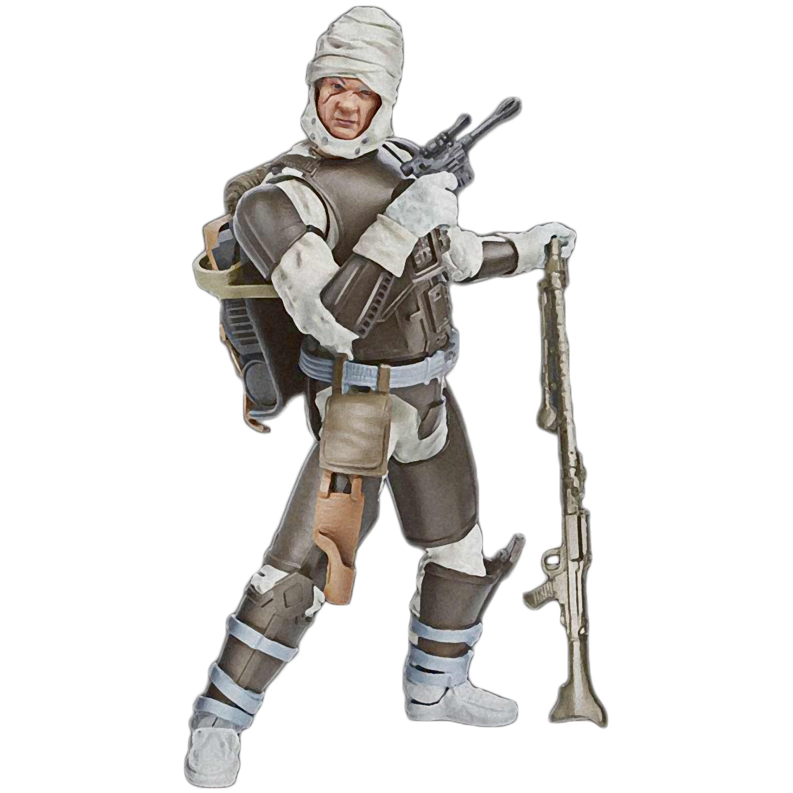

# Stalker Technique

Some Scouts become consumed by the thrill of the hunt. Only heard and never seen they revel in the violence of battle. Followers of the Stalker Technique hone their abilities to track others utilizing a variety of techniques: camouflage, infiltration, surveillance, and target acquisition.

## Accomplished Ambusher
_**Stalker Technique:** 3rd level_ 
When you take the Attack action against a creature that is surprised, you can make one additional attack against that creature as a part of that action.

## Mark of the Stalker
_**Stalker Technique:** 3rd level_ 
While you are hidden from the target of your Ranger's Quarry feature, the first attack roll you make each round against that creature does not automatically reveal your presence to that creature. Make a Dexterity (Stealth) check contested by your target's Wisdom (Perception) check. On a success, you remain hidden. If you are less than 30 feet from your target, the Dexterity (Stealth) check is made with disadvantage.

## Concealment
_**Stalker Technique:** 7th, 9th, 13th, and 17th level_ 
You've become adept at evading creatures that rely on darkvision. While in darkness, you are invisible to any creature that relies on darkvision to see you in that darkness.

Additionally, when you hit a creature with a ranged weapon attack while hidden, you can force that creature to make a Dexterity saving throw against your tech save DC. On a failed save, the creature's speed is reduced to 0 until the end of your next turn. You can use this feature three times. You gain an additional use at 9th, 13th, and 17th level. You regain all expended uses when you finish a short or long rest.

## Stalker's Flurry
_**Stalker Technique:** 11th level_ 
If you have advantage on a weapon attack against a target on your turn, you can forgo that advantage to immediately make an additional weapon attack against the same target as a bonus action.

## Stalker's Dodge
_**Stalker Technique:** 15th level_ 
Whenever a creature attacks you and does not have advantage, you can use your reaction to impose disadvantage on the creature's attack roll against you. You can use this feature before or after the attack roll is made, but it must be used before the outcome of the roll is determined.
